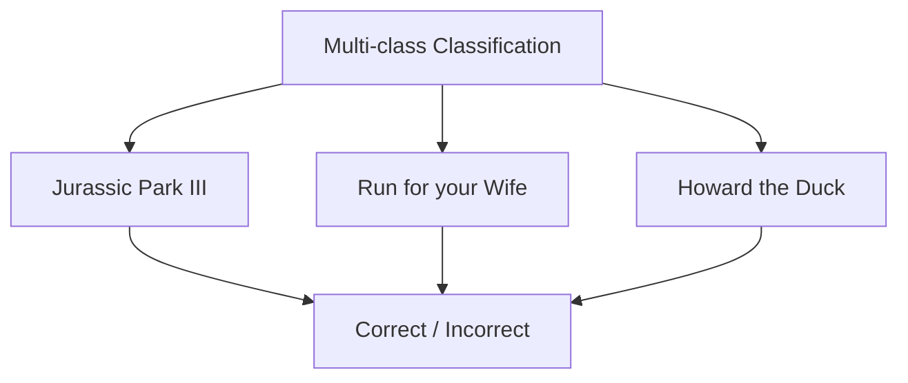

# Confusion Matrix

## <td align="center"> Introduction

A Confusion Matrix is a **table used to evaluate the performance of a classification** model by comparing predicted values with actual values.
It shows how many predictions were:

- Correctly classified
- Incorrectly classified
- False alarms
- Missed detections

Is very important start understating Confusion Matrix, because it's the foundation for several important evaluation metrics:

- Accuracy
- Precision
- Recall
- F1 Score
- Specificity

---

### Binary Classification Confusion Matrix

Binary Classification is one way to measeure with this table technique:

<div align="center">

|                 | Predicted Positive  | Predicted Negative  |
| --------------- | ------------------- | ------------------- |
| Actual Positive | True Positive (TP)  | False Negative (FN) |
| Actual Negative | False Positive (FP) | True Negative (TN)  |


</div>


#### Definitions

**True Positive (TP)**
Model correctly predicts the positive class.

Example:
Fraud detected → actually fraud

**True Negative (TN)**
Model correctly predicts the negative class.

Example:
Not fraud → actually not fraud

**False Positive (FP)**
Model predicts positive but it is actually negative.
Also called Type I error.

Example:
Fraud detected → actually normal transaction

**False Negative (FN)**
Model predicts negative but it is actually positive.
Also called Type II error.

Example:
Not fraud → actually fraud

 
## <td align="center"> How it works?

```
Dataset
   ↓
Train / Validation Split
   ↓
Model Training
   ↓
Predictions
   ↓
Evaluation Metrics
   ↓
Model Selection
```

### Step-by-step Example

1. Dataset

Email spam classification dataset:

<div align="center">

| Email          | Label    |
| -------------- | -------- |
| Win money now  | Spam     |
| Meeting at 3pm | Not Spam |
| Free vacation  | Spam     |
| Project update | Not Spam |

</div>

2. Train / Validation Split

Train: 80%
Validation: 20%

Training set used to learn patterns
Validation set used for evaluation


3. Model Training

Train a classifier:

Example:

- Logistic Regression
- Decision Tree
- Random Forest

The model learns patterns like:

- "win money" → spam
- "free vacation" → spam
- "meeting" → not spam


4. Predictions

Model predictions:

<div align="center">

| Email          | Actual   | Predicted |
| -------------- | -------- | --------- |
| Win money now  | Spam     | Spam      |
| Meeting at 3pm | Not Spam | Spam      |
| Free vacation  | Spam     | Spam      |
| Project update | Not Spam | Not Spam  |

</div>

5. Confusion Matrix

<div align="center">

|                 | Pred Spam | Pred Not Spam |
| --------------- | --------- | ------------- |
| Actual Spam     | 2 (TP)    | 0 (FN)        |
| Actual Not Spam | 1 (FP)    | 1 (TN)        |

</div>

Result:
True Positive (TP) = 2
True Negative (TN) = 1
False Positive (FP) = 1
False Negative (FN) = 0

These values are used to compute:

Accuracy
Precision
Recall
F1 Score

---

## Multi-class Example (3×3 Confusion Matrix)

Imagine a model predicting a user's favorite movie:
    - Classes:
          - Jurassic Park III
          - Run for your Wife
          - Howard the Duck

The model analyzes whether the user **liked or didn’t like** movies and predicts the favorite.

**3×3 Confusion Matrix**

| Actual \ Predicted | Jurassic Park III | Run for your Wife | Howard the Duck |
| ------------------ | ----------------- | ----------------- | --------------- |
| Jurassic Park III  | 1                 | 0                 | 1               |
| Run for your Wife  | 0                 | 2                 | 0               |
| Howard the Duck    | 0                 | 1                 | 0               |


**Interpretation**

Correct predictions (diagonal):

- Jurassic Park III → 1 correct
- Run for your Wife → 2 correct
- Howard the Duck → 0 correct

Errors:

- 1 Jurassic Park III predicted as Howard the Duck
- 1 Howard the Duck predicted as Run for your Wife




**Why Multi-class Confusion Matrix Matters?**

Binary confusion matrix → 2x2
Multi-class confusion matrix → NxN

Example:

- 3 classes → 3x3
- 5 classes → 5x5
- 10 classes → 10x10

This helps analyze which classes are being confused.

---

## <td align="center"> Why use it?

1. Shows detailed performance

Accuracy alone is not enough.
Confusion matrix shows types of errors.

Example:

Two models with same accuracy
But different false positives / false negatives


2. Works with imbalanced datasets

If dataset is:

- 95% Not Fraud
- 5% Fraud

Accuracy can be misleading.

Confusion matrix reveals the real performance.

3. Required for other metrics

These metrics depend on confusion matrix:

- Precision
- Recall
- F1 Score
- Specificity
- Sensitivity

4. Helps understand model mistakes

You can see:

- False alarms (FP)
- Missed detections (FN)

This helps improve the model.

5. Works for multi-class classification

Confusion matrix can be extended:

Example:

- Cat
- Dog
- Bird

The matrix becomes 3x3.

## <td align="center"> Summary

Confusion Matrix helps answer:

- How many predictions were correct?
- What type of mistakes did the model make?
- Is the model missing important cases?
- Is the model producing too many false alarms?

It is the first step in classification model evaluation.


###  Videos

A few recommended resources to visualize how LLMs work:

<div align="center">
  <a href="https://www.youtube.com/watch?v=Kdsp6soqA7o" target="_blank">
      
  </a>
</div>

---

<div align="center">
  <a href="https://www.youtube.com/watch?v=bN-yBh4GAeY" target="_blank">
      
  </a>
</div>
