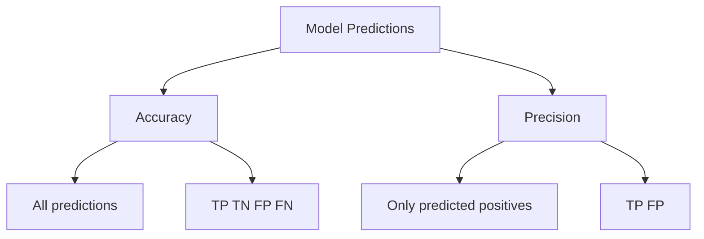

# Precision

## <td align="center"> Introduction

Precision is a classification metric that measures **how many predicted positives were actually correct**.

It answers the question:

**"When the model predicts Positive, how often is it correct?"**

Precision focuses on **False Positives**.  
It is especially important when **false alarms are costly**.

Precision is calculated using the Confusion Matrix values:

- True Positive (TP)
- False Positive (FP)

### Formula

Precision = TP / (TP + FP)

This means:

- Correct positive predictions → TP  
- Total predicted positives → TP + FP  

High Precision → Few False Positives  
Low Precision → Many False Positives  

---

### When Precision Matters

Precision is important when **false positives are dangerous**.

Examples:

- Spam detection → don't mark real emails as spam  
- Fraud detection → don't block normal transactions  
- Medical diagnosis → don't diagnose healthy patients as sick  

---

## <td align="center"> How it works?

```
Dataset
   ↓
Train / Validation Split
   ↓
Model Training
   ↓
Predictions
   ↓
Evaluation Metrics (Precision)
   ↓
Model Selection
```

### Step-by-step Example

1. Dataset

Email spam classification dataset:

| Email          | Label    |
| -------------- | -------- |
| Win money now  | Spam     |
| Meeting at 3pm | Not Spam |
| Free vacation  | Spam     |
| Project update | Not Spam |

---

2. Train / Validation Split

Train: 80%  
Validation: 20%

- Training set → used to train the model  
- Validation set → used to evaluate performance  

---

3. Model Training

Train a classifier:

Examples:
- Logistic Regression
- Decision Tree
- Random Forest

The model learns patterns like:

- "win money" → spam  
- "free vacation" → spam  
- "meeting" → not spam  

---

4. Predictions

| Email          | Actual   | Predicted |
| -------------- | -------- | --------- |
| Win money now  | Spam     | Spam      |
| Meeting at 3pm | Not Spam | Spam      |
| Free vacation  | Spam     | Spam      |
| Project update | Not Spam | Not Spam  |

---

5. Confusion Matrix Values

- TP = 2  
- FP = 1  
- TN = 1  
- FN = 0  

---

6. Precision Calculation

Precision = TP / (TP + FP)

Precision = 2 / (2 + 1)  
Precision = 2 / 3  
Precision = 0.66 → **66%**

---

Interpretation:

The model predicted **3 spam emails**  
Only **2 were actually spam**

So precision = **66%**

This means:
- 66% of predicted spam were correct
- 34% were false alarms

---

## <td align="center"> Why use it?

### 1. Reduces false positives

Precision measures how many predicted positives are correct.

High precision → fewer false alarms

Example:
Spam filter marking important emails as spam is bad.

---

### 2. Important when false alarms are costly

Use precision when False Positives are worse than False Negatives.

Examples:

- Fraud detection → blocking legit transaction is bad  
- Medical screening → wrong diagnosis is dangerous  
- Search results → irrelevant results hurt UX  

---

### 3. Helps evaluate prediction quality

Precision tells how reliable **positive predictions** are.

Example:

Model A:
Precision = 90%

Model B:
Precision = 60%

Model A produces **more trustworthy positive predictions**

---

### 4. Works well with Recall

Precision alone is not enough.

You should analyze together:

- Precision → false positives  
- Recall → false negatives  

This leads to:
- F1 Score
- Precision-Recall curve

---

### 5. Useful for imbalanced datasets

When positive class is rare:

- Fraud detection  
- Disease detection  
- Anomaly detection  

Precision becomes very important.

---

##  Precision vs Accuracy

Precision and Accuracy are often confused, but they measure **different things**.

### Accuracy

Accuracy measures **overall correctness**:

Accuracy = (TP + TN) / (TP + TN + FP + FN)

It answers:

**"How many predictions were correct?"**

Accuracy considers:
- True Positives
- True Negatives
- False Positives
- False Negatives

---

### Precision

Precision measures **quality of positive predictions**:

Precision = TP / (TP + FP)

It answers:

**"When the model predicts positive, how often is it correct?"**

Precision focuses on:
- True Positives
- False Positives

---

### Example

Confusion Matrix:

|                 | Pred Spam | Pred Not Spam |
|-----------------|-----------|---------------|
| Actual Spam     | 2 (TP)    | 0 (FN)        |
| Actual Not Spam | 1 (FP)    | 1 (TN)        |

Accuracy:

Accuracy = (TP + TN) / Total  
Accuracy = (2 + 1) / 4  
Accuracy = 75%

Precision:

Precision = TP / (TP + FP)  
Precision = 2 / (2 + 1)  
Precision = 66%

---

### Key Difference

Accuracy cares about **all predictions**

Precision cares only about **positive predictions**

---

### When to use Accuracy

Use Accuracy when:
- Dataset is balanced
- All errors have similar cost
- You want overall performance

Example:
- General image classification
- Document classification

---

### When to use Precision

Use Precision when:
- False positives are costly
- Positive predictions must be reliable
- You want fewer false alarms

Example:
- Spam detection
- Fraud detection
- Medical alerts

---

### Visual Comparison



---

## <td align="center"> Summary

Precision answers:

**"When the model predicts positive, how often is it correct?"**

Key points:

- Based on TP and FP  
- Measures prediction quality for positives  
- High precision → few false positives  
- Important when false alarms are costly  
- Should be used together with Recall  

Precision is essential for understanding **how trustworthy positive predictions are**.

##  Video

A few recommended resource:

<div align="center">
  <a href="https://www.youtube.com/shorts/67Ekk-rM5dE" target="_blank">
      
  </a>
</div>
