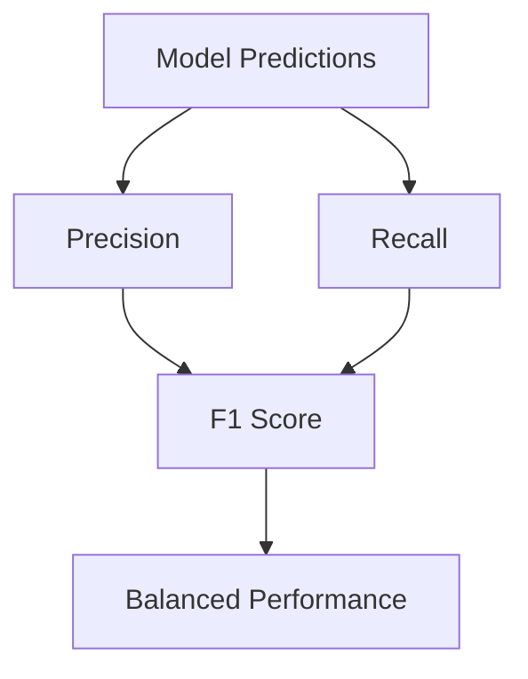

# F1 Score

## <td align="center"> Introduction

F1 Score is a classification metric that combines **Precision** and **Recall** into a single number.

It answers the question:

**"How good is the model at balancing Precision and Recall?"**

F1 Score is especially useful when:

- Classes are imbalanced
- Both false positives and false negatives matter
- You need a single evaluation metric

The F1 Score is the **harmonic mean** of Precision and Recall.

---

## Formula

F1 Score = 2 × (Precision × Recall) / (Precision + Recall)

This means:

- High Precision + High Recall → High F1 Score
- Low Precision or Low Recall → Low F1 Score

The harmonic mean penalizes extreme values.

Example:

Precision = 1.0  
Recall = 0.0  

F1 Score = 0  

Even though precision is perfect, recall is terrible → F1 is low.

---

## Relationship with Confusion Matrix

F1 Score depends on:

- True Positive (TP)
- False Positive (FP)
- False Negative (FN)

Because:

Precision = TP / (TP + FP)  
Recall = TP / (TP + FN)

F1 Score combines both.

---

## <td align="center"> How it works?

```
Dataset
   ↓
Train / Validation Split
   ↓
Model Training
   ↓
Predictions
   ↓
Precision + Recall
   ↓
F1 Score
   ↓
Model Selection
```

---

## Step-by-step Example

### Predictions

| Email          | Actual   | Predicted | Result                |
| -------------- | -------- | --------- | --------------------- |
| Win money now  | Spam     | Spam      | ✅ True Positive (TP)  |
| Meeting at 3pm | Not Spam | Spam      | ❌ False Positive (FP) |
| Free vacation  | Spam     | Spam      | ✅ True Positive (TP)  |
| Project update | Not Spam | Not Spam  | ✅ True Negative (TN)  |


---

### Confusion Matrix Values

TP = 2  
FP = 1  
FN = 0  
TN = 1  

---

### Step 1 — Precision
What Precision measures:
How many predicted positives were actually correct.

Formula:

Precision = TP / (TP + FP)

Legend:

- TP = True Positives → correctly predicted Spam
- FP = False Positives → predicted Spam but actually Not Spam

Calculation:

Precision = 2 / (2 + 1)  
Precision = 2 / 3  
Precision = 0.66

Interpretation:

- The model predicted 3 spam emails
- Only 2 were actually spam

So 66% of predicted spam were correct


---

### Step 2 — Recall
What Recall measures:
How many actual positives were correctly identified.

Formula:
Recall = TP / (TP + FN)

Legend:

- TP = True Positives → correctly predicted Spam
- FN = False Negatives → predicted Not Spam but actually Spam

Calculation:
Recall = 2 / (2 + 0)  
Recall = 2 / 2  
Recall = 1.0

Interpretation:
- There were 2 real spam emails
- The model detected both

So no spam emails were missed

---

### Step 3 — F1 Score
What F1 Score measures:
Balance between Precision and Recall.

Formula:
F1 = 2 × (Precision × Recall) / (Precision + Recall)

Legend:
- Precision = 0.66
- Recall = 1.0
- F1 = harmonic mean of Precision and Recall

Calculation:
F1 = 2 × (0.66 × 1.0) / (0.66 + 1.0)  
F1 = 1.32 / 1.66  
F1 = 0.79 → **79%**

Interpretation

- Precision is moderate (66%)
- Recall is perfect (100%)
- F1 Score balances both → 79%

This means the model:

- Finds all spam emails ✅
- But still produces some false alarms ⚠️
- Overall performance is well balanced

---

## <td align="center"> Why use F1 Score?

### 1. Balances Precision and Recall

F1 Score is useful when you need both:

- High Precision
- High Recall

It penalizes models that perform well in only one metric.

---

### 2. Works well with imbalanced datasets

Example:

- 95% Not Fraud
- 5% Fraud

Accuracy may be misleading.

F1 Score gives a more realistic performance measure.

---

### 3. Single metric for model comparison

Instead of comparing:

- Precision
- Recall

You compare one value:

Model A → F1 = 0.81  
Model B → F1 = 0.76  

Model A is better balanced.

---

### 4. Penalizes extreme behavior

Example:

Precision = 1.0  
Recall = 0.0  

F1 = 0

The model is useless even with perfect precision.

---

##  F1 vs Precision vs Recall

These three metrics evaluate classification models from different perspectives.

| Metric    | Focus | What it answers | Penalizes |
|-----------|------|----------------|-----------|
| Precision | False Positives | "When model predicts positive, how often is it correct?" | False alarms |
| Recall    | False Negatives | "Out of all real positives, how many were found?" | Missed positives |
| F1 Score  | Balance between both | "How well does the model balance precision and recall?" | Extreme imbalance |

---

### Precision Focus

High Precision means:

- Few false positives  
- Positive predictions are reliable  
- Model is conservative  

Example:
Spam filter with high precision:
- Only marks email as spam when very sure
- But may miss some spam

---

### Recall Focus

High Recall means:

- Few false negatives  
- Most positives are detected  
- Model is aggressive  

Example:
Fraud detection with high recall:
- Detects almost all fraud
- But may block legitimate transactions

---

### F1 Score Focus

F1 Score balances Precision and Recall.

It becomes **low when one of them is low**.

Examples:

Precision = 1.0  
Recall = 0.0  
F1 = 0  

Even with perfect precision, recall is terrible → bad model

---

### Example Comparison

Model A:
Precision = 0.90  
Recall = 0.40  

F1 ≈ 0.55

Model B:
Precision = 0.75  
Recall = 0.75  

F1 = 0.75

---

### Interpretation

Model A:
- Very high precision  
- Low recall  
- Misses many positives  
- Conservative model  

Model B:
- Balanced precision and recall  
- Detects positives reliably  
- Better overall performance  

Model B is better balanced.

---

### Visual Intuition

```
Model A
Precision ██████████ 0.90
Recall    ████       0.40
F1        ██████     0.55


Model B
Precision ████████   0.75
Recall    ████████   0.75
F1        ████████   0.75
```

---

### When each metric looks "better"

Use **Precision** when:
- False positives are costly
- Spam filtering
- Search ranking
- Recommendation systems

Use **Recall** when:
- Missing positives is dangerous
- Fraud detection
- Medical diagnosis
- Security alerts

Use **F1 Score** when:
- Dataset is imbalanced
- Both errors matter
- You need a single metric
- Comparing multiple models

---

### Key Takeaway

Precision → prediction quality  
Recall → detection ability  
F1 Score → balanced performance  

F1 Score is high **only when both Precision and Recall are high**.

---

## When to use F1 Score

Use F1 Score when:

- Dataset is imbalanced
- Precision and Recall are both important
- You need a single metric
- You care about overall detection quality

Examples:

- Fraud detection  
- Medical diagnosis  
- Spam detection  
- Anomaly detection  
- Information retrieval  

---

## When NOT to use F1 Score

Avoid F1 Score when:

- True negatives matter a lot
- You need overall accuracy
- Class distribution is balanced
- Business cost is asymmetric

In these cases use:

- Accuracy
- Precision
- Recall
- ROC-AUC

---

## Visual Representation



---

## <td align="center"> Summary

F1 Score answers:

**"How well does the model balance Precision and Recall?"**

Key points:

- Harmonic mean of Precision and Recall
- Penalizes extreme values
- Works well for imbalanced datasets
- Good single metric for comparison
- Should be used with confusion matrix

F1 Score is one of the **most important classification metrics**.

---


## <td align="center"> Challenges

### Challenge 1:
**Positive class = Spam**\
Fill the "Your Answer" column with: **TP, FP, FN, TN**

| #  | Email                              | Ground Truth | Model Prediction | Your Answer |
|----|------------------------------------|--------------|------------------|-------------|
| 1  | "Win money fast!!!"                | Spam         | Spam             | ?           |
| 2  | "Meeting tomorrow at 10am"         | Not Spam     | Spam             | ?           |
| 3  | "Exclusive promotion click here"   | Spam         | Not Spam         | ?           |
| 4  | "Credit card statement available"  | Not Spam     | Not Spam         | ?           |
| 5  | "You won an iPhone"                | Spam         | Spam             | ?           |
| 6  | "Project update"                   | Not Spam     | Not Spam         | ?           |
| 7  | "Click to reset your password"     | Not Spam     | Spam             | ?           |
| 8  | "Limited-time offer today only"    | Spam         | Spam             | ?           |
| 9  | "Interview invitation"             | Not Spam     | Not Spam         | ?           |
| 10 | "Bitcoin doubling your investment" | Spam         | Not Spam         | ?           |

<details>
  <summary>Answer</summary>
1.  TP
2.  FP
3.  FN
4.  TN
5.  TP
6.  TN
7.  FP
8.  TP
9.  TN
10. FN
</details>

### Challenge 2:

Questions

- 1. What is TP?
<details>
  <summary>Answer</summary>
    Actual Spam predicted as Spam
</details>

- 2. What is FP?
<details>
  <summary>Answer</summary>
    Not Spam predicted as Spam
</details>

- 3. What is FN?
   
<details>
  <summary>Answer</summary>
    Spam predicted as Not Spam
</details>

- 4. What is TN?
<details>
  <summary>Answer</summary>
    Not Spam predicted as Not Spam
</details>


### Challenge 3:
Using the same dataset, fill in the **Confusion Matrix**:

|                   | Predicted Spam | Predicted Not Spam |
|-------------------|----------------|--------------------|
| Actual Spam       | ?              | ?                  |
| Actual Not Spam   | ?              | ?                  |


<details>
  <summary>Answer</summary>

|                   | Predicted Spam | Predicted Not Spam |
|-------------------|----------------|--------------------|
| Actual Spam       | 3              | 2                  |
| Actual Not Spam   | 2              | 3                  |
</details>


### Challenge 4:
Metrics Calculation. Using the results above, calculate:

-   Accuracy
-   Recall
-   Precision
-   F1 Score

<details>
  <summary>Answer</summary>

Counts:

- TP = 3  
- TN = 3  
- FP = 2  
- FN = 2  
- Total = 10  

## Calculations

### Accuracy

Formula:

    (TP + TN) / Total

Your result:

    (3 + 3) / 10 = 6 / 10 = 0.60

Interpretation:

    The model is correct 60% of the time overall.

------------------------------------------------------------------------

### Recall

Formula:

    TP / (TP + FN)

Your result:

    3 / (3 + 2) = 3 / 5 = 0.60

Interpretation:

    The model correctly detects 60% of all spam emails.
    It misses 40% of the actual spam.

------------------------------------------------------------------------

### Precision

Formula:

    TP / (TP + FP)

Your result:

    3 / (3 + 2) = 3 / 5 = 0.60

Interpretation:

    When the model predicts spam, it is correct 60% of the time.
    40% of flagged emails are actually not spam.

------------------------------------------------------------------------

### F1 Score

Formula:

    2 * (Precision * Recall) / (Precision + Recall)

Your result:

    2 * (0.6 * 0.6) / (0.6 + 0.6)
    = 0.72 / 1.2
    = 0.60

Interpretation:

    The F1 score shows a balanced but moderate performance.
    Precision and recall are equally limited.

------------------------------------------------------------------------

</details>


##  Video

<div align="center">
  <a href="https://www.youtube.com/watch?v=2osIZ-dSPGE" target="_blank">
      
  </a>
</div>
