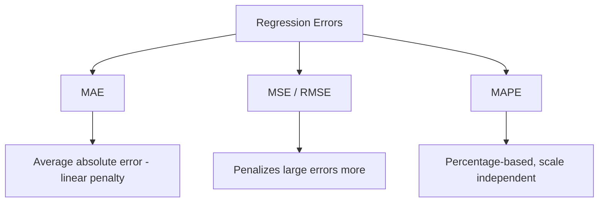

# Mean Absolute Error (MAE) 

## What is MAE ? 

Mean Absolute Error (MAE) is a **regression metric** that measures the **average magnitude of errors** between predicted and actual values, without considering their direction.

It answers the question:

**"On average, how far off are the model's predictions?"**

MAE treats every error with the same weight — a prediction that is off by 10 contributes exactly twice as much as a prediction that is off by 5. Because of this, MAE is easy to interpret: it is expressed in the **same unit as the target variable** (e.g., dollars, °C, days).

---

## Components 

MAE is built from:

- **Actual value** ($y_i$) — the true value for sample $i$
- **Predicted value** ($\hat{y}_i$) — the model's output for sample $i$
- **Absolute error** ($|y_i - \hat{y}_i|$) — the distance between actual and predicted, ignoring sign
- **n** — the number of samples

### Formula

$$MAE = \frac{1}{n} \sum_{i=1}^{n} |y_i - \hat{y}_i|$$

- Low MAE → predictions are close to actual values
- High MAE → predictions deviate significantly from actual values

---

### How it Works 

```
Dataset
   ↓
Train / Validation Split
   ↓
Model Training
   ↓
Predictions
   ↓
Evaluation Metrics (MAE)
   ↓
Model Selection
```

### Step-by-step Example

1. Dataset

House price dataset (in thousands):

| House | Actual Price | Predicted Price |
| ----- | ------------ | ---------------- |
| A     | 300          | 280              |
| B     | 450          | 470              |
| C     | 200          | 210              |
| D     | 600          | 550              |

---

2. Absolute Errors

| House | \|Actual - Predicted\| |
| ----- | ----------------------- |
| A     | \|300 - 280\| = 20      |
| B     | \|450 - 470\| = 20      |
| C     | \|200 - 210\| = 10      |
| D     | \|600 - 550\| = 50      |

---

Visually, each house contributes a "gap" between what was predicted and what actually happened — MAE is just the average size of that gap:

```mermaid
xychart-beta
    title "Actual vs. Predicted House Prices ($ in thousands)"
    x-axis ["House A", "House B", "House C", "House D"]
    y-axis "Price" 150 --> 650
    bar "Actual" [300, 450, 200, 600]
    bar "Predicted" [280, 470, 210, 550]
```



*Each pair's gap is `|y_i - ŷ_i|` — House A: 20, House B: 20, House C: 10, House D: 50. MAE = (20 + 20 + 10 + 50) / 4 = **25**.*

3. MAE Calculation

MAE = (20 + 20 + 10 + 50) / 4

MAE = 100 / 4

MAE = **25**

---

Interpretation:

On average, the model's predictions are **off by 25 (thousand)** from the actual house price, regardless of whether it over- or under-predicted.

---

## Limitations and Alternatives 

### Limitations

- **Treats all errors linearly** — a single large error (e.g., 100) has the same relative weight as many small errors adding up to 100, so MAE does not emphasize outliers.
- **No error direction** — MAE cannot tell if the model tends to over-predict or under-predict.
- **Scale-dependent** — a MAE of 25 is meaningless without knowing the scale of the target (25 seconds vs. 25 thousand dollars), making it hard to compare across different datasets.
- **Not smooth at zero** — the absolute value function is not differentiable at 0, which can complicate some gradient-based optimization methods.

### Alternatives

| Metric | Difference from MAE |
|--------|----------------------|
| MSE (Mean Squared Error) | Squares the errors, penalizing large errors more heavily |
| RMSE (Root Mean Squared Error) | Same sensitivity to large errors as MSE, but back in the original unit |
| R² Score | Measures proportion of variance explained, independent of scale |
| MAPE (Mean Absolute Percentage Error) | Expresses error as a percentage, useful for comparing across scales |



Use MAE when all errors should be weighted equally and outliers should not dominate the metric. Use MSE/RMSE when large errors are especially costly, and MAPE when comparing performance across targets with different scales.
