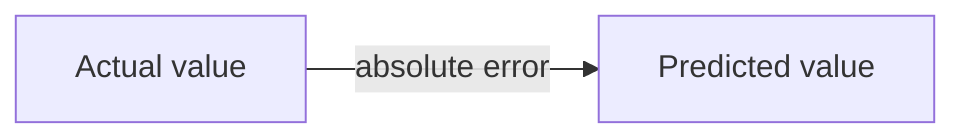
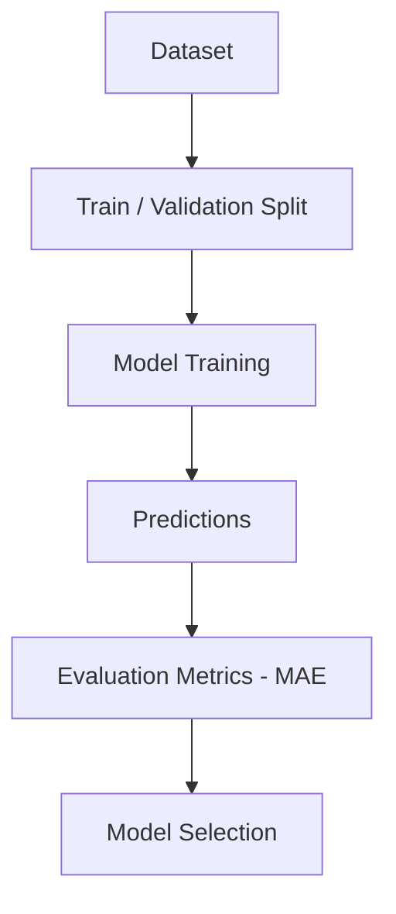
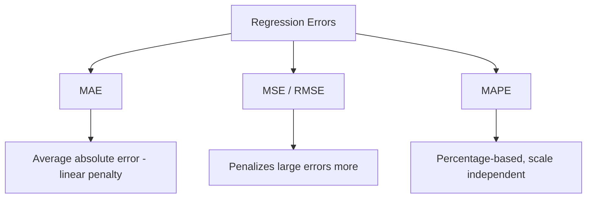

# Mean Absolute Error (MAE) 

## What is MAE ? 

Mean Absolute Error (MAE) is a **regression metric** that measures the **average magnitude of errors** between predicted and actual values, without considering their direction.

It answers the question:

**"On average, how far off are the model's predictions?"**

MAE treats every error with the same weight — a prediction that is off by 10 contributes exactly twice as much as a prediction that is off by 5. Because of this, MAE is easy to interpret: it is expressed in the **same unit as the target variable** (e.g., dollars, °C, days).

---

## Components 

MAE is built from:

- **Actual value** ($y_i$) — the true value for sample $i$
- **Predicted value** ($\hat{y}_i$) — the model's output for sample $i$
- **Absolute error** ($|y_i - \hat{y}_i|$) — the distance between actual and predicted, ignoring sign
- **n** — the number of samples

### Formula

$$MAE = \frac{1}{n} \sum_{i=1}^{n} |y_i - \hat{y}_i|$$

- Low MAE → predictions are close to actual values
- High MAE → predictions deviate significantly from actual values

### Score Interpretation Scale

MAE is expressed in the same unit as the target, so it has **no fixed range and no universal bands** — a MAE of 25 is excellent for a target in the thousands and terrible for a target that's usually under 10. It's only interpretable relative to something:

| Comparison | Reading |
| ----------- | -------- |
| MAE vs. the target's typical value | e.g. MAE of 25 on a target averaging 400 is roughly a 6% relative error — small |
| MAE vs. the target's standard deviation | MAE well below 1 std suggests the model captures most of the spread |
| MAE across model versions (same dataset, same units) | Directly comparable — lower is strictly better |
| MAE across different datasets or units | Not comparable without normalizing first (e.g., MAPE) |

---

### Actual vs. Predicted — Visual Intuition

Before the worked example, it helps to see what a single error actually represents:

*Each sample contributes one gap between what happened and what was predicted. MAE simply averages that gap's size across every sample — it never asks whether the model over-predicted or under-predicted, only how far off it was.*

---

### How it Works 

### Step-by-step Example

1. Dataset

House price dataset (in thousands):

| House | Actual Price | Predicted Price |
| ----- | ------------ | ---------------- |
| A     | 300          | 280              |
| B     | 450          | 470              |
| C     | 200          | 210              |
| D     | 600          | 550              |

---

2. Absolute Errors

| House | \|Actual - Predicted\| |
| ----- | ----------------------- |
| A     | \|300 - 280\| = 20      |
| B     | \|450 - 470\| = 20      |
| C     | \|200 - 210\| = 10      |
| D     | \|600 - 550\| = 50      |

---

Visually, each house contributes a "gap" between what was predicted and what actually happened — MAE is just the average size of that gap:

```mermaid
xychart-beta
    title "Actual vs. Predicted House Prices ($ in thousands)"
    x-axis ["House A", "House B", "House C", "House D"]
    y-axis "Price" 150 --> 650
    bar "Actual" [300, 450, 200, 600]
    bar "Predicted" [280, 470, 210, 550]
```

*Each pair's gap is `|y_i - ŷ_i|` — House A: 20, House B: 20, House C: 10, House D: 50. MAE = (20 + 20 + 10 + 50) / 4 = **25**.*

3. MAE Calculation

MAE = (20 + 20 + 10 + 50) / 4

MAE = 100 / 4

MAE = **25**

---

Interpretation:

On average, the model's predictions are **off by 25 (thousand)** from the actual house price, regardless of whether it over- or under-predicted.

---

### Edge Case: One Big Outlier

The dataset above has no extreme errors, so it's worth seeing how MAE reacts when one shows up. Suppose a fifth house, E, gets a badly wrong prediction — actual 300, predicted 100 (error 200):

| Metric | Without House E | With House E |
| ------- | ----------------- | -------------- |
| Errors | 20, 20, 10, 50 | 20, 20, 10, 50, 200 |
| MAE | (20+20+10+50) / 4 = **25** | (20+20+10+50+200) / 5 = **60** |

MAE more than doubled, but it grew **proportionally** to the extra error. If this same outlier were scored with a squared-error metric instead, the 200 error alone would contribute $200^2 = 40{,}000$ to the total — dwarfing every other house combined. That contrast is exactly why MAE is described as *not* emphasizing outliers, while MSE and RMSE do.

---

## Limitations and Alternatives 

### Limitations

| Limitation | Impact |
|------------|--------|
| **Treats all errors linearly** — a single large error has the same relative weight as many small errors summing to it | Sensitivity — MAE does not emphasize outliers, which can hide a model with a few very bad predictions |
| **No error direction** — cannot tell over-prediction from under-prediction | Diagnosis — a mean-zero mix of large over- and under-predictions looks identical to consistently small errors |
| **Scale-dependent** — meaningless without knowing the target's scale | Comparability — a MAE of 25 could be excellent or terrible depending on the units and typical value |
| **Not smooth at zero** — the absolute value function isn't differentiable at 0 | Optimization — can complicate some gradient-based training methods |

### Alternatives

| Metric | Difference from MAE |
|--------|----------------------|
| MSE (Mean Squared Error) | Squares the errors, penalizing large errors more heavily |
| RMSE (Root Mean Squared Error) | Same sensitivity to large errors as MSE, but back in the original unit |
| R² Score | Measures proportion of variance explained, independent of scale |
| MAPE (Mean Absolute Percentage Error) | Expresses error as a percentage, useful for comparing across scales |

Use MAE when all errors should be weighted equally and outliers should not dominate the metric. Use MSE/RMSE when large errors are especially costly, and MAPE when comparing performance across targets with different scales.
