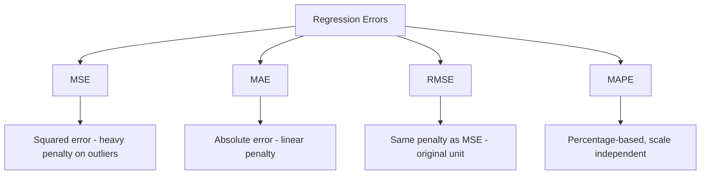

# Mean Squared Error (MSE) 

## What is MSE ? 

Mean Squared Error (MSE) is a **regression metric** that measures the **average of the squared differences** between predicted and actual values.

It answers the question:

**"On average, how large are the model's errors, with large errors weighted much more heavily?"**

Because each error is squared before averaging, MSE grows quadratically with the size of the error — a prediction that is off by 10 contributes **four times** more than a prediction that is off by 5. This makes MSE very sensitive to outliers, and its result is expressed in **squared units** of the target variable (e.g., dollars², °C²), which makes it harder to interpret directly than MAE.

---

## Components 

MSE is built from:

- **Actual value** ($y_i$) — the true value for sample $i$
- **Predicted value** ($\hat{y}_i$) — the model's output for sample $i$
- **Squared error** ($(y_i - \hat{y}_i)^2$) — the squared distance between actual and predicted
- **n** — the number of samples

### Formula

$$MSE = \frac{1}{n} \sum_{i=1}^{n} (y_i - \hat{y}_i)^2$$

- Low MSE → predictions are close to actual values
- High MSE → predictions deviate significantly from actual values, with large errors dominating the result

---

### How it Works 

```
Dataset
   ↓
Train / Validation Split
   ↓
Model Training
   ↓
Predictions
   ↓
Evaluation Metrics (MSE)
   ↓
Model Selection
```

### Step-by-step Example

1. Dataset

House price dataset (in thousands):

| House | Actual Price | Predicted Price |
| ----- | ------------ | ---------------- |
| A     | 300          | 280              |
| B     | 450          | 470              |
| C     | 200          | 210              |
| D     | 600          | 550              |

---

2. Squared Errors

| House | (Actual - Predicted)² |
| ----- | ----------------------- |
| A     | (300 - 280)² = 400      |
| B     | (450 - 470)² = 400      |
| C     | (200 - 210)² = 100      |
| D     | (600 - 550)² = 2500     |

---

Visually, each house's error is squared before being averaged — notice how House D's error (50) ends up dominating the total far more than in MAE, since it becomes 2500 instead of just 50:

```mermaid
xychart-beta
    title "Actual vs. Predicted House Prices ($ in thousands)"
    x-axis ["House A", "House B", "House C", "House D"]
    y-axis "Price" 150 --> 650
    bar "Actual" [300, 450, 200, 600]
    bar "Predicted" [280, 470, 210, 550]
```



*Squared errors per house — House A: 400, House B: 400, House C: 100, House D: 2500. MSE = (400 + 400 + 100 + 2500) / 4 = **850**.*

3. MSE Calculation

MSE = (400 + 400 + 100 + 2500) / 4

MSE = 3400 / 4

MSE = **850**

---

Interpretation:

On average, the model's squared error is **850 (thousand²)**. Notice that House D alone (2500) accounts for most of this total — MSE amplifies the effect of that single larger error far more than MAE did.

---

## Limitations and Alternatives 

### Limitations

- **Hard to interpret** — the result is in squared units (e.g., thousands²), which has no direct real-world meaning.
- **Very sensitive to outliers** — a single large error can dominate the metric, since errors are squared before averaging.
- **No error direction** — like MAE, MSE cannot tell if the model tends to over-predict or under-predict.
- **Scale-dependent** — cannot be meaningfully compared across datasets with different target scales.

### Alternatives

| Metric | Difference from MSE |
|--------|----------------------|
| MAE (Mean Absolute Error) | Penalizes all errors linearly, less sensitive to outliers |
| RMSE (Root Mean Squared Error) | Square root of MSE, brings the value back to the original unit |
| R² Score | Measures proportion of variance explained, independent of scale |
| MAPE (Mean Absolute Percentage Error) | Expresses error as a percentage, useful for comparing across scales |



Use MSE when large errors should be penalized much more heavily than small ones — e.g. when a big miss is disproportionately costly. Use MAE when all errors should be weighted equally, RMSE when you want that same sensitivity to large errors but back in the original unit, and MAPE when comparing performance across targets with different scales.
