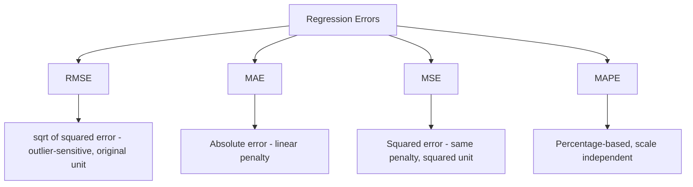

# Root Mean Squared Error (RMSE) 

## What is RMSE ? 

Root Mean Squared Error (RMSE) is a **regression metric** that takes the **square root of MSE**, bringing the error back to the **same unit as the target variable**.

It answers the question:

**"On average, how far off are the model's predictions — while still penalizing large errors more heavily?"**

RMSE keeps MSE's core behavior of squaring errors before averaging (so large errors are penalized more than small ones), but the final square root undoes the squared unit, making the result directly comparable to MAE and easy to interpret in the original scale (e.g., dollars, °C, days).

---

## Components 

RMSE is built from:

- **Actual value** ($y_i$) — the true value for sample $i$
- **Predicted value** ($\hat{y}_i$) — the model's output for sample $i$
- **Squared error** ($(y_i - \hat{y}_i)^2$) — the squared distance between actual and predicted
- **n** — the number of samples
- **Square root** — applied to the mean of the squared errors, to return to the original unit

### Formula

$$RMSE = \sqrt{\frac{1}{n} \sum_{i=1}^{n} (y_i - \hat{y}_i)^2} = \sqrt{MSE}$$

- Low RMSE → predictions are close to actual values
- High RMSE → predictions deviate significantly, with large errors weighing more than in MAE

---

### How it Works 

```
Dataset
   ↓
Train / Validation Split
   ↓
Model Training
   ↓
Predictions
   ↓
Evaluation Metrics (RMSE)
   ↓
Model Selection
```

### Step-by-step Example

1. Dataset

House price dataset (in thousands):

| House | Actual Price | Predicted Price |
| ----- | ------------ | ---------------- |
| A     | 300          | 280              |
| B     | 450          | 470              |
| C     | 200          | 210              |
| D     | 600          | 550              |

---

2. Squared Errors

| House | (Actual - Predicted)² |
| ----- | ----------------------- |
| A     | (300 - 280)² = 400      |
| B     | (450 - 470)² = 400      |
| C     | (200 - 210)² = 100      |
| D     | (600 - 550)² = 2500     |

---

Visually, RMSE starts from the same squared errors as MSE — House D's error still dominates the sum — but the final square root brings the result back into a price-like scale instead of a squared one:

```mermaid
xychart-beta
    title "Actual vs. Predicted House Prices ($ in thousands)"
    x-axis ["House A", "House B", "House C", "House D"]
    y-axis "Price" 150 --> 650
    bar "Actual" [300, 450, 200, 600]
    bar "Predicted" [280, 470, 210, 550]
```



*Squared errors per house — House A: 400, House B: 400, House C: 100, House D: 2500. MSE = (400 + 400 + 100 + 2500) / 4 = 850. RMSE = √850 ≈ **29.15**.*

3. RMSE Calculation

MSE = (400 + 400 + 100 + 2500) / 4 = 3400 / 4 = 850

RMSE = √850

RMSE ≈ **29.15**

---

Interpretation:

On average, the model's predictions are off by about **29.15 (thousand)** — a bit higher than MAE's 25, because RMSE still penalizes House D's larger error (50) more than the other three, even after taking the square root.

---

## Limitations and Alternatives 

### Limitations

- **Still sensitive to outliers** — although interpretable in the original unit, RMSE inherits MSE's tendency to be dominated by a few large errors.
- **No error direction** — cannot tell if the model tends to over-predict or under-predict.
- **Scale-dependent** — cannot be meaningfully compared across datasets with different target scales.
- **Always ≥ MAE** — for the same set of errors, RMSE is always greater than or equal to MAE, and the gap grows as errors become less uniform.

### Alternatives

| Metric | Difference from RMSE |
|--------|------------------------|
| MAE (Mean Absolute Error) | Penalizes all errors linearly, less sensitive to outliers |
| MSE (Mean Squared Error) | Same sensitivity to large errors, but stays in squared units |
| R² Score | Measures proportion of variance explained, independent of scale |
| MAPE (Mean Absolute Percentage Error) | Expresses error as a percentage, useful for comparing across scales |



Use RMSE when large errors should be penalized more heavily than small ones, but you still want the result expressed in the original unit for easier interpretation than MSE. Use MAE when all errors should be weighted equally, MSE when the squared-unit result itself is acceptable (e.g., as a loss function), and MAPE when comparing performance across targets with different scales.
