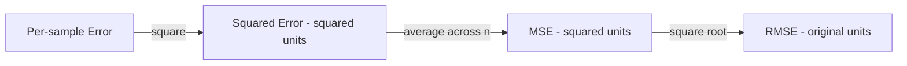
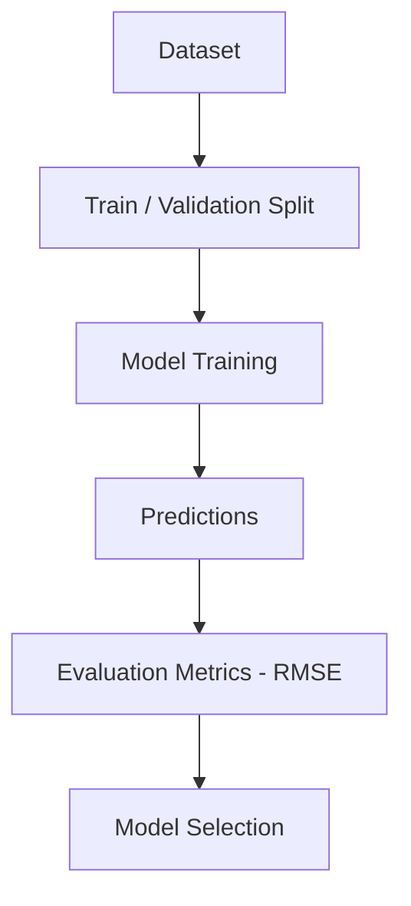
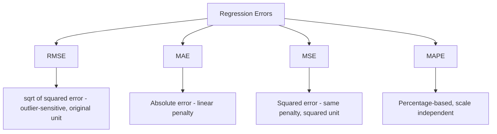

# Root Mean Squared Error (RMSE) 

## What is RMSE ? 

Root Mean Squared Error (RMSE) is a **regression metric** that takes the **square root of MSE**, bringing the error back to the **same unit as the target variable**.

It answers the question:

**"On average, how far off are the model's predictions — while still penalizing large errors more heavily?"**

RMSE keeps MSE's core behavior of squaring errors before averaging (so large errors are penalized more than small ones), but the final square root undoes the squared unit, making the result directly comparable to MAE and easy to interpret in the original scale (e.g., dollars, °C, days).

---

## Components 

RMSE is built from:

- **Actual value** ($y_i$) — the true value for sample $i$
- **Predicted value** ($\hat{y}_i$) — the model's output for sample $i$
- **Squared error**, $(y_i - \hat{y}_i)^2$ — the squared distance between actual and predicted
- **n** — the number of samples
- **Square root** — applied to the mean of the squared errors, to return to the original unit

### Formula

$$RMSE = \sqrt{\frac{1}{n} \sum_{i=1}^{n} (y_i - \hat{y}_i)^2} = \sqrt{MSE}$$

- Low RMSE → predictions are close to actual values
- High RMSE → predictions deviate significantly, with large errors weighing more than in MAE

### Score Interpretation Scale

RMSE is scale-dependent like MAE, so there is no universal band — but comparing it **against MAE on the same errors** gives a diagnostic that MAE alone can't:

| Comparison | Reading |
| ----------- | -------- |
| RMSE vs. the target's typical value or std | Same as MAE — no universal bands, judge relative to scale |
| RMSE vs. MAE (same errors) | RMSE ≈ MAE → errors are fairly uniform in size. RMSE much greater than MAE → a few large errors are inflating the metric |
| RMSE across model versions (same dataset, same units) | Directly comparable — lower is strictly better |
| RMSE across different datasets or units | Not comparable without normalizing first (e.g., NRMSE, MAPE) |

RMSE is mathematically guaranteed to be **greater than or equal to MAE** for the same set of errors — so the size of that gap is itself a signal about how uneven the errors are.

---

### The Round Trip: Error → Squared → Averaged → Square Root

Before the worked example, it helps to see RMSE as a pipeline rather than a single formula:

*Squaring inflates large errors more than small ones (MSE's whole point); the final square root doesn't undo that unequal penalty — it only undoes the **unit**, converting squared dollars back into dollars so the result reads like MAE.*

---

### How it Works 

### Step-by-step Example

1. Dataset

House price dataset (in thousands):

| House | Actual Price | Predicted Price |
| ----- | ------------ | ---------------- |
| A     | 300          | 280              |
| B     | 450          | 470              |
| C     | 200          | 210              |
| D     | 600          | 550              |

---

2. Squared Errors

| House | (Actual - Predicted)² |
| ----- | ----------------------- |
| A     | (300 - 280)² = 400      |
| B     | (450 - 470)² = 400      |
| C     | (200 - 210)² = 100      |
| D     | (600 - 550)² = 2500     |

---

Visually, RMSE starts from the same squared errors as MSE — House D's error still dominates the sum — but the final square root brings the result back into a price-like scale instead of a squared one:

```mermaid
xychart-beta
    title "Actual vs. Predicted House Prices ($ in thousands)"
    x-axis ["House A", "House B", "House C", "House D"]
    y-axis "Price" 150 --> 650
    bar "Actual" [300, 450, 200, 600]
    bar "Predicted" [280, 470, 210, 550]
```

*Squared errors per house — House A: 400, House B: 400, House C: 100, House D: 2500. MSE = (400 + 400 + 100 + 2500) / 4 = 850. RMSE = √850 ≈ **29.15**.*

3. RMSE Calculation

MSE = (400 + 400 + 100 + 2500) / 4 = 3400 / 4 = 850

RMSE = √850

RMSE ≈ **29.15**

---

Interpretation:

On average, the model's predictions are off by about **29.15 (thousand)** — a bit higher than MAE's 25, because RMSE still penalizes House D's larger error (50) more than the other three, even after taking the square root.

---

### Edge Case: Comparing All Three Metrics on the Same Outlier

The MAE and MSE docs both showed what happens when a fifth house, E, gets a badly wrong prediction (actual 300, predicted 100, error 200). Lining up all three metrics side by side shows how RMSE sits **between** MAE and MSE in how strongly it reacts:

| Metric | Without House E | With House E | Growth |
| ------- | ----------------- | -------------- | ------- |
| MAE | 25 | 60 | ≈ 2.4x |
| RMSE | 29.15 | √8680 ≈ 93.16 | ≈ 3.2x |
| MSE | 850 | 8680 | ≈ 10.2x |

RMSE grows faster than MAE (it still feels the outlier more) but far slower than MSE's raw squared-unit blow-up (the square root tames the extreme growth, without removing the outlier's extra weight). This is exactly the trade-off RMSE is designed for: outlier-aware like MSE, but readable in the original unit like MAE.

---

## Limitations and Alternatives 

### Limitations

| Limitation | Impact |
|------------|--------|
| **Still sensitive to outliers** — inherits MSE's squaring before the final square root | Robustness — a few large errors can still dominate the metric, as shown above |
| **No error direction** — cannot tell over-prediction from under-prediction | Diagnosis — same blind spot as MAE and MSE |
| **Scale-dependent** — meaningless without knowing the target's scale | Comparability — cannot be meaningfully compared across datasets with different target scales |
| **Always ≥ MAE** — for the same errors, RMSE never falls below MAE | Diagnostic — a wide RMSE-MAE gap signals uneven error sizes, per the interpretation table above |

### Alternatives

| Metric | Difference from RMSE |
|--------|------------------------|
| MAE (Mean Absolute Error) | Penalizes all errors linearly, less sensitive to outliers |
| MSE (Mean Squared Error) | Same sensitivity to large errors, but stays in squared units |
| R² Score | Measures proportion of variance explained, independent of scale |
| MAPE (Mean Absolute Percentage Error) | Expresses error as a percentage, useful for comparing across scales |

Use RMSE when large errors should be penalized more heavily than small ones, but you still want the result expressed in the original unit for easier interpretation than MSE. Use MAE when all errors should be weighted equally, MSE when the squared-unit result itself is acceptable (e.g., as a loss function), and MAPE when comparing performance across targets with different scales.
