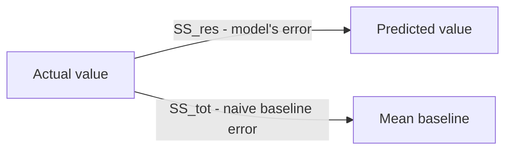
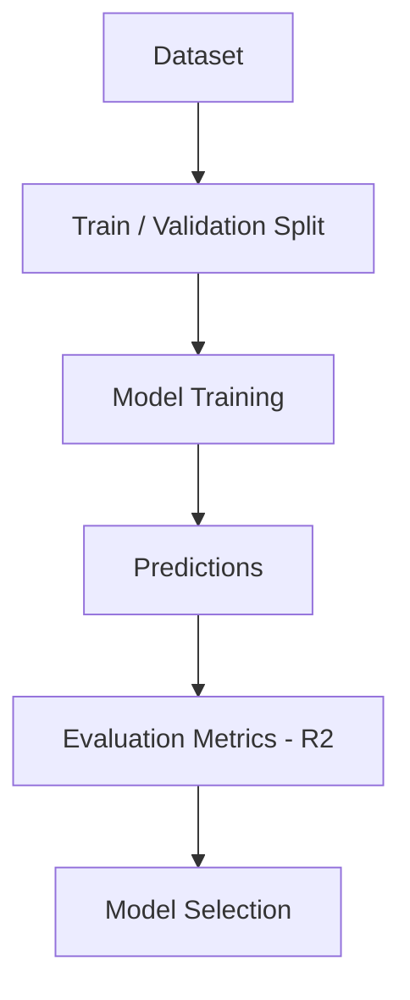
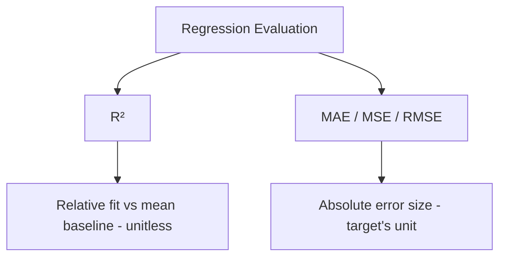

# R² Score (Coefficient of Determination) 

## What is R² Score ? 

R² Score (Coefficient of Determination) is a **regression metric** that measures **how much of the variance in the target variable is explained by the model**, compared to simply predicting the mean every time.

It answers the question:

**"How much better is the model than just guessing the average?"**

Unlike MAE, MSE, and RMSE — which are expressed in (or derived from) the target's unit — R² is a **unitless, relative score**, typically between 0 and 1 (it can go negative for a model worse than predicting the mean). This makes it useful for judging **overall fit quality** rather than the raw size of the errors.

---

## Components 

R² is built from:

- **Actual value** ($y_i$) — the true value for sample $i$
- **Predicted value** ($\hat{y}_i$) — the model's output for sample $i$
- **Mean of actual values** ($\bar{y}$) — the average of all actual values, used as the "naive" baseline prediction
- **SS_res (Residual Sum of Squares)** — $\sum (y_i - \hat{y}_i)^2$, the error the model actually makes (same numerator as MSE, before averaging)
- **SS_tot (Total Sum of Squares)** — $\sum (y_i - \bar{y})^2$, the error a model would make if it always predicted the mean

### Formula

$$R^2 = 1 - \frac{SS_{res}}{SS_{tot}} = 1 - \frac{\sum_{i=1}^{n} (y_i - \hat{y}_i)^2}{\sum_{i=1}^{n} (y_i - \bar{y})^2}$$

- R² = 1 → model predicts perfectly (SS_res = 0)
- R² = 0 → model performs the same as always predicting the mean
- R² < 0 → model performs worse than always predicting the mean

### Score Interpretation Scale

Unlike MAE, MSE, and RMSE, R² is unitless — so it's one of the few regression metrics that actually supports a general-purpose scale. What counts as "good" still shifts by domain (physical sciences often expect higher R² than social or behavioral data), but a common rough guide is:

| R² Range     | Interpretation |
| ------------- | --------------- |
| 0.9 – 1.0     | Excellent fit |
| 0.7 – 0.9     | Good fit |
| 0.5 – 0.7     | Moderate fit |
| 0.0 – 0.5     | Weak fit |
| < 0.0         | Worse than predicting the mean |

---

### SS_res vs. SS_tot — Visual Intuition

Before the worked example, it helps to see the two errors R² is actually comparing:

*SS_res is how wrong the model is. SS_tot is how wrong you'd be by always guessing the mean. R² is just "1 minus the ratio" of those two — the closer the model's error is to zero relative to the baseline's error, the closer R² gets to 1.*

---

### How it Works 

### Step-by-step Example

1. Dataset

House price dataset (in thousands):

| House | Actual Price | Predicted Price |
| ----- | ------------ | ---------------- |
| A     | 300          | 280              |
| B     | 450          | 470              |
| C     | 200          | 210              |
| D     | 600          | 550              |

---

2. Mean of Actual Values

$\bar{y}$ = (300 + 450 + 200 + 600) / 4 = 1550 / 4 = **387.5**

---

3. SS_res (model's squared errors — same as MSE's numerator)

| House | (Actual - Predicted)² |
| ----- | ----------------------- |
| A     | (300 - 280)² = 400      |
| B     | (450 - 470)² = 400      |
| C     | (200 - 210)² = 100      |
| D     | (600 - 550)² = 2500     |

SS_res = 400 + 400 + 100 + 2500 = **3400**

---

4. SS_tot (squared distance from the mean — the "guess the average" baseline)

| House | (Actual - Mean)² |
| ----- | ------------------- |
| A     | (300 - 387.5)² = 7656.25   |
| B     | (450 - 387.5)² = 3906.25   |
| C     | (200 - 387.5)² = 35156.25  |
| D     | (600 - 387.5)² = 45156.25  |

SS_tot = 7656.25 + 3906.25 + 35156.25 + 45156.25 = **91875**

---

Visually, R² compares the model's predictions (orange) against both the actual values (blue) and the flat "always predict the mean" baseline (dashed line at 387.5):

```mermaid
xychart-beta
    title "Actual vs. Predicted House Prices ($ in thousands)"
    x-axis ["House A", "House B", "House C", "House D"]
    y-axis "Price" 150 --> 650
    bar "Actual" [300, 450, 200, 600]
    bar "Predicted" [280, 470, 210, 550]
    line "Mean baseline (387.5)" [387.5, 387.5, 387.5, 387.5]
```

*SS_res (model's error) = 3400. SS_tot (mean-baseline's error) = 91875. R² = 1 - (3400 / 91875) ≈ **0.963**.*

5. R² Calculation

R² = 1 - (SS_res / SS_tot)

R² = 1 - (3400 / 91875)

R² = 1 - 0.037

R² ≈ **0.963**

---

Interpretation:

The model explains about **96.3% of the variance** in house prices — landing in the "excellent fit" band above, and a large improvement over always predicting the mean price (387.5), which would leave 100% of the variance ($SS_{tot}$) unexplained.

---

### Edge Case: A Negative R²

The example above is a strong model, so it's worth seeing what "worse than guessing the mean" actually looks like. Suppose a badly miscalibrated model just predicts **800** for every house, regardless of input:

| House | Actual | (Actual - 800)² |
| ----- | ------ | ------------------ |
| A     | 300    | (300 - 800)² = 250000 |
| B     | 450    | (450 - 800)² = 122500 |
| C     | 200    | (200 - 800)² = 360000 |
| D     | 600    | (600 - 800)² = 40000  |

SS_res = 250000 + 122500 + 360000 + 40000 = **772500**

SS_tot is unchanged (it only depends on the actual values): **91875**

R² = 1 - (772500 / 91875) = 1 - 8.41 = **-7.41**

A model this miscalibrated is far worse than simply guessing the mean price every time — the negative R² makes that failure explicit in a way MAE or RMSE alone would not (they'd just report a large but still "normal-looking" number).

---

## Limitations and Alternatives 

### Limitations

| Limitation | Impact |
|------------|--------|
| **Doesn't reveal error size or direction** — a high R² doesn't say whether the model is off by 1 or by 1,000 | Diagnosis — pair it with MAE/RMSE to know the real-world error size |
| **Can be misleadingly inflated with more predictors** — adding irrelevant features can never decrease R² in multiple regression | Model selection — use **Adjusted R²** to penalize unnecessary complexity |
| **Assumes a meaningful baseline mean** — for strongly multi-modal or non-central targets, the mean baseline may be uninformative | Applicability — R² can look artificially low or high depending on the target's distribution shape |
| **Can be negative** — a poorly generalizing model can score below 0 on unseen data | Interpretation — treat any negative score as "worse than the mean," not just "a low score" |
| **Not comparable across different datasets** — SS_tot depends on the target's own variance | Comparability — an R² of 0.9 on one dataset doesn't mean the model is as good as an R² of 0.9 on another |

### Alternatives

| Metric | Difference from R² |
|--------|------------------------|
| MAE (Mean Absolute Error) | Reports actual error size, in the target's unit, linear penalty |
| MSE (Mean Squared Error) | Reports actual error size, squared unit, penalizes large errors |
| RMSE (Root Mean Squared Error) | Same sensitivity as MSE, but back in the original unit |
| Adjusted R² | Same idea as R², but penalizes adding predictors that don't improve fit |

Use R² when you want a quick, unitless sense of **overall model fit** relative to a naive baseline. Use MAE, MSE, or RMSE alongside it when you also need to know **how large the errors actually are** in real-world terms — a model can have a high R² and still make errors too large for the use case.
