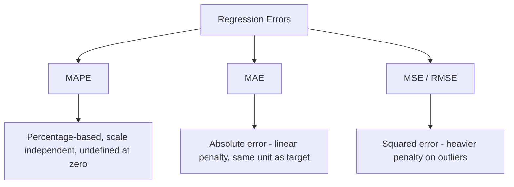

# Mean Absolute Percentage Error (MAPE) 

## What is MAPE ? 

Mean Absolute Percentage Error (MAPE) is a **regression metric** that measures the **average absolute error as a percentage of the actual value**, instead of in the target's raw unit.

It answers the question:

**"On average, by what percentage are the model's predictions off?"**

Because MAPE expresses error relative to the actual value, it is **scale-independent** — a MAPE of 6% means the same thing whether the target is prices in dollars, temperatures in °C, or units sold. This makes it especially useful for **comparing model performance across different datasets or targets**, which MAE, MSE, and RMSE cannot do directly.

---

## Components 

MAPE is built from:

- **Actual value** ($y_i$) — the true value for sample $i$
- **Predicted value** ($\hat{y}_i$) — the model's output for sample $i$
- **Absolute percentage error** ($\frac{|y_i - \hat{y}_i|}{|y_i|}$) — the absolute error scaled by the actual value
- **n** — the number of samples

### Formula

$$MAPE = \frac{100\%}{n} \sum_{i=1}^{n} \frac{|y_i - \hat{y}_i|}{|y_i|}$$

- Low MAPE → predictions are close to actual values, relative to their scale
- High MAPE → predictions deviate significantly, relative to their scale

---

### How it Works 

```
Dataset
   ↓
Train / Validation Split
   ↓
Model Training
   ↓
Predictions
   ↓
Evaluation Metrics (MAPE)
   ↓
Model Selection
```

### Step-by-step Example

1. Dataset

House price dataset (in thousands):

| House | Actual Price | Predicted Price |
| ----- | ------------ | ---------------- |
| A     | 300          | 280              |
| B     | 450          | 470              |
| C     | 200          | 210              |
| D     | 600          | 550              |

---

2. Absolute Percentage Errors

| House | \|Actual - Predicted\| / Actual |
| ----- | --------------------------------- |
| A     | 20 / 300 = 6.67%                  |
| B     | 20 / 450 = 4.44%                  |
| C     | 10 / 200 = 5.00%                  |
| D     | 50 / 600 = 8.33%                  |

---

Visually, the same absolute gaps from MAE (20, 20, 10, 50) turn into different percentages here, because each is divided by a different actual price — House C's smaller absolute error (10) becomes a *larger* percentage error than House B's (20), since House C's actual price is much lower:

```mermaid
xychart-beta
    title "Actual vs. Predicted House Prices ($ in thousands)"
    x-axis ["House A", "House B", "House C", "House D"]
    y-axis "Price" 150 --> 650
    bar "Actual" [300, 450, 200, 600]
    bar "Predicted" [280, 470, 210, 550]
```



*Percentage errors per house — House A: 6.67%, House B: 4.44%, House C: 5.00%, House D: 8.33%. MAPE = (6.67 + 4.44 + 5.00 + 8.33) / 4 ≈ **6.11%**.*

3. MAPE Calculation

MAPE = (6.67% + 4.44% + 5.00% + 8.33%) / 4

MAPE = 24.44% / 4

MAPE ≈ **6.11%**

---

Interpretation:

On average, the model's predictions are off by about **6.11%** of the actual house price — a relative measure that stays meaningful even if this dataset used a completely different price range.

---

## Limitations and Alternatives 

### Limitations

- **Undefined when actual values are zero** — dividing by $y_i = 0$ makes the metric explode or become undefined, so MAPE is unusable for targets that can be zero (e.g., forecasting demand that is sometimes 0 units).
- **Asymmetric penalty** — for the same absolute error, MAPE penalizes over-predictions (predicting too high) more than under-predictions, because the percentage is always computed relative to the actual value, not the predicted one.
- **Biased toward low-value samples** — as seen with House C above, small actual values inflate the percentage error even when the absolute error is small, which can skew the average.
- **No error direction** — like MAE, MAPE cannot tell if the model tends to over-predict or under-predict overall.

### Alternatives

| Metric | Difference from MAPE |
|--------|------------------------|
| MAE (Mean Absolute Error) | Reports absolute error in the target's unit, not relative to scale |
| MSE (Mean Squared Error) | Squares the errors, penalizing large errors more heavily |
| RMSE (Root Mean Squared Error) | Same sensitivity as MSE, but back in the original unit |
| R² Score | Measures proportion of variance explained, independent of scale |



Use MAPE when comparing model performance across datasets or targets with different scales, and when the target values are never zero or near zero. Use MAE, MSE, or RMSE when you need the error expressed in (or derived from) the target's actual unit instead of a percentage.
