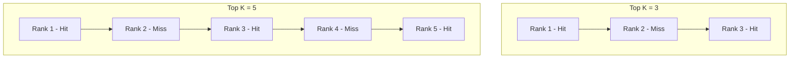
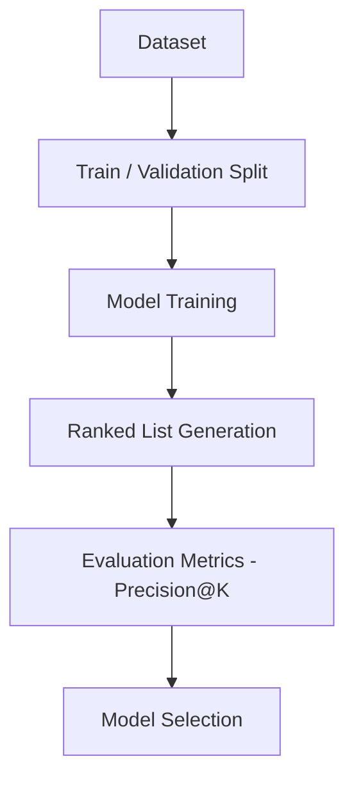
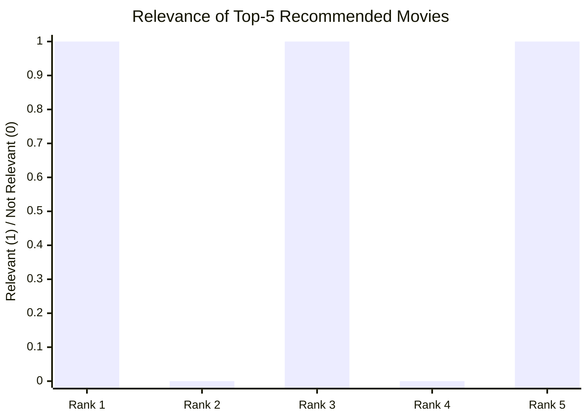
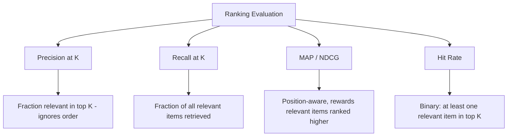

# Precision at K (Precision@K) 

## What is Precision@K ? 

Precision at K (Precision@K) is a **ranking metric** that measures the **proportion of relevant items among the top K results** returned by a model, such as a recommender system or a search engine.

It answers the question:

**"Out of the top K items I showed the user, how many were actually relevant?"**

Precision@K only looks at the top of the ranked list — it does not care how many relevant items exist in total, nor where inside the top K they landed. Because of this, it is easy to interpret: a Precision@5 of 0.6 means that, on average, **6 out of every 10 items** shown in the top 5 positions were relevant.

---

## Components 

Precision@K is built from:

- **Ranked list** — the ordered list of items a model returns for a query or a user (e.g., recommended movies, search results)
- **Relevance label** ($rel_i$) — a binary indicator for the item at rank $i$ (1 if relevant, 0 if not)
- **K** — the cutoff, i.e., how many top-ranked items are considered
- **Relevant items in top K** — the count of items among the top K that are actually relevant

### Formula

$$Precision@K = \frac{1}{K} \sum_{i=1}^{K} rel_i = \frac{\text{Number of relevant items in top K}}{K}$$

- High Precision@K → most of what was shown in the top K is relevant
- Low Precision@K → the top K is mostly noise, even if the model has some relevant items further down the list

### Score Interpretation Scale

Precision@K is bounded between 0 and 1, but unlike R² or MAPE, there's no universally cited scale — "good" depends heavily on K and how many relevant items even exist. What matters more is reading it correctly:

| Comparison | Reading |
| ----------- | -------- |
| Precision@K for two models, same K, same test set | Directly comparable — higher is better |
| Precision@K at different K values, same model | Not directly comparable — precision usually drops as K grows, since it gets harder to keep every extra slot relevant |
| Precision@K alone | Doesn't reveal how many relevant items were left out entirely — pair with Recall@K |
| Precision@1 vs. Precision@10 | Different questions: "was the very top result right?" vs. "was the whole visible page decent?" |

---

### Growing the Window K — Visual Intuition

Before the calculation, it helps to see how the *same* ranked list produces a different Precision@K as K grows:

*The same list scores Precision@3 = 2/3 ≈ 0.67, but Precision@5 = 3/5 = 0.6, once two more slots (one hit, one miss) are included. Widening K doesn't just add information — it changes the score itself.*

---

### How it Works 

### Step-by-step Example

1. Dataset

A movie recommender ranks 5 movies for a user. Ground truth relevance comes from what the user actually watched and liked:

| Rank | Movie   | Relevant? |
| ---- | ------- | --------- |
| 1    | Movie A | Yes (1)   |
| 2    | Movie B | No (0)    |
| 3    | Movie C | Yes (1)   |
| 4    | Movie D | No (0)    |
| 5    | Movie E | Yes (1)   |

---

2. Relevance at Each Rank

| Rank | Relevant? ($rel_i$) |
| ---- | -------------------- |
| 1    | 1                     |
| 2    | 0                     |
| 3    | 1                     |
| 4    | 0                     |
| 5    | 1                     |

---

Visually, each recommended slot either hits (relevant) or misses (not relevant) — Precision@K is just the fraction of hits among the top K slots:

*Each bar marks whether that ranked item was relevant — Rank 1: hit, Rank 2: miss, Rank 3: hit, Rank 4: miss, Rank 5: hit. Precision@5 = 3/5 = **0.6**.*

3. Precision@K Calculation

Precision@5 = (1 + 0 + 1 + 0 + 1) / 5

Precision@5 = 3 / 5

Precision@5 = **0.6** (60%)

---

Interpretation:

Out of the top 5 movies recommended to this user, **3 were relevant (60%)** — a solid, but not perfect, top-of-list experience.

---

### Edge Case: Same Precision@K, Very Different Coverage

The limitation that Precision@K "ignores total relevant items available" is easy to state but easy to miss in practice. Suppose two different users both get a Precision@5 of 0.6 (3 hits in their top 5) — but their catalogs of relevant items are wildly different sizes:

| User | Relevant items in top 5 | Total relevant items available | Precision@5 | Recall@5 |
| ---- | -------------------------- | ---------------------------------- | -------------- | ---------- |
| User 1 | 3 | 3 | 0.6 | 3 / 3 = **100%** |
| User 2 | 3 | 100 | 0.6 | 3 / 100 = **3%** |

Precision@5 alone reports the identical "0.6" for both — it cannot distinguish a user who has already seen everything relevant to them (User 1) from one who has 97 relevant items still buried in the list (User 2). This is exactly why Precision@K is normally reported alongside Recall@K, never alone.

---

## Limitations and Alternatives 

### Limitations

| Limitation | Impact |
|------------|--------|
| **Ignores position within top K** — a relevant item at Rank 1 counts the same as one at Rank 5 | Ranking quality — doesn't reward putting the best result first, unlike MAP or NDCG |
| **Sensitive to the choice of K** — Precision@3 and Precision@10 on the same list can differ a lot | Comparability — K must match the real use case (e.g., results visible without scrolling) |
| **Ignores total relevant items available** — as shown above, two very different situations can share the same score | Blind spot — always pair with Recall@K to know how much was left out |
| **Assumes binary relevance** — no native support for graded relevance (e.g., a 1–5 rating) | Applicability — only distinguishes "relevant" vs. "not relevant," unlike NDCG |

### Alternatives

| Metric | Difference from Precision@K |
|--------|------------------------------|
| Recall@K | Measures the fraction of *all* relevant items captured in the top K, instead of the precision of what was returned |
| MAP (Mean Average Precision) | Averages precision at each rank where a relevant item appears, rewarding relevant items placed higher |
| NDCG | Weighs relevant items by their position and supports graded (non-binary) relevance |
| Hit Rate | Checks only whether at least one relevant item appears in the top K, ignoring how many |

Use Precision@K when you care about the quality of exactly what is shown in the first K results and order within that window does not matter much. Use MAP or NDCG when the ranking order matters, and Recall@K or Hit Rate when coverage of the relevant items matters more than the precision of the top K.
