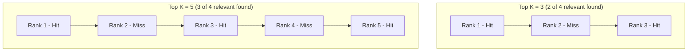
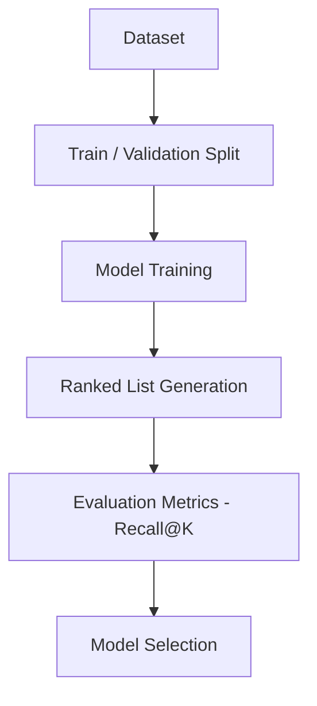
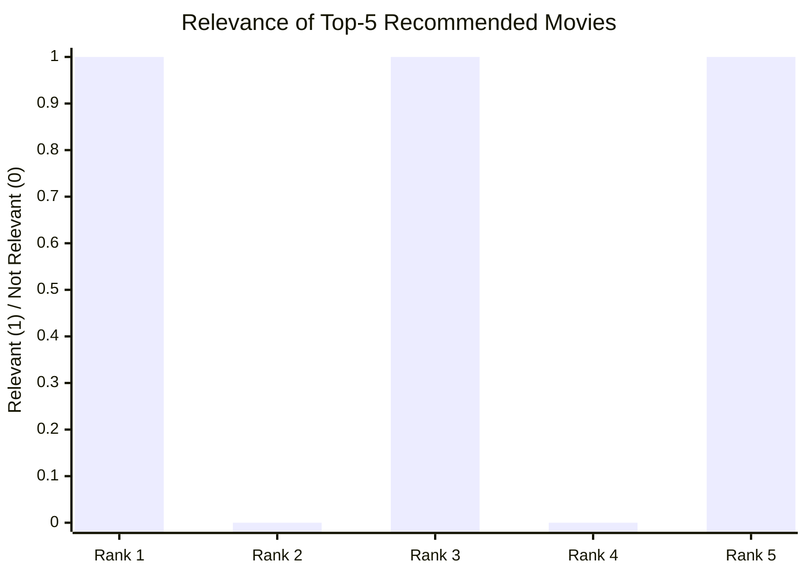
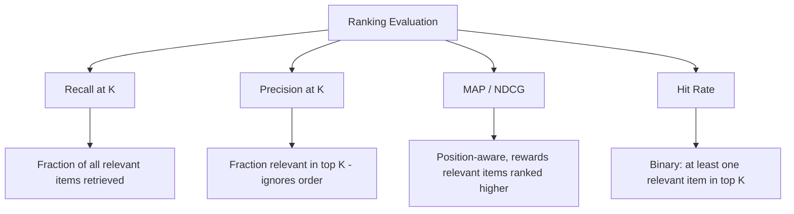

# Recall at K (Recall@K) 

## What is Recall@K ? 

Recall at K (Recall@K) is a **ranking metric** that measures the **proportion of all relevant items that were successfully captured within the top K results** returned by a model, such as a recommender system or a search engine.

It answers the question:

**"Out of all the items that were actually relevant, how many did I manage to surface in the top K?"**

Unlike [[01.precision_at_k]], which only looks at the quality of the top K slots, Recall@K looks at **coverage** — it does not care how much "noise" is mixed into the top K, only how much of the full set of relevant items made it in. Because of this, it is easy to interpret: a Recall@5 of 0.75 means that, on average, **3 out of every 4 relevant items** were found within the top 5 results.

---

## Components 

Recall@K is built from:

- **Ranked list** — the ordered list of items a model returns for a query or a user (e.g., recommended movies, search results)
- **Relevance label** ($rel_i$) — a binary indicator for the item at rank $i$ (1 if relevant, 0 if not)
- **K** — the cutoff, i.e., how many top-ranked items are considered
- **Total relevant items** ($|R|$) — the total number of relevant items that exist for this query or user, whether they were returned or not

### Formula

$$Recall@K = \frac{1}{|R|} \sum_{i=1}^{K} rel_i = \frac{\text{Number of relevant items in top K}}{\text{Total number of relevant items}}$$

- High Recall@K → most of the relevant items available were surfaced in the top K
- Low Recall@K → many relevant items were left out of the top K, even if the ones shown were mostly correct

### Score Interpretation Scale

Like [[01.precision_at_k]], Recall@K is bounded between 0 and 1 with no universal "good" threshold — but it has one property Precision@K doesn't: it can only go up or stay flat as K grows, never down.

| Comparison | Reading |
| ----------- | -------- |
| Recall@K for two models, same K, same test set | Directly comparable — higher is better |
| Recall@K at different K values, same model | Monotonically non-decreasing — it trivially reaches 1.0 once K covers the whole catalog |
| Recall@K alone | Doesn't reveal how much noise is mixed into the top K — pair with Precision@K |
| Recall@1 vs. Recall@50 | Different questions: "did we nail the single best item?" vs. "did we eventually surface everything relevant, somewhere in a long list?" |

---

### Growing the Window K — Visual Intuition

The same "widening K" idea from Precision@K applies here, but recall moves in the opposite direction:

*Recall@3 = 2/4 = 0.5, Recall@5 = 3/4 = 0.75 — widening K can only help or hold steady here, never hurt, which is the opposite of how Precision@K behaved with the same list.*

---

### How it Works 

### Step-by-step Example

1. Dataset

The same movie recommender ranks 5 movies for a user. This time we also know the **full set of relevant movies** for that user, including ones that never made it into the top 5:

| Rank | Movie   | Relevant? |
| ---- | ------- | --------- |
| 1    | Movie A | Yes (1)   |
| 2    | Movie B | No (0)    |
| 3    | Movie C | Yes (1)   |
| 4    | Movie D | No (0)    |
| 5    | Movie E | Yes (1)   |
| —    | Movie F | Yes (1) — relevant, but **not** in the top 5 |

Total relevant movies for this user: **A, C, E, F → 4 relevant movies**

---

2. Relevance at Each Rank (Top 5 Only)

| Rank | Relevant? ($rel_i$) |
| ---- | -------------------- |
| 1    | 1                     |
| 2    | 0                     |
| 3    | 1                     |
| 4    | 0                     |
| 5    | 1                     |

---

Visually, Recall@K asks how many of the "yes" bars from the *entire* relevant set were captured in the top K window, instead of just measuring the hit rate inside that window:

*Each bar marks whether that ranked item was relevant — Rank 1: hit, Rank 2: miss, Rank 3: hit, Rank 4: miss, Rank 5: hit. 3 relevant items were captured in the top 5, but Movie F (also relevant) was missed. Recall@5 = 3/4 = **0.75**.*

3. Recall@K Calculation

Recall@5 = (1 + 0 + 1 + 0 + 1) / 4

Recall@5 = 3 / 4

Recall@5 = **0.75** (75%)

---

Interpretation:

Out of the **4 movies this user actually found relevant**, the recommender surfaced **3 of them (75%)** within the top 5 — Movie F was relevant but got missed entirely.

---

### Edge Case: "Perfect" Recall by Returning Everything

The limitation that Recall@K "ignores precision" is easy to state abstractly, but stark once you see the numbers. Suppose this user's whole catalog only has 20 movies, and the recommender is changed to just return **all 20** instead of a curated top 5:

| K | Items shown | Relevant found | Recall@K | Precision@K |
| - | -------------- | ------------------ | ---------- | -------------- |
| 5  | 5  | 3 | 0.75 | 3/5 = 0.6 |
| 20 | 20 | 4 | **1.0** | 4/20 = **0.2** |

Recall@20 hits a "perfect" 1.0 — every relevant movie is technically in the list — but Precision@20 collapses to 0.2, since 16 of the 20 shown movies are irrelevant noise. Recall@K alone can't tell the difference between "a great recommender" and "a recommender that just shows everything," which is exactly why it's read together with Precision@K, never alone.

---

## Limitations and Alternatives 

### Limitations

| Limitation | Impact |
|------------|--------|
| **Requires knowing the full relevant set** — needs the total relevant count (\|R\|), which is often incomplete or unknown in real systems | Applicability — a user may like items they never saw or rated, making that total an estimate at best |
| **Ignores precision** — perfect recall is trivial if K covers the whole catalog | Blind spot — as shown above, always pair with Precision@K |
| **Ignores position within top K** — a relevant item at Rank 1 counts the same as one at Rank 5 | Ranking quality — doesn't reward putting the best result first, unlike MAP or NDCG |
| **Sensitive to the choice of K** — Recall@3 and Recall@10 on the same list can differ substantially | Comparability — K should match the real use case |

### Alternatives

| Metric | Difference from Recall@K |
|--------|----------------------------|
| Precision@K | Measures how much of the top K is relevant, instead of how much of all relevant items were captured |
| MAP (Mean Average Precision) | Averages precision at each rank where a relevant item appears, rewarding relevant items placed higher |
| NDCG | Weighs relevant items by their position and supports graded (non-binary) relevance |
| Hit Rate | Checks only whether at least one relevant item appears in the top K, ignoring how many or how complete the coverage is |

Use Recall@K when missing relevant items is costly and you need to know how much of the relevant set was covered, such as in medical or legal document retrieval. Use Precision@K when the quality of exactly what is shown matters more than completeness, and MAP or NDCG when the ranking order itself needs to be rewarded.
