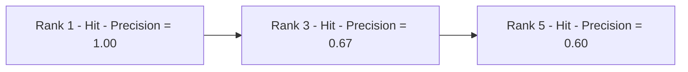
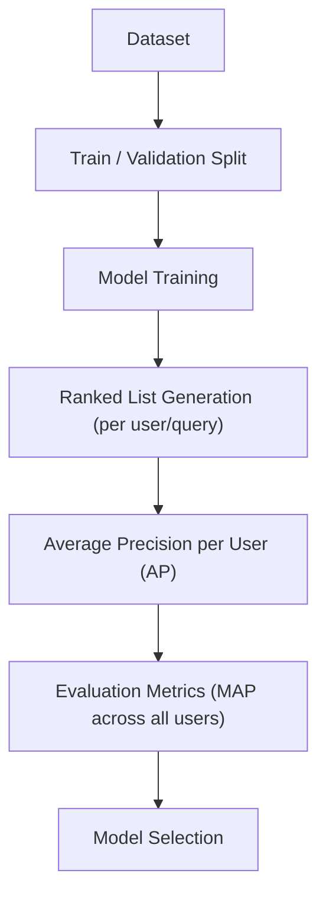
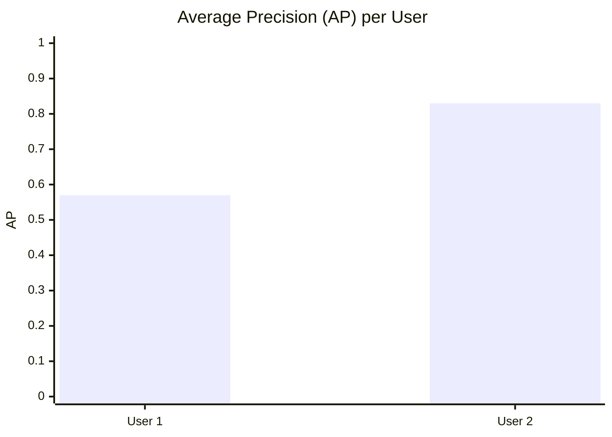
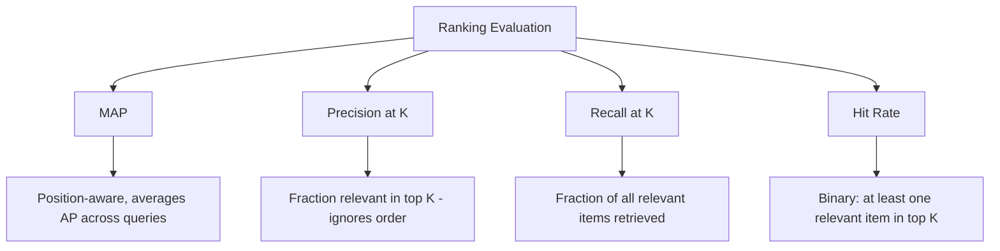

# Mean Average Precision (MAP) 

## What is MAP ? 

Mean Average Precision (MAP) is a **ranking metric** that measures the **average quality of ranked lists across multiple queries or users**, rewarding models that place relevant items **earlier** in each list.

It answers the question:

**"Across all my users, how good is the ranking — not just what's relevant, but where does it show up?"**

MAP first computes an **Average Precision (AP)** score for each individual ranked list (each query or each user), then averages those AP scores across all of them. Unlike [[01.precision_at_k]] and [[02.recall_at_k]], which only look at a single fixed cutoff K, AP looks at **every rank position where a relevant item appears**, so it naturally rewards a model for ranking relevant items higher.

---

## Components 

MAP is built from:

- **Ranked list** — the ordered list of items a model returns for a query or a user (e.g., recommended movies, search results)
- **Relevance label** ($rel_k$) — a binary indicator for the item at rank $k$ (1 if relevant, 0 if not)
- **Precision@k** — the precision computed at each rank $k$ where a relevant item occurs
- **Total relevant items** ($|R|$) — the total number of relevant items that exist for that query, whether they were returned or not
- **Q** — the total number of queries or users being evaluated

### Formula

$$AP = \frac{1}{|R|} \sum_{k=1}^{n} Precision@k \times rel_k$$

$$MAP = \frac{1}{Q} \sum_{q=1}^{Q} AP_q$$

- High MAP → across users, relevant items tend to be ranked near the top of the list
- Low MAP → relevant items are either missing entirely or buried deep in the ranking

### Score Interpretation Scale

MAP is bounded between 0 and 1 like Precision@K and Recall@K, and just as with those metrics, there's no universal "good" threshold — it depends on the task and how many relevant items typically exist. What matters more is reading it correctly:

| Comparison | Reading |
| ----------- | -------- |
| MAP for two models, same set of queries | Directly comparable — higher is better |
| MAP vs. the spread of AP scores behind it | A single MAP hides per-query variance — see the edge case below |
| MAP alone | Doesn't say whether relevant items were merely *present* or *ranked early* within the hits — check individual AP curves for that |
| MAP vs. Precision@K / Recall@K | Different question: "how well-ranked overall, across many users?" vs. "how good is one fixed top-K window?" |

---

### Building AP from a Single List — Visual Intuition

Before averaging across users, it helps to see how one user's AP is actually assembled — only the ranks with a relevant **hit** contribute a precision value:

*Misses (Rank 2, Rank 4) contribute nothing to the sum, but they still lengthen the list, which is why later hits carry a lower Precision@k. Dividing by the full relevant count (4, not just the 3 hits) is what penalizes the model for the relevant movie it missed entirely (Movie F).*

---

### How it Works 

### Step-by-step Example

1. Dataset — User 1

The same movie recommender ranks 5 movies for User 1. Total relevant movies for this user is 4 (A, C, E, F), but Movie F never makes it into the top 5:

| Rank | Movie   | Relevant? | Precision@Rank |
| ---- | ------- | --------- | ---------------- |
| 1    | Movie A | Yes (1)   | 1/1 = 1.00        |
| 2    | Movie B | No (0)    | —                 |
| 3    | Movie C | Yes (1)   | 2/3 = 0.67        |
| 4    | Movie D | No (0)    | —                 |
| 5    | Movie E | Yes (1)   | 3/5 = 0.60        |

$AP_1 = \frac{1.00 + 0.67 + 0.60}{4} = \frac{2.27}{4} = 0.57$

*Note: the sum is divided by $|R| = 4$ (all relevant movies for this user), not just the 3 that were retrieved — this is what penalizes the model for missing Movie F.*

---

2. Dataset — User 2

The same model ranks 3 movies for User 2. Total relevant movies for this user is 2 (X and Z), and both are retrieved:

| Rank | Movie   | Relevant? | Precision@Rank |
| ---- | ------- | --------- | ---------------- |
| 1    | Movie X | Yes (1)   | 1/1 = 1.00        |
| 2    | Movie Y | No (0)    | —                 |
| 3    | Movie Z | Yes (1)   | 2/3 = 0.67        |

$AP_2 = \frac{1.00 + 0.67}{2} = \frac{1.67}{2} = 0.83$

---

Visually, MAP is just the average height of each user's AP bar — User 1's missed relevant item (Movie F) pulls their bar down, while User 2's fully-retrieved relevant set keeps theirs high:

*User 1: AP = 0.57 (missed one relevant movie). User 2: AP = 0.83 (retrieved every relevant movie, ranked early). MAP = (0.57 + 0.83) / 2 = **0.70**.*

3. MAP Calculation

MAP = (AP₁ + AP₂) / 2

MAP = (0.57 + 0.83) / 2

MAP = **0.70**

---

Interpretation:

Across these two users, the recommender achieves a **MAP of 0.70** — relevant movies tend to be ranked early, but the missed item for User 1 shows there is still room to improve coverage.

---

### Edge Case: Same MAP, Very Different Experiences

The limitation that MAP "averages away per-query variance" sounds abstract until you see two very different systems land on the identical score. Compare the worked example above against a hypothetical System B, evaluated on two different users:

| System | User 1 AP | User 2 AP | MAP |
| ------- | ----------- | ----------- | ----- |
| A (worked example) | 0.57 | 0.83 | (0.57 + 0.83) / 2 = **0.70** |
| B (hypothetical) | 1.00 (perfect) | 0.40 (poor) | (1.00 + 0.40) / 2 = **0.70** |

Both systems report the exact same MAP of 0.70, but System A gives every user a moderately good experience, while System B delights one user and disappoints the other. MAP cannot tell these apart on its own — it's why production systems usually also look at the distribution of AP scores, not just their mean.

---

## Limitations and Alternatives 

### Limitations

| Limitation | Impact |
|------------|--------|
| **Assumes binary relevance** — treats an item as either relevant or not | Applicability — no native support for graded relevance (e.g., a 1–5 rating), unlike NDCG |
| **Requires knowing the full relevant set** — computing AP needs the total relevant count per query | Applicability — often incomplete or unknown in real systems |
| **Averages away per-query variance** — very different score distributions can share one MAP | Blind spot — as shown above, always check the underlying AP spread, not just the mean |
| **Harder to explain to non-technical stakeholders** — "average of average precisions" is less intuitive than a simple ratio | Communication — Precision@K or Recall@K are easier to justify to a non-technical audience |

### Alternatives

| Metric | Difference from MAP |
|--------|-----------------------|
| Precision@K | Looks only at a single fixed cutoff K, ignoring where relevant items rank inside it |
| Recall@K | Measures coverage of relevant items at a fixed cutoff K, not position-weighted quality |
| NDCG | Also rewards higher-ranked relevant items, but supports graded (non-binary) relevance and uses a logarithmic position discount |
| Hit Rate | Checks only whether at least one relevant item appears in the top K, ignoring rank position entirely |

Use MAP when the position of relevant items across many queries or users matters and you need a single comparable score for model selection. Use Precision@K or Recall@K when a fixed cutoff is more meaningful for the product (e.g., "the first page of results"), and NDCG when relevance is graded rather than binary.
