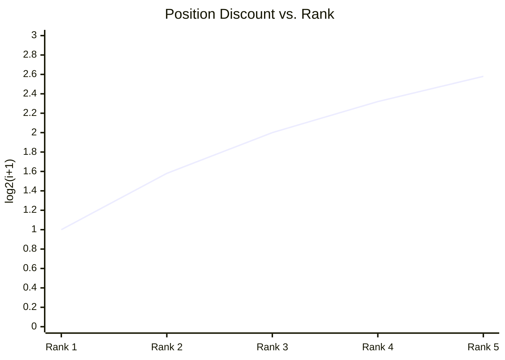
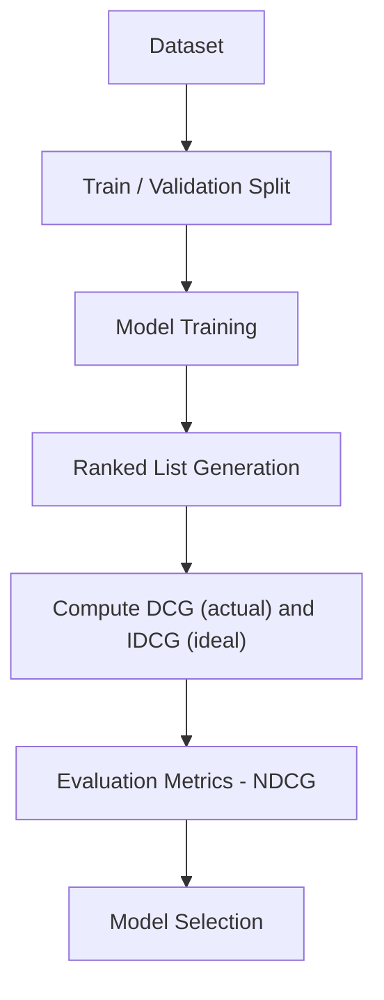
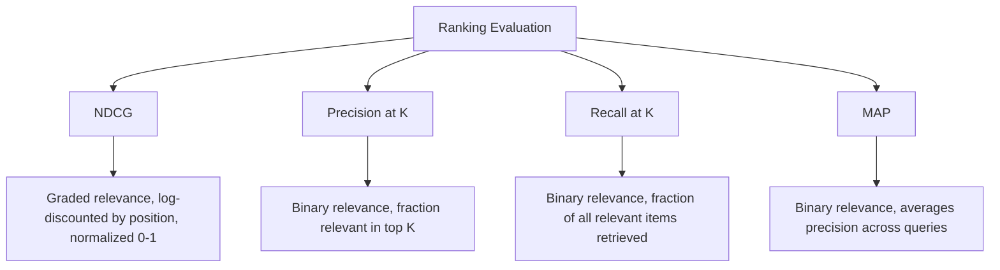

# Normalized Discounted Cumulative Gain (NDCG) 

## What is NDCG ? 

Normalized Discounted Cumulative Gain (NDCG) is a **ranking metric** that measures **how good a ranked list is compared to the best possible ordering**, while supporting **graded relevance** (not just relevant/not relevant) and rewarding relevant items that appear **earlier** in the list.

It answers the question:

**"How close is my ranking to the ideal ranking, given that some items are more relevant than others?"**

Unlike [[01.precision_at_k]], [[02.recall_at_k]], and [[03.map]], which treat relevance as binary, NDCG works with **graded relevance scores** (e.g., 0 = not relevant, 1 = somewhat relevant, 2 = highly relevant). It discounts the contribution of each item by its rank position using a logarithmic factor, then normalizes against the best possible arrangement of the same items — the **Ideal DCG (IDCG)** — so the final score always falls between 0 and 1.

---

## Components 

NDCG is built from:

- **Ranked list** — the ordered list of items a model returns for a query or a user (e.g., recommended movies, search results)
- **Relevance grade** ($rel_i$) — a graded relevance score for the item at rank $i$ (e.g., 0, 1, or 2), instead of a strict yes/no label
- **Position discount** ($\log_2(i+1)$) — a factor that shrinks the contribution of items the deeper they appear in the ranking
- **DCG (Discounted Cumulative Gain)** — the sum of discounted relevance for the model's actual ranking
- **IDCG (Ideal DCG)** — the DCG of the best possible ranking, where items are sorted by relevance in descending order

### Formula

$$DCG@K = \sum_{i=1}^{K} \frac{rel_i}{\log_2(i+1)}$$

$$NDCG@K = \frac{DCG@K}{IDCG@K}$$

- NDCG close to 1 → the model's ranking is close to the best possible ordering of these items
- NDCG close to 0 → highly relevant items are ranked poorly, or missing altogether

### Score Interpretation Scale

Because NDCG is normalized against the best possible ordering of the *same* items, it's one of the few ranking metrics — alongside R² and MAPE in the regression set — that supports a genuine general-purpose scale:

| NDCG Range   | Interpretation |
| ------------- | --------------- |
| 0.9 – 1.0     | Excellent — ranking nearly matches the ideal order |
| 0.7 – 0.9     | Good — minor position losses |
| 0.5 – 0.7     | Moderate — noticeable reordering losses |
| < 0.5         | Poor — relevant items poorly positioned or missing |

---

### The Position Discount Curve — Visual Intuition

Before the worked example, it helps to see why *where* an item lands matters as much as *how relevant* it is:

*Every unit of relevance gets divided by this growing number, so the same relevance grade is worth less and less the deeper it appears. This is the mechanism behind "rewarding relevant items that appear earlier" — it isn't a bonus tacked on, it's built directly into the denominator.*

---

### How it Works 

### Step-by-step Example

1. Dataset

The same movie recommender ranks 5 movies for a user, but this time relevance is **graded** (0 = not relevant, 1 = somewhat relevant, 2 = highly relevant) instead of binary:

| Rank | Movie   | Relevance Grade | Discount ($\log_2(i+1)$) | Discounted Gain |
| ---- | ------- | ----------------- | --------------------------- | ------------------ |
| 1    | Movie A | 2                  | $\log_2(2) = 1.00$          | 2 / 1.00 = 2.00     |
| 2    | Movie B | 0                  | $\log_2(3) = 1.58$          | 0 / 1.58 = 0.00     |
| 3    | Movie C | 1                  | $\log_2(4) = 2.00$          | 1 / 2.00 = 0.50     |
| 4    | Movie D | 0                  | $\log_2(5) = 2.32$          | 0 / 2.32 = 0.00     |
| 5    | Movie E | 2                  | $\log_2(6) = 2.58$          | 2 / 2.58 = 0.77     |

$DCG@5 = 2.00 + 0.00 + 0.50 + 0.00 + 0.77 = 3.27$

---

2. Ideal Ranking (for IDCG)

The best possible ordering sorts the same relevance grades from highest to lowest: **2, 2, 1, 0, 0** (Movie A, Movie E, Movie C, then the two irrelevant ones):

| Rank | Relevance Grade | Discount ($\log_2(i+1)$) | Discounted Gain |
| ---- | ----------------- | --------------------------- | ------------------ |
| 1    | 2                  | $\log_2(2) = 1.00$          | 2 / 1.00 = 2.00     |
| 2    | 2                  | $\log_2(3) = 1.58$          | 2 / 1.58 = 1.26     |
| 3    | 1                  | $\log_2(4) = 2.00$          | 1 / 2.00 = 0.50     |
| 4    | 0                  | $\log_2(5) = 2.32$          | 0 / 2.32 = 0.00     |
| 5    | 0                  | $\log_2(6) = 2.58$          | 0 / 2.58 = 0.00     |

$IDCG@5 = 2.00 + 1.26 + 0.50 + 0.00 + 0.00 = 3.76$

---

Then

| Rank | Discount ($\log_2(i+1)$) | Actual Movie | Actual Grade | Actual Gain | Ideal Grade | Ideal Gain |
| ---- | --------------------------- | -------------- | -------------- | -------------- | -------------- | -------------- |
| 1    | $\log_2(2) = 1.00$          | Movie A         | 2               | 2 / 1.00 = 2.00 | 2               | 2 / 1.00 = 2.00 |
| 2    | $\log_2(3) = 1.58$          | Movie B         | 0               | 0 / 1.58 = 0.00 | 2               | 2 / 1.58 = 1.26 |
| 3    | $\log_2(4) = 2.00$          | Movie C         | 1               | 1 / 2.00 = 0.50 | 1               | 1 / 2.00 = 0.50 |
| 4    | $\log_2(5) = 2.32$          | Movie D         | 0               | 0 / 2.32 = 0.00 | 0               | 0 / 2.32 = 0.00 |
| 5    | $\log_2(6) = 2.58$          | Movie E         | 2               | 2 / 2.58 = 0.77 | 0               | 0 / 2.58 = 0.00 |

$DCG@5 = 2.00 + 0.00 + 0.50 + 0.00 + 0.77 = 3.27$

$IDCG@5 = 2.00 + 1.26 + 0.50 + 0.00 + 0.00 = 3.76$

Reading across Rank 2 shows exactly where the two rankings diverge: the actual ranking places a not-relevant movie there (gain 0.00), while the ideal ranking would place the second highly-relevant movie there (gain 1.26) — that single row accounts for almost the entire gap between DCG and IDCG.

---

Visually, the gap between the "Actual" bars and the "Ideal" bars shows exactly where the ranking loses value — here, Movie E (grade 2) was pushed down to Rank 5 instead of Rank 2, so its gain gets discounted much more heavily than it should:

```mermaid
xychart-beta
    title "Discounted Gain: Actual Ranking vs. Ideal Ranking"
    x-axis ["Rank 1", "Rank 2", "Rank 3", "Rank 4", "Rank 5"]
    y-axis "Discounted Gain" 0 --> 2.5
    bar "Actual" [2.00, 0.00, 0.50, 0.00, 0.77]
    bar "Ideal" [2.00, 1.26, 0.50, 0.00, 0.00]
```

*Rank 1 and Rank 3 already match the ideal gain. Rank 2's gap (0.00 vs. 1.26) is the cost of Movie E being ranked 5th instead of 2nd. NDCG@5 = 3.27 / 3.76 = **0.87**.*

3. NDCG Calculation

NDCG@5 = DCG@5 / IDCG@5

NDCG@5 = 3.27 / 3.76

NDCG@5 = **0.87**

---

Interpretation:

The model's ranking achieves **87% of the maximum possible discounted gain** for this user — landing in the "good" band above, close to ideal, but losing some value by ranking a highly relevant movie (Movie E) later than it should have.

---

### Edge Case: The Worst-Case Ordering

The example above is only mildly out of order, so it's worth seeing what happens with the *same five relevance grades* (2, 0, 1, 0, 2) arranged as badly as possible — worst-first instead of best-first: **0, 0, 1, 2, 2**:

| Rank | Relevance Grade | Discount ($\log_2(i+1)$) | Discounted Gain |
| ---- | ----------------- | --------------------------- | ------------------ |
| 1    | 0                  | $\log_2(2) = 1.00$          | 0 / 1.00 = 0.00     |
| 2    | 0                  | $\log_2(3) = 1.58$          | 0 / 1.58 = 0.00     |
| 3    | 1                  | $\log_2(4) = 2.00$          | 1 / 2.00 = 0.50     |
| 4    | 2                  | $\log_2(5) = 2.32$          | 2 / 2.32 = 0.86     |
| 5    | 2                  | $\log_2(6) = 2.58$          | 2 / 2.58 = 0.78     |

$DCG_{worst}@5 = 0.00 + 0.00 + 0.50 + 0.86 + 0.78 = 2.14$

NDCG@5 (worst case) = 2.14 / 3.76 = **0.57**

Even in the worst possible arrangement of these exact same items, NDCG doesn't collapse to 0 — it lands at 0.57 ("moderate"), because both highly-relevant movies are still present in the top 5, just badly positioned. NDCG punishes bad ordering, but being present at all still counts for something; a truly 0 score would require the relevant items to be missing from the list entirely.

---

## Limitations and Alternatives 

### Limitations

| Limitation | Impact |
|------------|--------|
| **Requires graded relevance judgments** — reliable graded labels (e.g., 0–2 or 0–5 scales) cost more to collect than binary labels | Applicability — more expensive to set up than Precision@K, Recall@K, or MAP |
| **The log discount is a modeling choice** — $\log_2(i+1)$ is a convention, not a law | Sensitivity — different discount functions can produce different rankings of model quality |
| **Needs the ideal ranking to normalize** — IDCG requires knowing every item's true relevance grade in advance | Applicability — may be incomplete or unknown in production settings |
| **Less intuitive to explain** — "normalized discounted cumulative gain" is a mouthful | Communication — harder to justify to stakeholders than a plain ratio like Precision@K |

### Alternatives

| Metric | Difference from NDCG |
|--------|-------------------------|
| Precision@K | Uses binary relevance and a fixed cutoff, ignoring both grading and position discount |
| Recall@K | Measures coverage of relevant items at a fixed cutoff, not position-weighted graded quality |
| MAP | Also position-aware and averages across queries, but assumes binary relevance instead of graded |
| Hit Rate | Checks only whether at least one relevant item appears in the top K, ignoring grading and position entirely |

Use NDCG when relevance is graded rather than binary and the exact rank position of each item matters (e.g., search engines, ad ranking). Use Precision@K, Recall@K, or MAP when relevance is naturally binary and a simpler, more explainable score is preferred.
