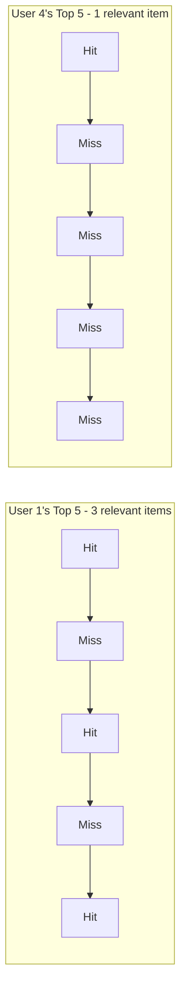
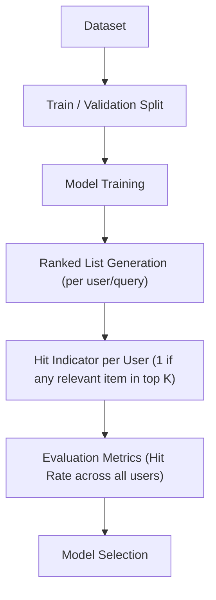
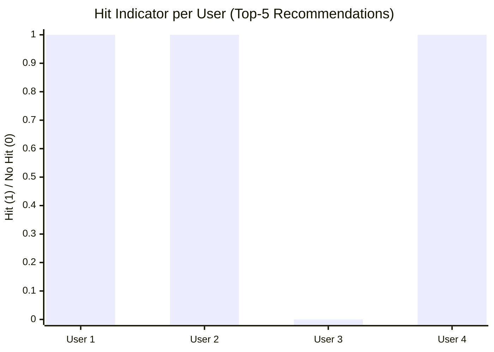
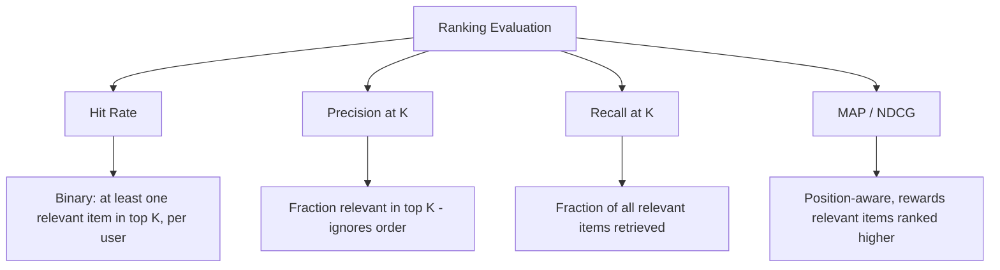

# Hit Rate 

## What is Hit Rate ? 

Hit Rate (often written as Hit Rate@K) is a **ranking metric** that measures the **proportion of users or queries for which at least one relevant item appears in the top K results**, across many users or queries.

It answers the question:

**"For how many of my users did I get at least one relevant recommendation right?"**

Hit Rate is the simplest ranking metric of the group — it does not care how many relevant items were found, where they landed, or how relevant they were, only whether the top K results contained **at least one** relevant item. Because of this, it is very easy to interpret: a Hit Rate of 0.75 means that **3 out of every 4 users** got at least one useful recommendation in their top K.

---

## Components 

Hit Rate is built from:

- **Ranked list** — the ordered list of items a model returns for a query or a user (e.g., recommended movies, search results)
- **Relevance label** ($rel_i$) — a binary indicator for the item at rank $i$ (1 if relevant, 0 if not)
- **K** — the cutoff, i.e., how many top-ranked items are considered
- **Hit indicator** ($hit_u$) — 1 if user $u$'s top K contains at least one relevant item, 0 otherwise
- **U** — the total number of users or queries being evaluated

### Formula

$$hit_u = \begin{cases} 1, & \text{if at least one relevant item is in top K for user } u \\ 0, & \text{otherwise} \end{cases}$$

$$HitRate@K = \frac{1}{U} \sum_{u=1}^{U} hit_u$$

- High Hit Rate → most users find at least one relevant item within the top K
- Low Hit Rate → many users get a top K with no relevant items at all

### Score Interpretation Scale

Hit Rate is bounded between 0 and 1, but like Precision@K and Recall@K, there's no universal "good" threshold — and it's especially sensitive to K, since a bigger K makes a lucky hit more likely. Read it with that in mind:

| Comparison | Reading |
| ----------- | -------- |
| Hit Rate for two models, same K, same users | Directly comparable — higher is better |
| Hit Rate at different K values | Not directly comparable — it rises (or holds) as K grows, since more slots make a hit more likely on their own |
| Hit Rate alone | Doesn't reveal how many relevant items were found or where — pair with Precision@K, Recall@K, or MAP |
| Hit Rate@1 vs. Hit Rate@20 | Different questions: "did we nail the single best guess?" vs. "did the user see anything useful anywhere on a long list?" |

---

### Collapsing a List to One Bit — Visual Intuition

Before the worked example, it helps to see just how much detail Hit Rate throws away. Reusing this doc's own User 1 and User 4:

*User 1 found three relevant movies; User 4 found exactly one. Hit Rate collapses both down to the identical "1" — a user who barely scraped by looks indistinguishable from one who got an excellent list.*

---

### How it Works 

### Step-by-step Example

1. Dataset

The same movie recommender ranks 5 movies for each of 4 different users. Each user's top 5 is checked for at least one relevant movie:

| User   | Top 5 Recommendations (relevant marked with ✓) | Hit? |
| ------ | ------------------------------------------------- | ------ |
| User 1 | Movie A ✓, Movie B, Movie C ✓, Movie D, Movie E ✓ | 1      |
| User 2 | Movie X ✓, Movie Y, Movie Z ✓                     | 1      |
| User 3 | Movie P, Movie Q, Movie R, Movie S, Movie T       | 0      |
| User 4 | Movie M ✓, Movie N, Movie O, Movie P, Movie Q     | 1      |

---

2. Hit Indicator per User

| User   | Hit Indicator ($hit_u$) |
| ------ | -------------------------- |
| User 1 | 1                           |
| User 2 | 1                           |
| User 3 | 0                           |
| User 4 | 1                           |

---

Visually, Hit Rate collapses each user's entire top K down to a single 0-or-1 bar — it does not matter whether User 1 had one relevant movie or three, only that they had at least one, same as User 2 and User 4:

*User 1, User 2, and User 4 each got at least one relevant movie in their top 5. User 3 got none. Hit Rate@5 = 3/4 = **0.75**.*

3. Hit Rate Calculation

HitRate@5 = (1 + 1 + 0 + 1) / 4

HitRate@5 = 3 / 4

HitRate@5 = **0.75** (75%)

---

Interpretation:

**75% of users** received at least one relevant movie recommendation within their top 5 — only User 3 walked away with a completely irrelevant list.

---

### Edge Case: Inflating the Score by Widening K

The limitation that Hit Rate "can look artificially high with a large K" is easy to demonstrate using User 3, the one miss in the example above. Suppose the catalog has 20 movies, and User 3 actually does have one relevant movie somewhere further down the list — just not in the top 5:

| K | User 3's outcome | Hit Rate across all 4 users |
| - | -------------------- | ------------------------------- |
| 5  | No relevant movie in top 5 → miss | (1 + 1 + 0 + 1) / 4 = **0.75** |
| 20 (whole catalog) | Relevant movie now included → hit | (1 + 1 + 1 + 1) / 4 = **1.00** |

Nothing about the recommender's actual ranking quality improved — User 3's relevant movie was simply *always* somewhere in the catalog. Widening K from 5 to 20 turned a "0.75" into a "perfect 1.00" without the model getting any better, which is exactly why Hit Rate should never be reported without stating the K it was computed at.

---

## Limitations and Alternatives 

### Limitations

| Limitation | Impact |
|------------|--------|
| **Ignores how many relevant items were found** — 1 relevant item counts the same as 5 | Blind spot — as shown above, cannot distinguish a barely-passing list from an excellent one |
| **Ignores position within top K** — a relevant item at Rank 1 counts the same as one at Rank K | Ranking quality — doesn't reward putting the best result first, unlike MAP or NDCG |
| **Can look artificially high with a large K** — a hit becomes more likely by chance alone | Comparability — always report Hit Rate together with the K it was computed at |
| **Assumes binary relevance** — no native support for graded relevance | Applicability — same limitation as Precision@K and Recall@K, unlike NDCG |

### Alternatives

| Metric | Difference from Hit Rate |
|--------|------------------------------|
| Precision@K | Measures what fraction of the top K is relevant, instead of just whether any item is relevant |
| Recall@K | Measures how much of the full relevant set was captured, instead of a single yes/no per user |
| MAP | Position-aware and rewards ranking relevant items earlier, instead of treating all hits equally |
| NDCG | Position-aware and supports graded relevance, instead of a binary hit/no-hit signal |

Use Hit Rate when a quick, easy-to-explain signal is enough — e.g., "did the user see anything useful at all?" — such as in early-stage recommender evaluation or A/B test dashboards. Use Precision@K or Recall@K when the amount of relevant content matters, and MAP or NDCG when the exact ranking order needs to be rewarded.
