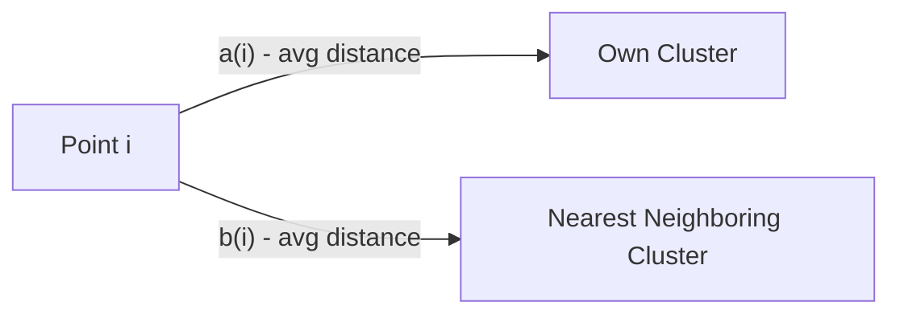
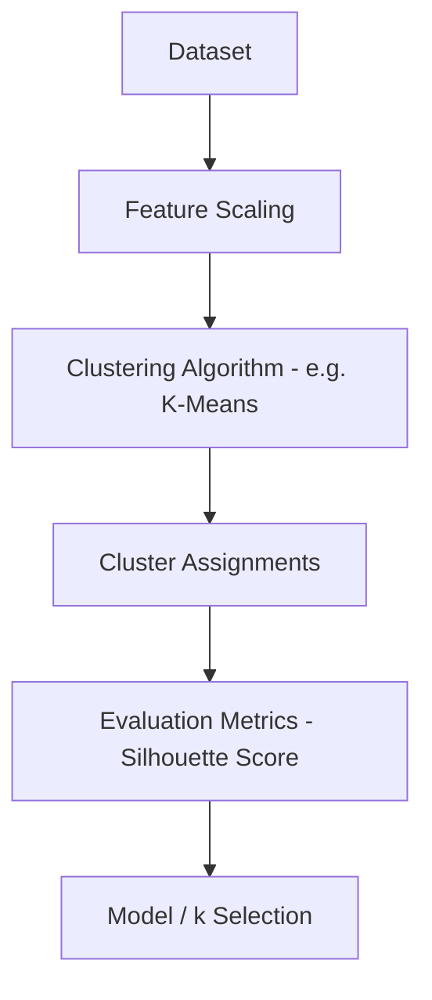
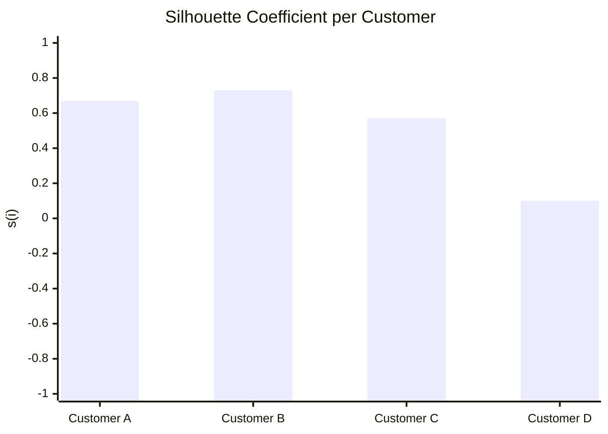
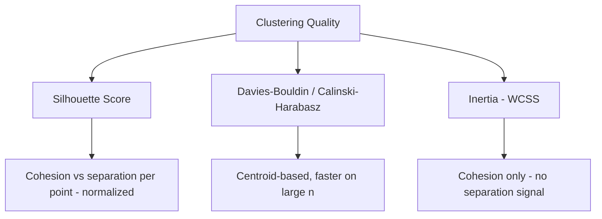

# Silhouette Score 

## What is Silhouette Score ? 

Silhouette Score is a **clustering metric** that measures how well each point fits inside its own cluster compared to how well it would fit in the next-nearest cluster, without needing ground-truth labels.

It answers the question:

**"Is each point closer to its own cluster than to the neighboring one?"**

Silhouette Score combines cohesion (how tight a cluster is) and separation (how far it is from other clusters) into a single value per point, ranging from **-1 to 1**. Because it is normalized, it is easy to interpret across different datasets and cluster counts (e.g., choosing k in k-means).

---

## Components 

Silhouette Score is built from:

- **a(i)** — the average distance between point $i$ and every other point **in the same cluster** (cohesion)
- **b(i)** — the average distance between point $i$ and every point **in the nearest other cluster** (separation)
- **s(i)** — the silhouette coefficient for point $i$
- **Mean Silhouette Score** — the average of $s(i)$ across all points, representing the overall quality of the clustering

### Formula

$$s(i) = \frac{b(i) - a(i)}{\max(a(i), b(i))}$$

$$\text{Silhouette Score} = \frac{1}{n} \sum_{i=1}^{n} s(i)$$

- Close to **+1** → point is well matched to its own cluster and far from others
- Close to **0** → point sits on or near the boundary between two clusters
- Close to **-1** → point is likely assigned to the wrong cluster

### Score Interpretation Scale

The formula produces a number between -1 and 1, but "how good is 0.52?" still needs a reference point. The commonly cited Kaufman & Rousseeuw bands give one:

| Score Range | Interpretation |
| ------------ | --------------- |
| 0.71 – 1.00  | Strong clustering structure |
| 0.51 – 0.70  | Reasonable structure |
| 0.26 – 0.50  | Weak structure — could be artificial |
| ≤ 0.25       | No substantial structure found |

---

### a(i) vs b(i) — Visual Intuition

Before working through the full example, it helps to see what the two distances actually represent for a single point:

*a(i) pulls the point toward its own cluster (cohesion) — smaller is better. b(i) measures the pull of the closest competing cluster (separation) — larger is better. Silhouette Score rewards points where b(i) is much larger than a(i).*

---

### How it Works 

### Step-by-step Example

1. Dataset

Customers clustered by (annual spend, visit frequency), already grouped into 2 clusters:

| Customer | Cluster | a(i) — avg dist. within cluster | b(i) — avg dist. to nearest cluster |
| -------- | ------- | -------------------------------- | ------------------------------------ |
| A        | 1       | 2.0                               | 6.0                                   |
| B        | 1       | 1.5                               | 5.5                                   |
| C        | 2       | 3.0                               | 7.0                                   |
| D        | 2       | 4.5                               | 5.0                                   |

---

2. Silhouette Coefficients

| Customer | s(i) = (b - a) / max(a, b) |
| -------- | ---------------------------- |
| A        | (6.0 - 2.0) / 6.0 = 0.67      |
| B        | (5.5 - 1.5) / 5.5 = 0.73      |
| C        | (7.0 - 3.0) / 7.0 = 0.57      |
| D        | (5.0 - 4.5) / 5.0 = 0.10      |

---

Visually, each point's coefficient shows how confidently it belongs to its cluster — the closer to 1, the tighter and more separated the fit:

*Customer D sits closest to the boundary between clusters (s(i) = 0.10), while Customer B is the most confidently clustered (s(i) = 0.73).*

3. Silhouette Score Calculation

Silhouette Score = (0.67 + 0.73 + 0.57 + 0.10) / 4

Silhouette Score = 2.07 / 4

Silhouette Score = **0.52**

---

Interpretation:

An overall score of **0.52** falls in the "reasonable structure" band above — clusters are separated more than they overlap, but points like Customer D suggest some boundary ambiguity that might improve with a different k or algorithm.

---

### Edge Case: A Misassigned Point

The example above never produces a negative s(i), so it's worth seeing what one looks like. Suppose a fifth customer, E, was placed in Cluster 1 but actually sits much closer to Cluster 2:

| Customer | Cluster | a(i) | b(i) | s(i) = (b - a) / max(a, b) |
| -------- | ------- | ---- | ---- | ---------------------------- |
| E        | 1       | 5.0  | 2.0  | (2.0 - 5.0) / 5.0 = **-0.60** |

Here $a(i) > b(i)$: Customer E is farther from its own cluster's members (5.0) than from Cluster 2's members (2.0). The negative score flags that E is likely mislabeled and would fit better in Cluster 2.

> **Note:** in practice, tools like scikit-learn plot every point's s(i) grouped and sorted by cluster (a "silhouette plot") rather than reporting only the mean. This reveals thin, imbalanced, or partly-negative clusters that a single averaged score can hide.

---

## Limitations and Alternatives 

### Limitations

| Limitation | Impact |
|------------|--------|
| **Computationally expensive** — requires pairwise distances between all points, O(n²) | Runtime — scales poorly on large datasets |
| **Biased toward convex clusters** — favors round, evenly-sized clusters | Cluster shape — can penalize valid elongated or density-based clusters (e.g., DBSCAN) |
| **Sensitive to distance metric and scaling** — unscaled features distort a(i)/b(i) | Preprocessing — requires consistent scaling before use |
| **No absolute threshold** — "good" depends on the dataset | Interpretation — treat the scale above as a guide, not a hard rule |
| **Undefined for a single cluster (k = 1)** — there is no "other cluster" to measure b(i) against | Applicability — cannot be used to justify k = 1, unlike Inertia |

### Alternatives

| Metric | Difference from Silhouette Score |
|--------|----------------------------------|
| Davies-Bouldin Index | Uses cluster centroids and scatter instead of pairwise distances; lower is better |
| Calinski-Harabasz Index | Ratio of between-cluster to within-cluster dispersion; faster to compute on large datasets |
| Dunn Index | Focuses on the worst-case (minimum) separation vs. maximum cluster diameter |
| Inertia (WCSS) | Measures only cohesion (within-cluster distance), with no notion of separation |

Use Silhouette Score when you want an interpretable, per-point view of clustering quality and dataset size is manageable. Use Davies-Bouldin or Calinski-Harabasz when comparing many candidate values of k quickly, and Inertia when only measuring compactness (e.g., the elbow method) is enough.
