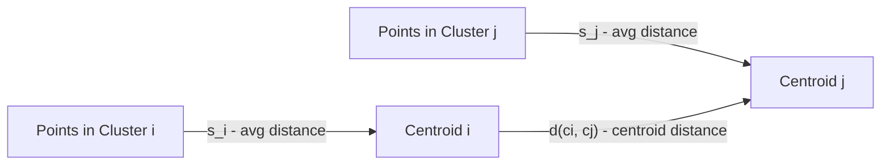
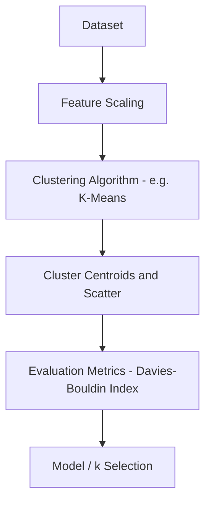
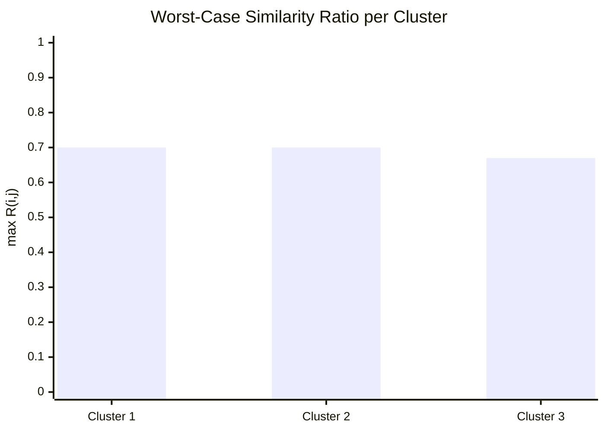
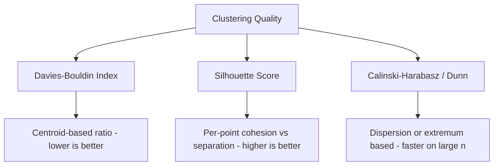

# Davies-Bouldin Index 

## What is Davies-Bouldin Index ? 

Davies-Bouldin Index (DBI) is a **clustering metric** that measures the average "similarity" between each cluster and its most similar (i.e., worst) neighboring cluster, without needing ground-truth labels.

It answers the question:

**"How much do clusters overlap or resemble each other, relative to how spread out they are?"**

DBI combines within-cluster scatter (how tight a cluster is around its centroid) and between-cluster separation (how far apart centroids are) into a single ratio per cluster pair. Unlike Silhouette Score, **lower is better** — a value of 0 is the best possible score, and there is no upper bound.

---

## Components 

Davies-Bouldin Index is built from:

- **Centroid** ($c_i$) — the center of cluster $i$
- **Scatter** ($s_i$) — the average distance between points in cluster $i$ and its centroid $c_i$ (cohesion)
- **Centroid distance** ($d(c_i, c_j)$) — the distance between the centroids of clusters $i$ and $j$ (separation)
- **k** — the number of clusters

### Formula

$$R_{ij} = \frac{s_i + s_j}{d(c_i, c_j)}$$

$$DBI = \frac{1}{k} \sum_{i=1}^{k} \max_{j \neq i} R_{ij}$$

- Close to **0** → clusters are compact and well separated from each other
- High values → clusters are either loosely scattered, too close together, or both

### Score Interpretation Scale

Unlike Silhouette Score, DBI has no fixed upper bound, so there is no formal standard scale — but practitioners commonly use these rough bands as a starting point:

| DBI Range   | Interpretation |
| ------------ | --------------- |
| 0.0 – 0.5    | Excellent separation |
| 0.5 – 1.0    | Good separation |
| 1.0 – 2.0    | Moderate — some overlap likely |
| > 2.0        | Poor — clusters likely overlapping or poorly formed |

---

### s_i and d(c_i, c_j) — Visual Intuition

Before the worked example, it helps to see what feeds into a single ratio $R_{ij}$:

*Each cluster contributes its own scatter ($s_i$, $s_j$) — how loosely its points sit around its centroid. That combined scatter is then compared against how far apart the two centroids are ($d(c_i, c_j)$). A pair scores badly when the clusters are loose, close together, or both.*

---

### How it Works 

### Step-by-step Example

1. Dataset

Customers clustered by (annual spend, visit frequency), already grouped into 3 clusters:

| Cluster | Scatter ($s_i$) — avg dist. to centroid |
| ------- | ----------------------------------------- |
| 1       | 1.5                                        |
| 2       | 2.0                                        |
| 3       | 1.0                                        |

Distances between centroids:

| Pair    | $d(c_i, c_j)$ |
| ------- | --------------- |
| 1 - 2   | 5.0              |
| 1 - 3   | 6.0              |
| 2 - 3   | 4.5              |

---

2. Similarity Ratios ($R_{ij}$)

| Pair    | $R_{ij} = (s_i + s_j) / d(c_i, c_j)$ |
| ------- | -------------------------------------- |
| 1 - 2   | (1.5 + 2.0) / 5.0 = 0.70                |
| 1 - 3   | (1.5 + 1.0) / 6.0 = 0.42                |
| 2 - 3   | (2.0 + 1.0) / 4.5 = 0.67                |

For each cluster, keep only the **worst (highest)** ratio against any other cluster:

| Cluster | Worst $R_{ij}$ |
| ------- | ---------------- |
| 1       | max(0.70, 0.42) = 0.70 |
| 2       | max(0.70, 0.67) = 0.70 |
| 3       | max(0.42, 0.67) = 0.67 |

---

Visually, each cluster's worst-case ratio shows how much it is dragged down by its most similar neighbor — the lower the bar, the more distinct the cluster:

*Clusters 1 and 2 are the most similar to each other (both driven by the 1-2 pair), while Cluster 3 is comparatively more distinct.*

3. Davies-Bouldin Index Calculation

DBI = (0.70 + 0.70 + 0.67) / 3

DBI = 2.07 / 3

DBI = **0.69**

---

Interpretation:

An index of **0.69** falls in the "good separation" band above — the value is closer to 0 than to typical "poor" scores (above 2.0), but Clusters 1 and 2 have some room for tighter separation.

---

### Edge Case: A Near-Overlapping Pair

The example above never rises above 1.0, so it's worth seeing what a genuinely bad pair looks like. Suppose two clusters, X and Y, are both loosely scattered and sit close together:

| Pair  | $s_i$ | $s_j$ | $d(c_i, c_j)$ | $R_{ij}$ |
| ----- | ----- | ----- | -------------- | --------- |
| X - Y | 4.0   | 3.5   | 2.0             | (4.0 + 3.5) / 2.0 = **3.75** |

A ratio this high (well past the "poor" threshold of 2.0) means the combined scatter of X and Y is nearly **twice as large** as the distance between their centroids — a strong signal the two clusters overlap and might really be one cluster. Because DBI only keeps the **worst** ratio per cluster, a single pair like this is enough to drag the whole index up, even if every other cluster is tight and well separated.

---

## Limitations and Alternatives 

### Limitations

| Limitation | Impact |
|------------|--------|
| **Biased toward convex clusters** — assumes roughly spherical, evenly-sized clusters | Cluster shape — can misjudge elongated or density-based shapes (e.g., DBSCAN) |
| **Only considers the worst neighbor** — the max in the formula lets one close pair dominate | Sensitivity — score can look bad even if most clusters are well separated |
| **No absolute threshold** — has no fixed upper bound | Interpretation — treat the bands above as a guide, not a hard rule |
| **Sensitive to scaling** — unscaled features distort scatter and centroid distances | Preprocessing — requires consistent scaling before use |
| **Sensitive to outliers** — centroids and scatter shift with far-away points | Robustness — a few outliers can inflate $s_i$ and skew $R_{ij}$ |

### Alternatives

| Metric | Difference from Davies-Bouldin Index |
|--------|----------------------------------------|
| Silhouette Score | Per-point cohesion vs. separation, ranges -1 to 1, higher is better |
| Calinski-Harabasz Index | Ratio of between-cluster to within-cluster dispersion; faster to compute on large datasets |
| Dunn Index | Focuses on the single worst-case minimum separation vs. maximum cluster diameter |
| Inertia (WCSS) | Measures only cohesion (within-cluster distance), with no notion of separation |

Use Davies-Bouldin Index when you want a fast, centroid-based sanity check across many candidate values of k. Use Silhouette Score when a per-point, normalized view is more useful, and Calinski-Harabasz or Dunn Index when comparing dispersion ratios or worst-case separations across large datasets.
