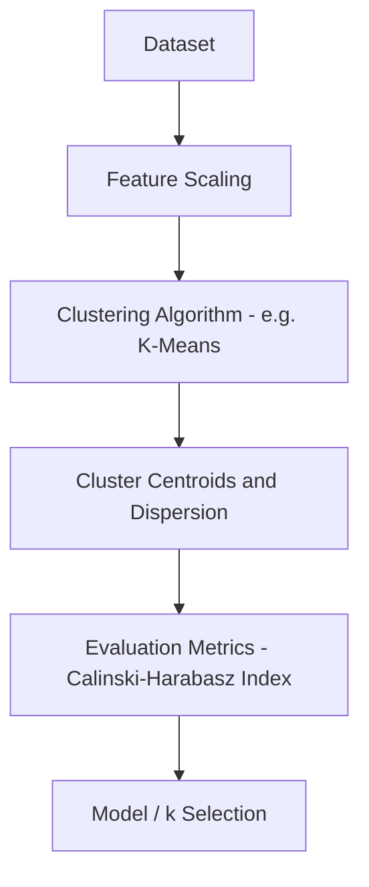
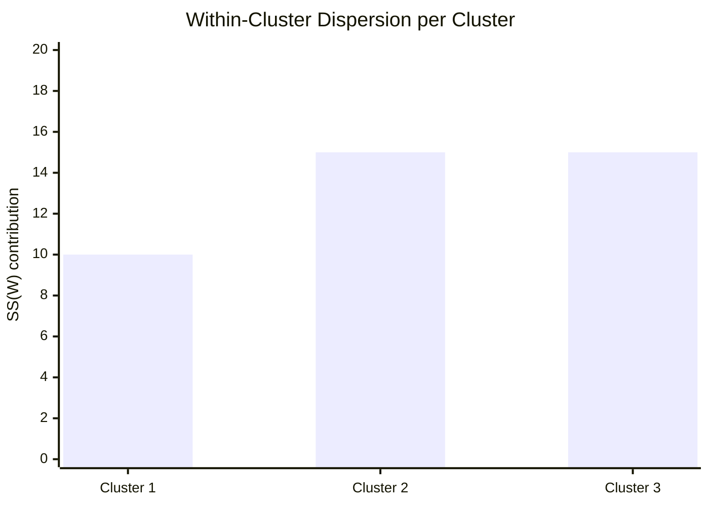
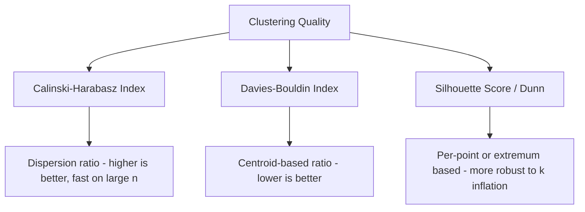

# Calinski-Harabasz Index 

## What is Calinski-Harabasz Index ? 

Calinski-Harabasz Index (CHI), also known as the **Variance Ratio Criterion**, is a **clustering metric** that measures the ratio between how spread out clusters are from each other and how tight each cluster is internally, without needing ground-truth labels.

It answers the question:

**"Relative to their own size, how much more do clusters differ from each other than they vary within themselves?"**

CHI combines between-cluster dispersion (how far clusters are from the overall data center) and within-cluster dispersion (how tight each cluster is) into a single ratio, normalized by the number of clusters and samples. Like Silhouette Score, **higher is better** — there is no upper bound, so it is best used to compare clustering results against each other (e.g., different values of k) rather than read in isolation.

---

## Components 

Calinski-Harabasz Index is built from:

- **Between-cluster dispersion** (SS_B) — the sum of squared distances between each cluster's centroid and the overall data centroid, weighted by cluster size (separation)
- **Within-cluster dispersion** (SS_W) — the sum of squared distances between each point and its own cluster's centroid (cohesion)
- **n** — the total number of samples
- **k** — the number of clusters

### Formula

$$CHI = \frac{SS_B / (k - 1)}{SS_W / (n - k)}$$

- High values → clusters are far apart relative to their internal spread
- Low values → clusters overlap or are as spread out internally as they are from each other

### Score Interpretation Scale

CHI has no fixed upper bound and grows with **n**, so a fixed set of bands (like Silhouette Score's) would be misleading across different datasets. Instead, the standard way to read CHI is **relative, across candidate k values on the same dataset**:

| k | CHI | Reading |
| - | --- | ------- |
| 2 | 8.1  | Weaker separation for this k |
| 3 | 13.5 | Peak — best separation-to-scatter ratio found |
| 4 | 11.9 | Slightly worse — extra cluster adds more scatter than separation |
| 5 | 9.4  | Continues declining |

Pick the **k that maximizes CHI**, the same way Inertia's elbow method looks for a bend rather than an absolute value.

---

### SS_B and SS_W — Visual Intuition

Before the worked example, it helps to see what each dispersion term is actually measuring:

*$SS_B$ measures how far each cluster's centroid sits from the overall data center — the more spread out the clusters are, the larger it grows. $SS_W$ measures how far each point sits from its own cluster's centroid — the tighter the clusters, the smaller it stays. CHI is the ratio of the two, normalized by k and n.*

---

### How it Works 

### Step-by-step Example

1. Dataset

Customers clustered by (annual spend, visit frequency): **n = 9** customers grouped into **k = 3** clusters.

Within-cluster dispersion (sum of squared distances to each cluster's own centroid):

| Cluster | $SS_W$ contribution |
| ------- | --------------------- |
| 1       | 10                     |
| 2       | 15                     |
| 3       | 15                     |

Between-cluster dispersion (sum of squared distances from each centroid to the overall data centroid, weighted by cluster size): **$SS_B$ = 180**

---

2. Aggregating Dispersion

| Term | Value |
| ---- | ----- |
| Total $SS_W$ | 10 + 15 + 15 = 40 |
| Total $SS_B$ | 180 |
| $SS_B / (k - 1)$ | 180 / (3 - 1) = 90 |
| $SS_W / (n - k)$ | 40 / (9 - 3) = 6.67 |

---

Visually, within-cluster dispersion is small compared to between-cluster dispersion — the clusters are tight relative to how far apart they sit:

*Total within-cluster dispersion (40) is small relative to the between-cluster dispersion (180), which is what drives the index up.*

3. Calinski-Harabasz Index Calculation

CHI = (180 / 2) / (40 / 6)

CHI = 90 / 6.67

CHI = **13.5**

---

Interpretation:

A CHI of **13.5** indicates that clusters are, on average, **13.5 times more separated from each other than they are internally scattered** — and per the k = 3 row in the table above, this is the peak value among the candidate k's tested, making k = 3 the preferred choice.

---

### Edge Case: A Meaningless Clustering

The example above shows a strong result, so it's worth seeing what a weak one looks like. Suppose the same 9 customers are forced into 3 clusters that don't reflect any real structure — roughly the same scatter as before, but centroids that barely differ from the overall center:

| Term | Value |
| ---- | ----- |
| Total $SS_W$ | 180 |
| Total $SS_B$ | 20 |
| CHI | (20 / 2) / (180 / 6) = 10 / 30 = **0.33** |

A CHI below 1 means the **within-cluster scatter is larger than the between-cluster separation** — the clusters vary more internally than they differ from each other, which is a strong signal that this k (or this clustering algorithm) isn't finding real structure in the data.

---

## Limitations and Alternatives 

### Limitations

| Limitation | Impact |
|------------|--------|
| **Biased toward convex clusters** — relies on Euclidean distances to centroids | Cluster shape — assumes roughly spherical, evenly-sized clusters |
| **No absolute threshold** — no fixed upper bound | Interpretation — only meaningful when comparing across k on the same dataset, not as a standalone quality gate |
| **Tends to reward higher k** — divides by $(n - k)$ | Model selection — can favor more granular clusterings than are practically useful |
| **Sensitive to scaling** — unscaled features distort both dispersion terms | Preprocessing — requires consistent scaling before use |
| **Grows with n** — larger datasets produce larger raw values | Comparability — CHI values from different datasets or sample sizes are not directly comparable |

### Alternatives

| Metric | Difference from Calinski-Harabasz Index |
|--------|-------------------------------------------|
| Silhouette Score | Per-point cohesion vs. separation, ranges -1 to 1, more robust to k inflation |
| Davies-Bouldin Index | Centroid-based ratio focused on the worst-case cluster pair; lower is better |
| Dunn Index | Focuses on the single worst-case minimum separation vs. maximum cluster diameter |
| Inertia (WCSS) | Measures only cohesion (within-cluster distance), with no notion of separation |

Use Calinski-Harabasz Index when you want a fast, variance-based way to compare many candidate values of k. Use Davies-Bouldin Index for a similarly fast centroid-based check less prone to rewarding higher k, and Silhouette Score or Dunn Index when a per-point or worst-case view is more important than raw speed.
