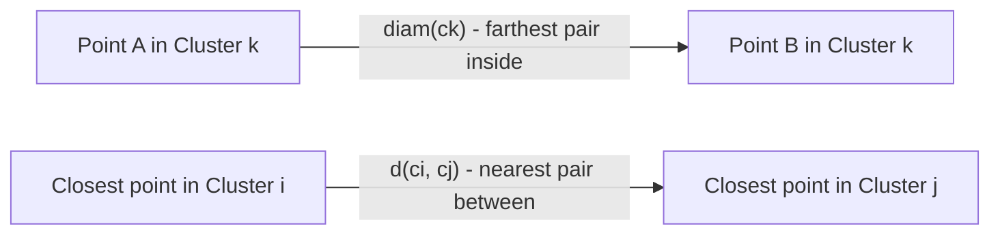
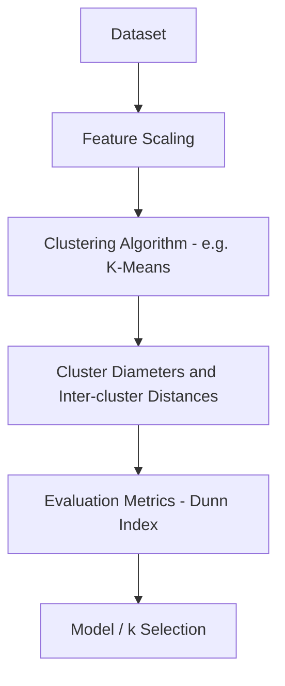
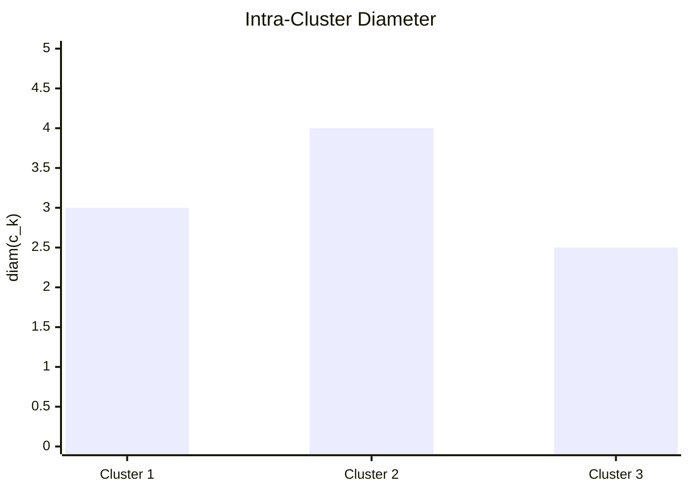
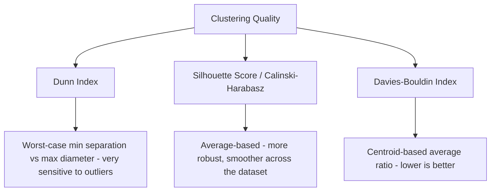

# Dunn Index 

## What is Dunn Index ? 

Dunn Index (DI) is a **clustering metric** that measures the ratio between the smallest distance separating any two clusters and the largest "diameter" found inside any single cluster, without needing ground-truth labels.

It answers the question:

**"Is even the closest pair of clusters still farther apart than the widest cluster is internally spread?"**

Dunn Index focuses on the **worst case** on both sides: the tightest gap between clusters (separation) and the loosest, most spread-out cluster (cohesion). Like Calinski-Harabasz Index, **higher is better** — there is no fixed upper bound, but unlike CHI, DI is driven by extremes rather than averages, making it especially sensitive to a single bad cluster or a single close pair.

---

## Components 

Dunn Index is built from:

- **Inter-cluster distance**, $d(c_i, c_j)$ — the distance between the closest points (or centroids) of two different clusters $i$ and $j$ (separation)
- **Intra-cluster diameter**, $\text{diam}(c_k)$ — the largest distance between any two points inside cluster $k$ (cohesion, worst case)
- **k** — the number of clusters

### Formula

$$DI = \frac{\min_{i \neq j} d(c_i, c_j)}{\max_{k} \text{diam}(c_k)}$$

- High values → the closest clusters are still well separated relative to the widest cluster
- Low values (close to or below 1) → at least one pair of clusters nearly touches, or at least one cluster is too spread out

### Score Interpretation Scale

Like Davies-Bouldin and Calinski-Harabasz, DI has no fixed upper bound, so there is no formal standard scale — but the **value of 1 is a natural reference point**: it's the break-even where the closest clusters are exactly as far apart as the widest cluster is wide. Practitioners commonly use:

| DI Range   | Interpretation |
| ------------ | --------------- |
| > 2.0        | Excellent separation |
| 1.0 – 2.0    | Acceptable — closest clusters still clear the widest cluster's spread |
| < 1.0        | Poor — the widest cluster is wider than the gap between the closest clusters, likely overlap |

---

### d(c_i, c_j) and diam(c_k) — Visual Intuition

Before the worked example, it helps to see what the two extremes actually measure:

*$\text{diam}(c_k)$ is set by the two farthest points **inside** the same cluster — a single stray point can stretch it. $d(c_i, c_j)$ is set by the two closest points **across** two different clusters — a single bridging point can shrink it. Dunn Index takes the worst of each and divides them.*

---

### How it Works 

### Step-by-step Example

1. Dataset

Customers clustered by (annual spend, visit frequency), grouped into **k = 3** clusters.

Intra-cluster diameter (largest distance between two points inside each cluster):

| Cluster | $\text{diam}(c_k)$ |
| ------- | -------------------- |
| 1       | 3.0                   |
| 2       | 4.0                   |
| 3       | 2.5                   |

Inter-cluster distance (closest distance between points of two different clusters):

| Pair    | $d(c_i, c_j)$ |
| ------- | --------------- |
| 1 - 2   | 6.0              |
| 1 - 3   | 7.0              |
| 2 - 3   | 5.5              |

---

2. Identifying the Extremes

| Term | Value |
| ---- | ----- |
| Smallest inter-cluster distance | min(6.0, 7.0, 5.5) = 5.5 (pair 2-3) |
| Largest intra-cluster diameter | max(3.0, 4.0, 2.5) = 4.0 (cluster 2) |

---

Visually, cluster diameters show how spread out each cluster is internally — the widest one sets the denominator that the whole index depends on:

*Cluster 2 is both the widest cluster (diameter 4.0) and part of the closest cluster pair (2-3 at distance 5.5) — it drives the index the most.*

3. Dunn Index Calculation

DI = 5.5 / 4.0

DI = **1.375**

---

Interpretation:

A Dunn Index of **1.375** falls in the "acceptable" band above — even the closest pair of clusters (2 and 3) sits farther apart than the widest cluster's own internal spread, though Cluster 2's diameter is the main factor limiting a higher score.

---

### Edge Case: One Outlier Breaks the Score

The example above stays comfortably above 1, so it's worth seeing how quickly a single point can flip that. Suppose one noisy customer drifts between Clusters 2 and 3, stretching Cluster 2's diameter and shrinking the 2-3 gap:

| Term | Before | After the outlier |
| ---- | ------ | ------------------- |
| $\text{diam}(c_2)$ | 4.0 | 6.0 |
| $d(c_2, c_3)$ | 5.5 | 4.0 |
| DI | 5.5 / 4.0 = 1.375 | 4.0 / 6.0 = **0.67** |

A single point moved the index from "acceptable" (1.375) to "poor" (0.67) — Dunn Index has no averaging to absorb this kind of noise, unlike Silhouette Score or Calinski-Harabasz Index.

---

## Limitations and Alternatives 

### Limitations

| Limitation | Impact |
|------------|--------|
| **Highly sensitive to outliers** — driven by a single max and a single min | Robustness — one noisy point can dominate the entire score, as shown above |
| **Computationally expensive** — exact diameters and inter-cluster distances need pairwise comparisons | Runtime — scales poorly (O(n²)) on large datasets |
| **Biased toward convex clusters** — assumes distance-based, roughly compact cluster shapes | Cluster shape — can misjudge elongated or density-based clusters |
| **No absolute threshold** — depends on the dataset and distance scale | Interpretation — treat the bands above as a guide; values above 1 are the more reliable signal |

### Alternatives

| Metric | Difference from Dunn Index |
|--------|-------------------------------|
| Silhouette Score | Per-point cohesion vs. separation, averaged rather than worst-case, ranges -1 to 1 |
| Davies-Bouldin Index | Centroid-based ratio averaged across clusters; lower is better |
| Calinski-Harabasz Index | Ratio of between- to within-cluster dispersion using averages, less sensitive to single outliers |
| Inertia (WCSS) | Measures only cohesion (within-cluster distance), with no notion of separation |

Use Dunn Index when you specifically care about the worst-case gap between clusters and are confident the data is reasonably clean. Use Silhouette Score or Calinski-Harabasz Index when averages are more representative than extremes, and Davies-Bouldin Index for a fast centroid-based alternative.
