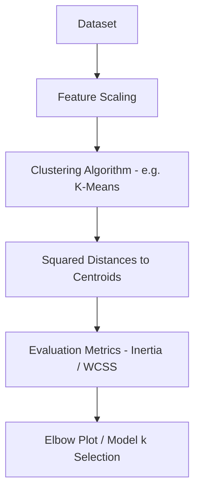
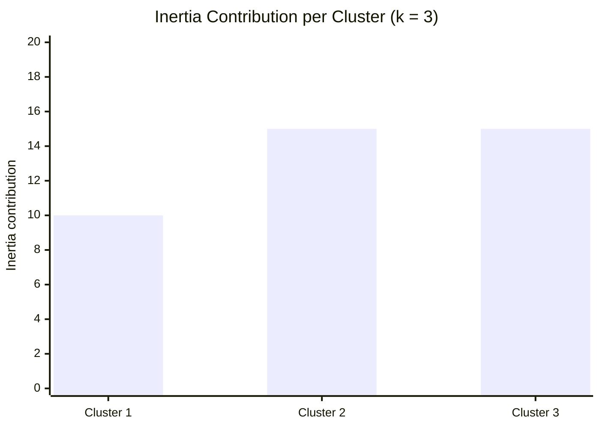
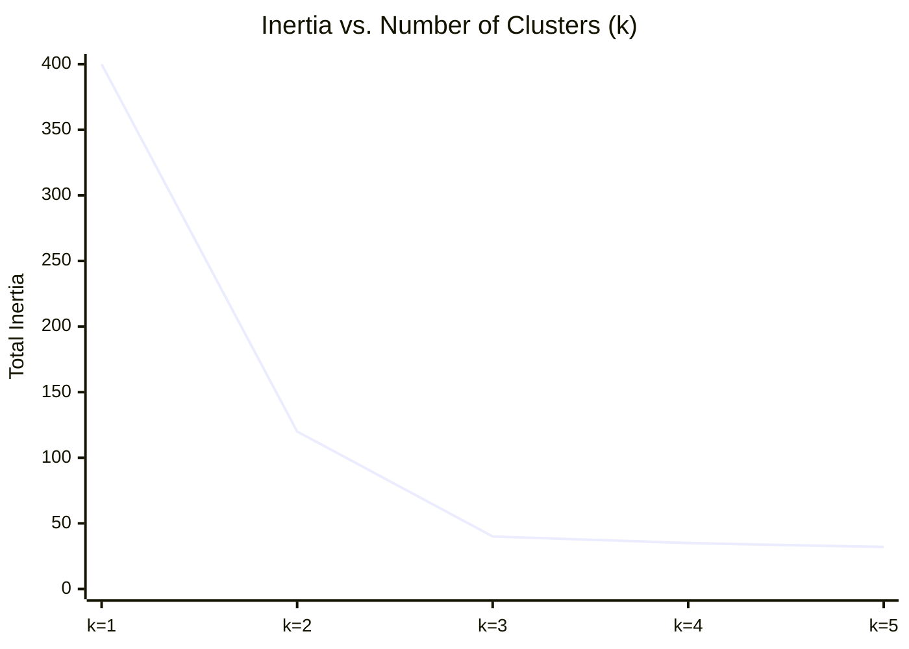
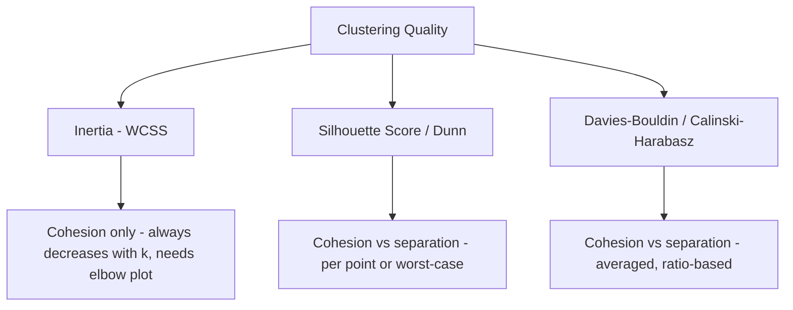

# Inertia (WCSS) 

## What is Inertia (WCSS) ? 

Inertia, also known as **Within-Cluster Sum of Squares (WCSS)**, is a **clustering metric** that measures how tightly the points inside each cluster are packed around their own centroid, without needing ground-truth labels.

It answers the question:

**"How far, on average, are points from the center of the cluster they were assigned to?"**

Unlike Silhouette Score, Davies-Bouldin Index, Calinski-Harabasz Index, and Dunn Index, Inertia captures **only cohesion** — it has no notion of separation between clusters. **Lower is better**, but Inertia decreases monotonically as k grows (reaching 0 when every point is its own cluster), so it cannot be used alone to pick the "best" k — it is typically read from an **elbow plot** across multiple values of k.

---

## Components 

Inertia is built from:

- **Centroid** ($c_k$) — the center of cluster $k$
- **Squared distance** ($\|x_i - c_k\|^2$) — the squared distance between point $x_i$ and its assigned cluster's centroid (cohesion, penalizes larger gaps more)
- **k** — the number of clusters

### Formula

$$WCSS = \sum_{k=1}^{K} \sum_{i \in C_k} \|x_i - c_k\|^2$$

- Low values → points sit close to their cluster's centroid
- High values → points are loosely scattered around their assigned centroid
- Always decreases (or stays the same) as K increases

### Score Interpretation Scale

Inertia has **no fixed range and no bands to compare against** — it's a raw sum of squared distances, so its absolute value depends on the feature scale, the units, and the number of points. A single Inertia number is not interpretable on its own; the only meaningful reading is **how it changes across candidate k values**:

| Signal | Reading |
| ------- | -------- |
| Large drop from k to k+1 | The extra cluster captures real structure |
| Small drop from k to k+1 | The extra cluster mostly splits noise — this is the "elbow" |
| Inertia = 0 | k equals the number of points — every point is its own cluster (overfit, not useful) |

---

### Centroid and Squared Distance — Visual Intuition

Before the worked example, it helps to see what Inertia actually measures — and what it deliberately leaves out:

*Unlike Silhouette Score, Davies-Bouldin, Calinski-Harabasz, or Dunn Index, this is the **only** relationship in Inertia's diagram — there is no second cluster to compare against. That missing arrow is the direct visual reason Inertia has no separation signal.*

---

### How it Works 

### Step-by-step Example

1. Dataset

Customers clustered by (annual spend, visit frequency), grouped into **k = 3** clusters.

Sum of squared distances from each point to its own cluster's centroid:

| Cluster | Inertia contribution |
| ------- | ---------------------- |
| 1       | 10                      |
| 2       | 15                      |
| 3       | 15                      |

---

2. Aggregating Inertia

| Term | Value |
| ---- | ----- |
| Total Inertia (k = 3) | 10 + 15 + 15 = 40 |

---

Visually, each cluster's contribution shows where the points are least tightly packed — Cluster 2 and 3 are looser than Cluster 1:

*Total Inertia at k = 3 is 40 — but this number alone doesn't say whether k = 3 is the right choice.*

3. Inertia Across Candidate k Values (Elbow Method)

| k | Total Inertia |
| - | -------------- |
| 1 | 400            |
| 2 | 120            |
| 3 | 40             |
| 4 | 35             |
| 5 | 32             |

The same values plotted as a curve make the "elbow" easier to spot than the table alone:

---

Interpretation:

Inertia **always drops** as k increases, but the drop from k=2 to k=3 (120 → 40) is much larger than from k=3 to k=4 (40 → 35) or k=4 to k=5 (35 → 32). This flattening point — the **"elbow"** — suggests **k = 3** captures most of the benefit of adding more clusters, after which extra clusters mostly overfit noise.

---

### Edge Case: k Equals n

The table above stops at k = 5, but it's worth seeing what happens at the extreme. With **n = 9** customers, pushing k all the way to 9 puts every customer in their own cluster:

| k | Total Inertia | Meaningful clustering? |
| - | -------------- | ------------------------ |
| 3 | 40             | Yes — genuine grouping by spend and visit frequency |
| 9 | 0              | No — every point is its own cluster; nothing was learned |

A score of 0 is mathematically "perfect" cohesion, but it's the clearest proof that Inertia can never be optimized directly — it must always be read as a trend across k, never chased toward its best possible value.

---

## Limitations and Alternatives 

### Limitations

| Limitation | Impact |
|------------|--------|
| **Monotonically decreases with k** — reaches 0 when k equals the number of points | Model selection — can never be optimized directly; must be read as a trend (elbow method) |
| **No separation term** — no notion of distance between clusters | Blind spot — two clusters can be tight yet overlapping, and Inertia won't flag it |
| **Biased toward convex, evenly-sized clusters** — squared Euclidean distance favors round, similarly-sized clusters | Cluster shape — matches k-means' own assumptions, penalizes other valid shapes |
| **Sensitive to scale and outliers** — distances are squared | Preprocessing/Robustness — unscaled features or far-away points dominate the total |
| **Raw units, not comparable across datasets** — value depends on feature scale and n | Comparability — an Inertia of 40 means nothing without the same dataset and preprocessing as a reference |

### Alternatives

| Metric | Difference from Inertia (WCSS) |
|--------|-----------------------------------|
| Silhouette Score | Per-point cohesion vs. separation, ranges -1 to 1, does not always decrease with k |
| Davies-Bouldin Index | Centroid-based ratio that includes separation; lower is better |
| Calinski-Harabasz Index | Ratio of between- to within-cluster dispersion, penalizes overly high k less naively |
| Dunn Index | Worst-case minimum separation vs. maximum cluster diameter |

Use Inertia when running the elbow method to get a first estimate of k, but pair it with a metric that captures separation — Silhouette Score, Davies-Bouldin Index, Calinski-Harabasz Index, or Dunn Index — before finalizing the number of clusters.
