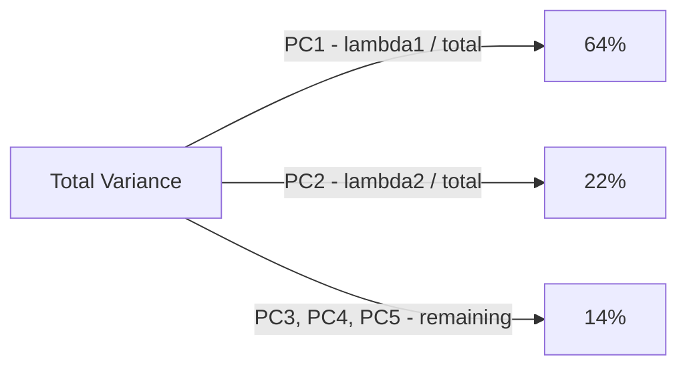
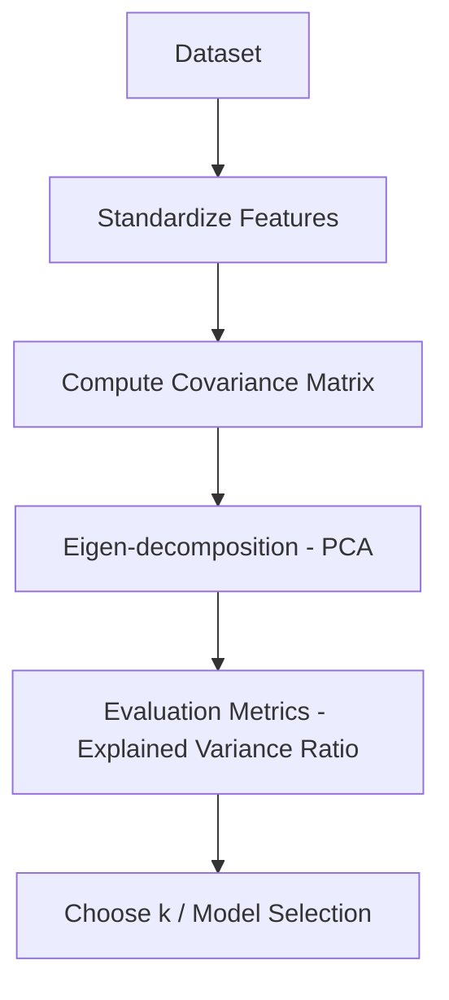
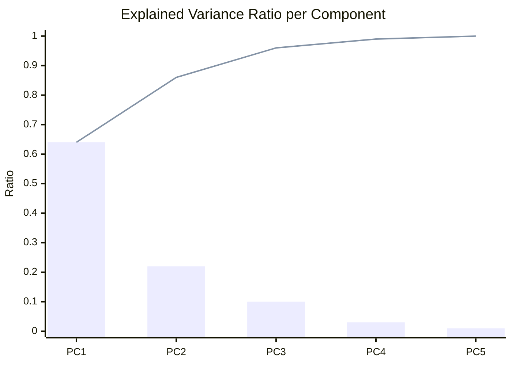
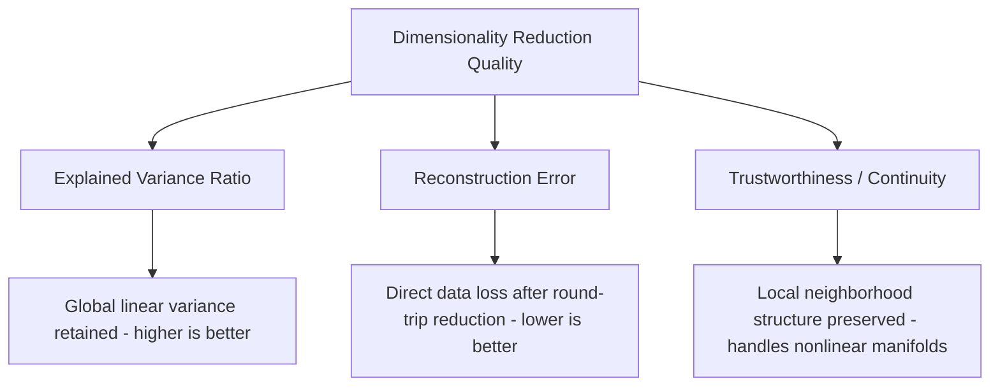

# Explained Variance Ratio 

## What is Explained Variance Ratio ? 

Explained Variance Ratio (EVR) is a **dimensionality reduction metric** that measures **how much of the original data's total variance is preserved by each retained component**, most commonly in PCA (Principal Component Analysis).

It answers the question:

**"If I compress my data down to fewer dimensions, how much of the original information am I keeping?"**

Each principal component captures a share of the dataset's total variance, and EVR expresses that share as a proportion between 0 and 1. Because it's normalized against the total variance, it is easy to interpret — an EVR of 0.64 for the first component means that component alone accounts for **64% of all the spread** in the original data.

---

## Components 

Explained Variance Ratio is built from:

- **Eigenvalue** ($\lambda_i$) — the variance captured by principal component $i$
- **Total variance** — the sum of every component's eigenvalue, $\sum_j \lambda_j$ (equal to the sum of variances of the original standardized features)
- **Explained Variance Ratio per component** — $\lambda_i$ divided by the total variance
- **Cumulative Explained Variance Ratio** — the running sum of EVR across the first $k$ retained components
- **k** — the number of components kept after reduction

### Formula

$$EVR_i = \frac{\lambda_i}{\sum_{j=1}^{n} \lambda_j}$$

$$\text{Cumulative } EVR_k = \sum_{i=1}^{k} EVR_i$$

- High EVR for early components → the data's structure is concentrated in a few directions, so reduction loses little
- Low EVR spread evenly across many components → variance is diffuse, so reduction to a small k loses a lot

### Score Interpretation Scale

Cumulative EVR is a genuine 0–1 proportion, so — like R², MAPE, and NDCG — it supports a general-purpose scale. The right threshold still depends on the task, but a common rule of thumb for choosing k is:

| Cumulative EVR | Interpretation |
| ---------------- | --------------- |
| 0.95 – 1.00       | Excellent — almost no information lost |
| 0.90 – 0.95       | Good — the standard "keep 90%+" convention for many pipelines |
| 0.70 – 0.90       | Moderate — noticeable information loss, acceptable for visualization or noisy data |
| < 0.70            | Poor — reduction is discarding a large share of the original structure |

---

### Splitting Total Variance — Visual Intuition

Before the worked example, it helps to see EVR as slices of a single, fixed pie — the dataset's total variance doesn't change, only how it's divided among components:

*Every component's slice comes out of the same fixed total. Keeping only PC1 and PC2 means keeping 64% + 22% = 86% of the pie and discarding the remaining 14% entirely.*

---

### How it Works 

### Step-by-step Example

1. Dataset

A customer dataset with **5 standardized features** (mean 0, variance 1 each, so total variance = 5) is reduced with PCA. Each component's eigenvalue is its share of that total:

| Component | Eigenvalue ($\lambda_i$) |
| ----------- | --------------------------- |
| PC1         | 3.20                         |
| PC2         | 1.10                         |
| PC3         | 0.50                         |
| PC4         | 0.15                         |
| PC5         | 0.05                         |

Total variance = 3.20 + 1.10 + 0.50 + 0.15 + 0.05 = **5.00**

---

2. Explained Variance Ratio per Component

| Component | EVR = $\lambda_i$ / 5.00 | Cumulative EVR |
| ----------- | --------------------------- | ---------------- |
| PC1         | 3.20 / 5.00 = 0.64           | 0.64              |
| PC2         | 1.10 / 5.00 = 0.22           | 0.86              |
| PC3         | 0.50 / 5.00 = 0.10           | 0.96              |
| PC4         | 0.15 / 5.00 = 0.03           | 0.99              |
| PC5         | 0.05 / 5.00 = 0.01           | 1.00              |

---

Visually, individual EVR bars shrink fast, while the cumulative line climbs toward 1.00 — this pairing is the classic **scree plot**:

*PC1 and PC2 together already reach 0.86 cumulative — the "moderate-to-good" boundary. Reaching the "excellent" band (0.95+) requires keeping PC1 through PC3.*

3. Explained Variance Ratio Calculation

Cumulative EVR (k=2) = 0.64 + 0.22 = **0.86**

Cumulative EVR (k=3) = 0.64 + 0.22 + 0.10 = **0.96**

---

Interpretation:

Keeping just the first **2** components preserves **86% of the original variance** — a "moderate-to-good" reduction — while keeping **3** components pushes that to **96%**, landing solidly in the "excellent" band, at the cost of one extra dimension.

---

### Edge Case: Skipping Standardization

The example above assumes standardized features (each with variance 1), which is what makes the total variance meaningful. Here's what happens if that step is skipped on a 2-feature dataset — "Age" (variance ≈ 50) and "Income in dollars" (variance ≈ 999,500, simply because dollars are a much larger unit than years):

| Version | $\lambda_1$ | $\lambda_2$ | Total | EVR₁ |
| --------- | ------------- | ------------- | ------- | ------ |
| Unscaled (raw units) | 999,500 | 500 | 1,000,000 | 999,500 / 1,000,000 = **0.9995** |
| Standardized (z-scores) | 1.30 | 0.70 | 2.00 | 1.30 / 2.00 = **0.65** |

Without standardization, PC1 looks like it captures a stunning 99.95% of the variance — but that's an artifact of Income's raw scale dwarfing Age's, not evidence of genuine shared structure between the two features. Once both are standardized to the same scale, the "true" EVR drops to a much more modest 0.65. **A high EVR on unscaled data doesn't mean good dimensionality reduction — it can just mean one feature's units are bigger.**

---

## Limitations and Alternatives 

### Limitations

| Limitation | Impact |
|------------|--------|
| **Sensitive to feature scaling** — unstandardized features distort every eigenvalue | Preprocessing — as shown above, always standardize before computing EVR |
| **Only captures linear structure** — PCA finds linear combinations of features | Applicability — cannot detect nonlinear manifolds; a high EVR can still miss curved structure entirely |
| **Ignores downstream task relevance** — EVR only measures variance, not usefulness for a specific goal | Blind spot — a high-variance component can be irrelevant noise, while a low-variance one might be exactly what separates two classes |
| **No universal cutoff** — the 90%/95% conventions are heuristics, not laws | Interpretation — treat the bands above as a starting point, not a hard rule for every domain |

### Alternatives

| Metric | Difference from Explained Variance Ratio |
|--------|---------------------------------------------|
| Reconstruction Error | Measures how much information is lost by directly comparing original data to its reconstruction from the reduced space |
| Trustworthiness & Continuity | Measures whether local neighborhood structure is preserved, rather than global linear variance — better suited to nonlinear methods like t-SNE or UMAP |

Use Explained Variance Ratio when your reduction method is linear (PCA) and you want a fast, interpretable way to choose how many components to keep. Use Reconstruction Error when you need to know exactly how much the reduced data diverges from the original, and Trustworthiness & Continuity when the data's structure is nonlinear and preserving local neighborhoods matters more than global variance.
