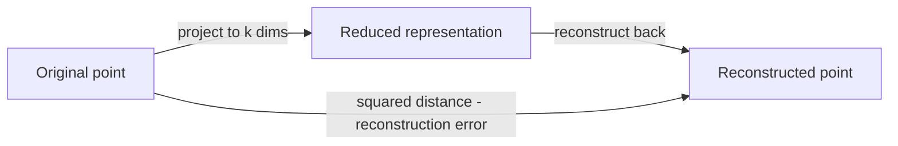
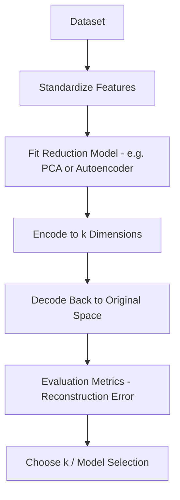
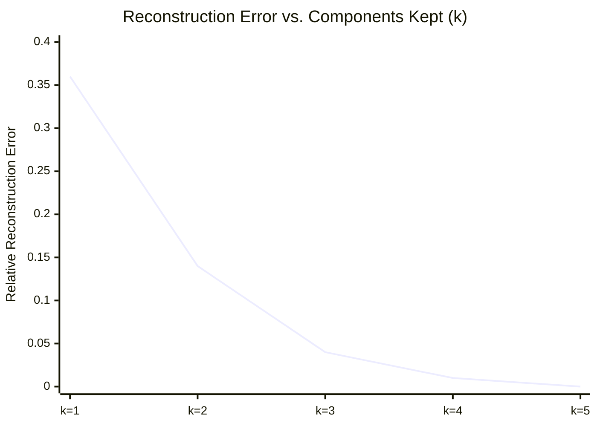
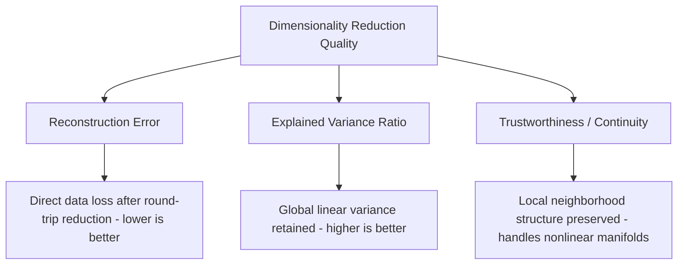

# Reconstruction Error 

## What is Reconstruction Error ? 

Reconstruction Error is a **dimensionality reduction metric** that measures **how much information is lost when data is compressed to fewer dimensions and then mapped back to the original space**, most commonly with PCA or an autoencoder.

It answers the question:

**"After compressing and decompressing my data, how far off is the result from the original?"**

Where Explained Variance Ratio looks at variance retained inside the reduced space, Reconstruction Error looks at the round trip directly: take a point, reduce it to $k$ dimensions, reconstruct it back to the original number of dimensions, and measure the gap. For PCA specifically, the two are mathematically linked — Reconstruction Error is exactly the variance the retained components **didn't** capture.

---

## Components 

Reconstruction Error is built from:

- **Original point** ($x_i$) — the data point in its original, full-dimensional space
- **Reconstructed point** ($\hat{x}_i$) — the same point after being reduced to $k$ dimensions and mapped back
- **Squared reconstruction distance** ($\|x_i - \hat{x}_i\|^2$) — the squared distance between the original and reconstructed point
- **n** — the number of samples
- **Relative Reconstruction Error** — the raw error divided by the data's total variance, for a scale-independent version

### Formula

$$ReconstructionError = \frac{1}{n} \sum_{i=1}^{n} \|x_i - \hat{x}_i\|^2$$

$$\text{Relative Reconstruction Error} = \frac{ReconstructionError}{\text{Total variance}}$$

- Low Reconstruction Error → the reduced representation reconstructs the original data closely
- High Reconstruction Error → compression is throwing away a substantial amount of information

For PCA specifically, Reconstruction Error at $k$ components equals the sum of the **discarded** eigenvalues — so it is exactly $1 - \text{Cumulative } EVR_k$, times the total variance.

### Score Interpretation Scale

The raw Reconstruction Error is scale-dependent, just like MSE — a value of 0.70 means nothing without knowing the data's units and variance. The **relative** version, however, is a genuine 0–1 proportion and supports a general-purpose scale:

| Relative Reconstruction Error | Interpretation |
| -------------------------------- | --------------- |
| < 0.05                            | Excellent — almost no information lost |
| 0.05 – 0.10                       | Good |
| 0.10 – 0.30                       | Moderate — noticeable but often acceptable loss |
| > 0.30                            | Poor — compression is discarding a large share of the original structure |

---

### The Compress-Decompress Round Trip — Visual Intuition

Before the worked example, it helps to see Reconstruction Error as a pipeline, not just a single formula:

*The point never "sees" the reduced space directly in this comparison — it only matters how close the round trip lands it to where it started. A smaller k means a smaller reduced space, which usually means a longer trip back and a bigger gap.*

---

### How it Works 

### Step-by-step Example

1. Dataset

Reusing the same 5-standardized-feature dataset from [[01.explained_variance_ratio]] (total variance = 5.00), with eigenvalues:

| Component | Eigenvalue ($\lambda_i$) | Kept at k = 2? |
| ----------- | --------------------------- | ---------------- |
| PC1         | 3.20                         | Yes               |
| PC2         | 1.10                         | Yes               |
| PC3         | 0.50                         | No — discarded    |
| PC4         | 0.15                         | No — discarded    |
| PC5         | 0.05                         | No — discarded    |

---

2. Reconstruction Error at k = 2

For PCA, Reconstruction Error equals the sum of the **discarded** eigenvalues — the variance the kept components left behind:

Reconstruction Error (k=2) = 0.50 + 0.15 + 0.05 = **0.70**

Relative Reconstruction Error = 0.70 / 5.00 = **0.14**

---

Visually, Reconstruction Error falls as more components are kept — the mirror image of the cumulative EVR curve from the previous doc:

*At k=1, keeping only PC1 leaves 0.36 (36%) of the variance unreconstructed. By k=2 that drops to 0.14, and by k=5 (keeping everything) it reaches exactly 0 — nothing was discarded.*

3. Reconstruction Error Across Candidate k Values

| k (components kept) | Discarded eigenvalues | Reconstruction Error | Relative Reconstruction Error |
| ---------------------- | ------------------------ | ----------------------- | -------------------------------- |
| 1 | 1.10+0.50+0.15+0.05 | 1.80 | 1.80/5.00 = 0.36 |
| 2 | 0.50+0.15+0.05 | 0.70 | 0.70/5.00 = 0.14 |
| 3 | 0.15+0.05 | 0.20 | 0.20/5.00 = 0.04 |
| 4 | 0.05 | 0.05 | 0.05/5.00 = 0.01 |
| 5 | — | 0.00 | 0.00/5.00 = 0.00 |

---

Interpretation:

At k=2, Relative Reconstruction Error is **0.14**, landing in the "moderate" band — consistent with [[01.explained_variance_ratio]]'s 0.86 cumulative EVR at the same k, since the two numbers are exact complements (0.14 = 1 − 0.86). Reaching the "good" band (< 0.10) requires k=3, matching that doc's own finding that 3 components were needed to cross into "excellent" EVR territory.

---

### Edge Case: Low Reconstruction Error Doesn't Mean "Linear-Friendly" Data

The PCA numbers above assume the data's true structure is genuinely linear. Suppose instead the data actually lies on a curved arc in 2D space (a classic nonlinear manifold), and we reduce it to k=1:

| Method | Approach at k=1 | Approximate Reconstruction Error | Relative Reconstruction Error |
| -------- | ------------------- | ------------------------------------ | -------------------------------- |
| PCA (linear) | Best-fit straight line through the arc | 8.0 | 0.60 — "poor" |
| Nonlinear method (e.g., a manifold-aware reducer) | Follows the arc's actual curve | 0.3 | 0.02 — "excellent" |

Both methods use the exact same k=1 — one number of retained dimensions — but PCA's straight-line assumption cannot follow a curved shape, so its Reconstruction Error stays high no matter how the line is rotated. **A high PCA Reconstruction Error doesn't prove the data can't be compressed well; it can just mean the data's structure is nonlinear**, which is exactly the situation Trustworthiness & Continuity is designed to evaluate.

---

## Limitations and Alternatives 

### Limitations

| Limitation | Impact |
|------------|--------|
| **Raw error is scale-dependent** — like MSE, its units depend on the data's own units | Comparability — use the relative/normalized version to compare across datasets |
| **Assumes the reduction method matches the data's structure** — linear methods reconstruct nonlinear data poorly | Applicability — as shown above, a high PCA error can just mean the data is nonlinear, not incompressible |
| **Can be driven toward zero trivially** — increasing k (or an overfit autoencoder's capacity) shrinks it, similar to Inertia reaching 0 as k grows | Model selection — must be read alongside k, never chased to its minimum on its own |
| **Ignores downstream task relevance** — measures information loss in general, not whether the *useful* information was kept | Blind spot — a reconstruction can look accurate overall while dropping the one feature that mattered for a classification task |

### Alternatives

| Metric | Difference from Reconstruction Error |
|--------|------------------------------------------|
| Explained Variance Ratio | Measures variance retained directly from eigenvalues, without needing to decode back to the original space |
| Trustworthiness & Continuity | Measures whether local neighborhood structure is preserved, better suited to nonlinear methods where reconstruction error can be misleading |

Use Reconstruction Error when you need a direct, method-agnostic measure of information loss (it works for PCA, autoencoders, or any encoder-decoder pair). Use Explained Variance Ratio for a faster, PCA-specific check that doesn't require decoding, and Trustworthiness & Continuity when the data's structure is nonlinear and a low reconstruction error alone wouldn't tell the full story.
