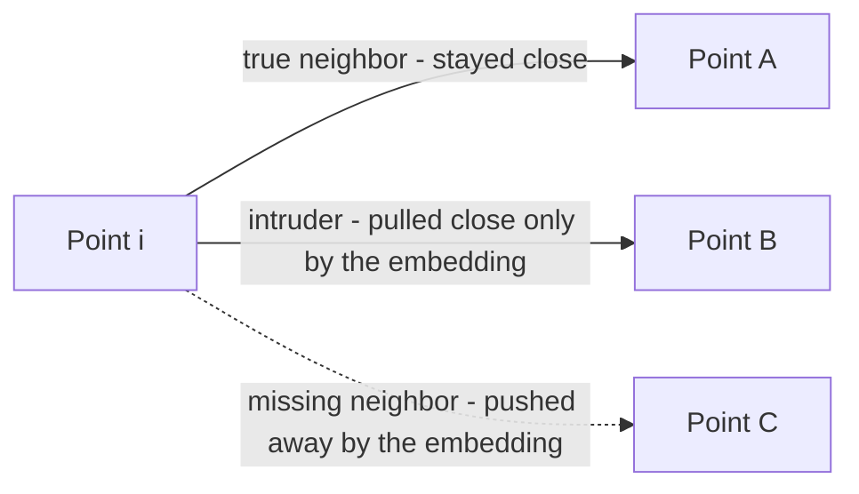
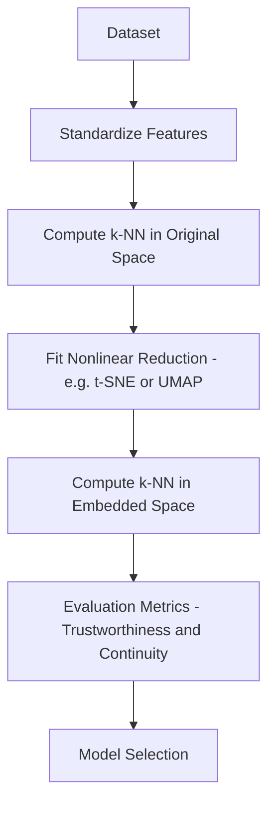
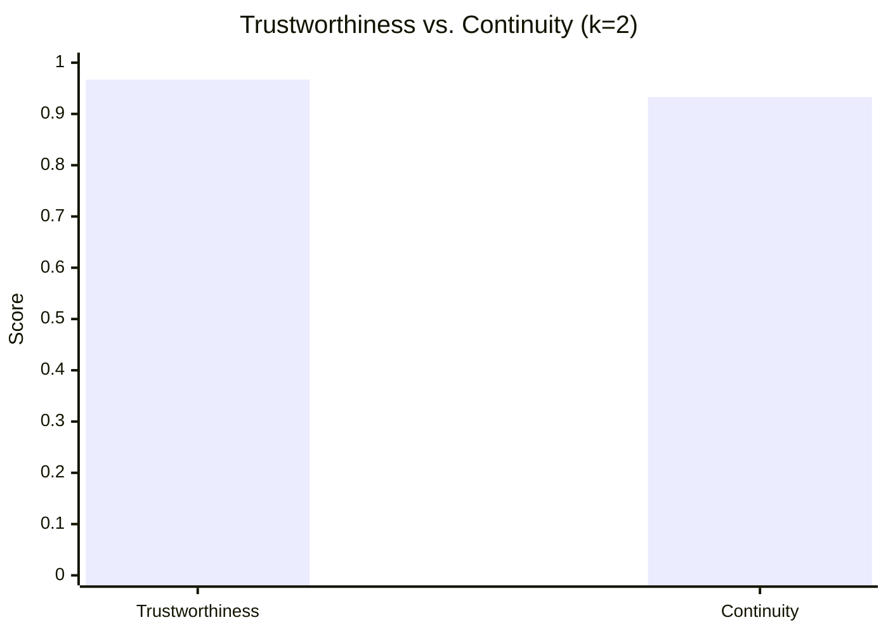
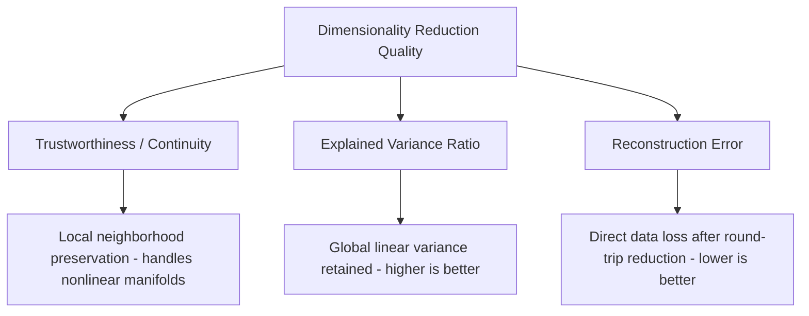

# Trustworthiness & Continuity 

## What is Trustworthiness & Continuity ? 

Trustworthiness and Continuity are a **paired dimensionality reduction metric** that measures whether the **local neighborhood structure** of the data survives the reduction, instead of measuring global variance or overall reconstruction distance. They're the standard way to evaluate **nonlinear** methods like t-SNE, UMAP, or Isomap, where [[01.explained_variance_ratio]] and [[02.reconstruction_error]] don't really apply.

They answer two related but distinct questions:

**"Did the embedding invent new neighbors that weren't really close (Trustworthiness)? Did it break apart neighbors that really were close (Continuity)?"**

Both scores compare each point's k-nearest neighbors in the **original** high-dimensional space against its k-nearest neighbors in the **reduced** low-dimensional embedding. Trustworthiness penalizes **false neighbors** introduced by the embedding; Continuity penalizes **true neighbors** the embedding broke apart. Both range from 0 to 1, with 1 meaning perfect local preservation.

---

## Components 

Trustworthiness & Continuity are built from:

- **k-nearest neighbors (k-NN)** — the k closest points to a given point, computed separately in the original space and in the embedded space
- **Rank**, $r(i,j)$ — how close point $j$ is to point $i$, ranked by distance, within a given space
- **Intruders**, $U_k(i)$ — points that are among point $i$'s k-nearest neighbors in the **embedding** but were **not** among its k-nearest neighbors **originally** (false neighbors)
- **Missing neighbors**, $V_k(i)$ — points that were among point $i$'s k-nearest neighbors **originally** but are **not** among its k-nearest neighbors in the **embedding** (broken neighbors)
- **n** and **k** — the number of samples and the neighborhood size being checked

### Formula

$$T(k) = 1 - \frac{2}{nk(2n-3k-1)} \sum_{i=1}^{n} \sum_{j \in U_k(i)} \left( r(i,j) - k \right)$$

$$C(k) = 1 - \frac{2}{nk(2n-3k-1)} \sum_{i=1}^{n} \sum_{j \in V_k(i)} \left( \hat{r}(i,j) - k \right)$$

- $T(k)$ close to 1 → almost no false neighbors were introduced by the embedding
- $C(k)$ close to 1 → almost no genuine neighbors were broken apart by the embedding
- Either score close to 0 → the embedding severely distorts local structure, in one direction or the other

### Score Interpretation Scale

Both Trustworthiness and Continuity are genuine 0–1 proportions, so — like EVR and NDCG — they support a general-purpose scale:

| Score Range | Interpretation |
| ------------- | --------------- |
| 0.95 – 1.00   | Excellent — local neighborhoods almost perfectly preserved |
| 0.85 – 0.95   | Good |
| 0.70 – 0.85   | Moderate — noticeable local distortion |
| < 0.70        | Poor — the embedding significantly rearranges local structure |

---

### Intruders and Missing Neighbors — Visual Intuition

Before the worked example, it helps to see the two failure modes these metrics are built to catch:

*Point A is a genuine neighbor in both spaces — no penalty. Point B looks close in the embedding but wasn't originally — Trustworthiness penalizes this "intruder." Point C was genuinely close originally but got pushed out of the neighborhood by the embedding — Continuity penalizes this "missing neighbor."*

---

### How it Works 

### Step-by-step Example

1. Dataset

Continuing the curved-arc dataset from [[02.reconstruction_error]]'s edge case: 6 points sit along a 1D curve, embedded into 2D. A nonlinear reduction method maps them down to 1D, checking neighborhoods with **k = 2**.

For 5 of the 6 points, the embedding preserves the original neighbor order perfectly (0 penalty each). Point 1 is where the distortion shows up:

| For Point 1 | Original k=2 neighbors | Embedded k=2 neighbors |
| ------------- | -------------------------- | -------------------------- |
| Rank 1 | Point 2 | Point 2 |
| Rank 2 | Point 3 | Point 4 |

Point 4 appears in the embedding's neighborhood but wasn't originally close (it was originally the 3rd-closest point, i.e. $r(1,4) = 3$) — an **intruder**. Point 3 was genuinely the 2nd-closest point originally but got pushed out of the embedded neighborhood, landing at embedded rank 4 (i.e. $\hat{r}(1,3) = 4$) — a **missing neighbor**.

---

2. Computing the Penalty Terms (n = 6, k = 2)

Normalizing constant: $\frac{2}{nk(2n-3k-1)} = \frac{2}{6 \times 2 \times (12-6-1)} = \frac{2}{60} = 0.0333$

*For simplicity, only Point 1 contributes a nonzero term below — every other point's neighborhood was preserved exactly, contributing 0.*

| Term | Calculation | Value |
| ------ | -------------- | ------- |
| Trustworthiness penalty sum | $r(1,4) - k = 3 - 2$ | 1 |
| Continuity penalty sum | $\hat{r}(1,3) - k = 4 - 2$ | 2 |

---

Visually, the two scores land close to 1, but Continuity is pulled down slightly more than Trustworthiness — this single embedding introduced one intruder but broke one genuine neighbor slightly worse:

3. Trustworthiness & Continuity Calculation

$T(2) = 1 - 0.0333 \times 1 = 1 - 0.033 = \mathbf{0.967}$

$C(2) = 1 - 0.0333 \times 2 = 1 - 0.067 = \mathbf{0.933}$

---

Interpretation:

Trustworthiness of **0.967** ("excellent") means almost no false neighbors were introduced anywhere in the embedding. Continuity of **0.933** ("good," just under the "excellent" cutoff) reflects the one genuine neighbor (Point 3) that got pushed out of Point 1's local neighborhood — a small but real distortion.

---

### Edge Case: Excellent Local Scores, Meaningless Global Layout

The example above shows what these metrics catch — but it's just as important to see what they **don't** catch. Suppose a nonlinear method embeds two well-separated, internally tight clusters, A and B:

| Aspect | What T&C (k=5) reports | What's actually true |
| -------- | -------------------------- | ------------------------ |
| Local neighbors within Cluster A | ≈ 0.99 — excellent | Genuinely well preserved |
| Local neighbors within Cluster B | ≈ 0.99 — excellent | Genuinely well preserved |
| Distance and orientation between Cluster A and Cluster B | Not measured at all | Arbitrary — t-SNE/UMAP can stretch, compress, or rotate the space between clusters freely |

Trustworthiness and Continuity would both report "excellent" here, because every point's *local* neighbors are intact. But nothing about that score says whether Cluster A and Cluster B are meaningfully close, far, or oddly shaped relative to each other in the plot — that's exactly the well-known caveat behind reading distances between t-SNE clusters at face value.

---

## Limitations and Alternatives 

### Limitations

| Limitation | Impact |
|------------|--------|
| **Only measures local structure** — nothing about inter-cluster distance or global layout | Blind spot — as shown above, "excellent" T&C says nothing about whether the overall plot is meaningful |
| **Requires choosing k** — results shift with the neighborhood size, similar to Precision@K's sensitivity | Comparability — always report the k a T&C score was computed at |
| **Computationally expensive** — needs k-NN and rank computations in both spaces, for every point | Runtime — scales poorly on large datasets, similar to Silhouette Score or Dunn Index |
| **Two separate numbers to report** — unlike a single Reconstruction Error or EVR value | Communication — a full picture needs both T(k) and C(k) together, not just one |

### Alternatives

| Metric | Difference from Trustworthiness & Continuity |
|--------|---------------------------------------------------|
| Explained Variance Ratio | Measures global linear variance retained; fast, but blind to nonlinear structure entirely |
| Reconstruction Error | Measures direct round-trip data loss; meaningful for linear methods, less so for nonlinear embeddings without a decoder |

Use Trustworthiness & Continuity when the reduction method is nonlinear (t-SNE, UMAP, Isomap) and preserving local neighborhoods — not global variance — is the actual goal, such as for visualization or downstream clustering. Use Explained Variance Ratio or Reconstruction Error when the method is linear (PCA) and a single, faster, global measure is enough.
