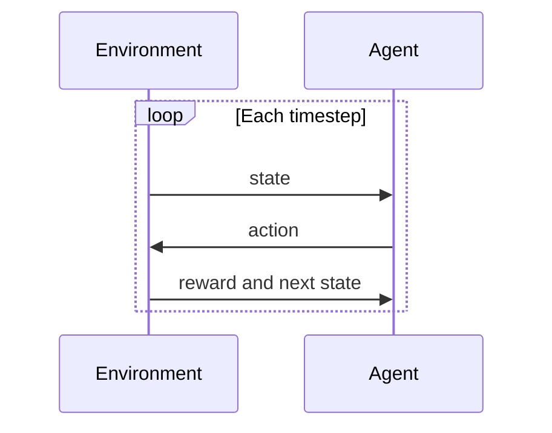
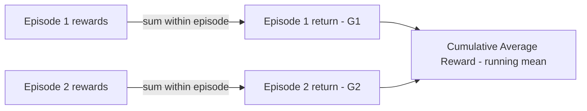
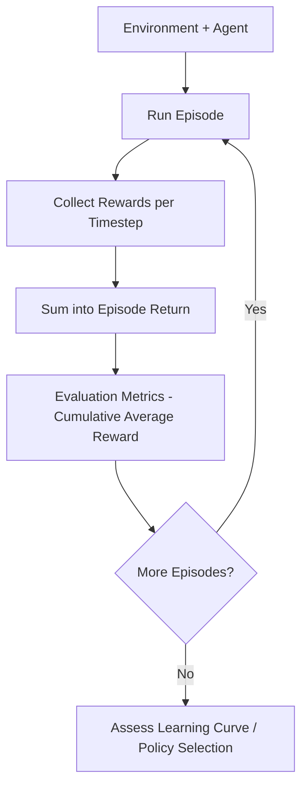
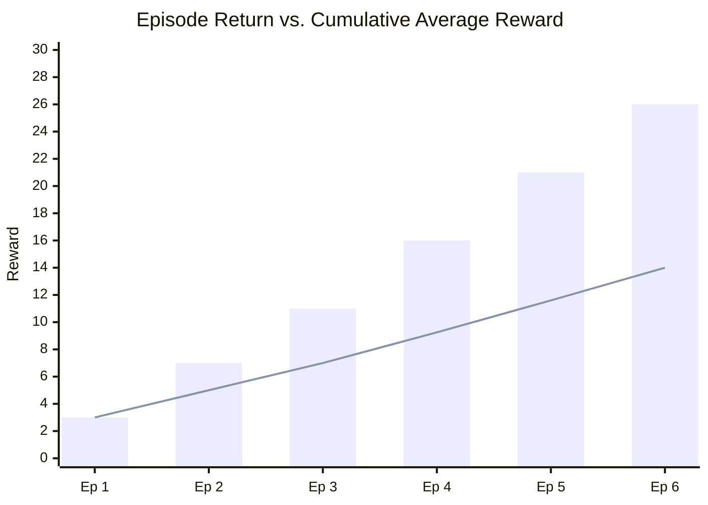
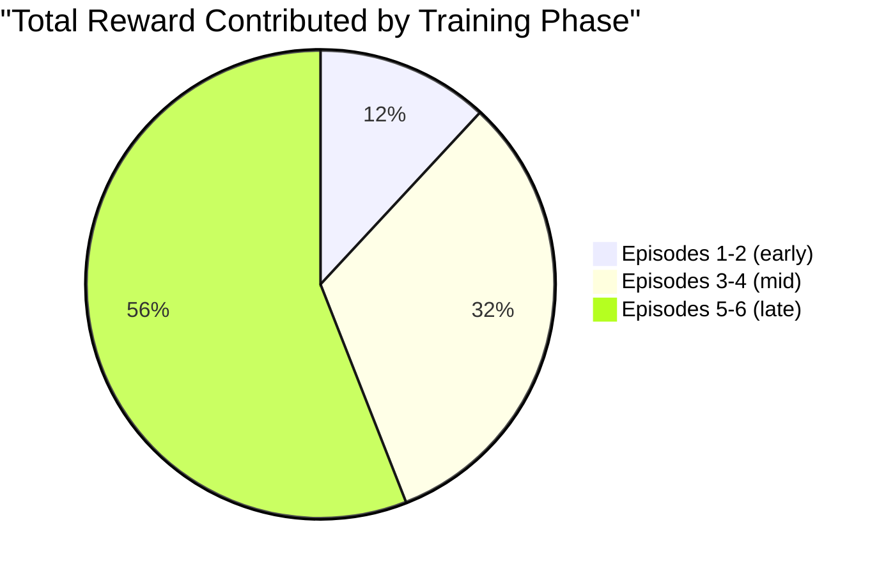
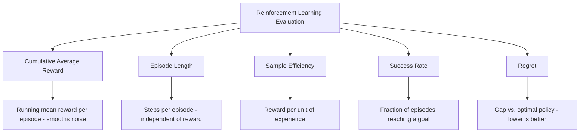

# Cumulative Average Reward 

## What is Cumulative Average Reward ? 

Cumulative Average Reward is a **reinforcement learning metric** that measures the **running mean of total reward earned per episode**, tracked across training, to show whether an agent's policy is actually improving over time.

It answers the question:

**"On average, is my agent earning more reward as training goes on?"**

Unlike a single episode's score, which can swing wildly due to randomness in the environment or the policy's own exploration, Cumulative Average Reward smooths that noise out by averaging every episode's return seen so far. This is the classic **learning curve** plotted in almost every RL paper and training dashboard — reward on the y-axis, episodes (or training steps) on the x-axis.

---

## Components 

Cumulative Average Reward is built from:

- **Reward at timestep t** ($r_t$) — the immediate reward the agent receives after taking one action
- **Episode return** ($G_e$) — the sum of all rewards collected during a single episode $e$, from start to termination
- **E** — the number of episodes considered so far
- **Cumulative Average Reward** ($\bar{G}_E$) — the running mean of episode returns across all $E$ episodes

### Formula

$$G_e = \sum_{t=0}^{T_e} r_t$$

$$\bar{G}_E = \frac{1}{E} \sum_{e=1}^{E} G_e$$

- Rising $\bar{G}_E$ over training → the agent's policy is improving
- Flat $\bar{G}_E$ → learning has plateaued or converged
- Falling $\bar{G}_E$ → the policy is degrading (instability, forgetting, or a bad update)

### Score Interpretation Scale

Reward scale is entirely environment-specific — a score of 200 is excellent in one environment and terrible in another, exactly like MAE's units problem. There's no universal band; the metric is only meaningful relative to something:

| Comparison | Reading |
| ----------- | -------- |
| $\bar{G}_E$ vs. a random-policy baseline | Clearly above random confirms the agent has learned something real |
| $\bar{G}_E$ vs. a known optimal or expert score | Close to that ceiling suggests the policy is near its best achievable performance |
| The trend across training (rising / flat / falling) | Matters more than any single value — see the edge case below |
| $\bar{G}_E$ across different environments | Not comparable directly — rewards are environment-specific units |

---

### The Agent-Environment Loop — Visual Intuition

Before any reward can be averaged, it helps to see exactly where each $r_t$ actually comes from:

*Every r_t in the formula above is one "reward" message in this loop. An episode is just this loop repeated until termination — and Cumulative Average Reward is the running mean of how much reward accumulated per full loop.*

---

### From Timesteps to a Running Average — Visual Intuition

The formula aggregates twice: first within an episode, then across episodes:

*Each episode first collapses its own timesteps into a single return, G_e. Only then does the metric average those returns across episodes — noise inside an episode gets absorbed at the first step, and noise between episodes gets absorbed at the second.*

---

### How it Works 

### Step-by-step Example

1. Dataset

An agent trains for 6 episodes. Each episode's per-timestep rewards are recorded, then summed into an episode return:

| Episode | Rewards per Timestep | Episode Return ($G_e$) |
| --------- | ------------------------ | -------------------------- |
| 1         | 1, 1, 1                   | 3                            |
| 2         | 2, 2, 3                   | 7                            |
| 3         | 3, 4, 4                   | 11                           |
| 4         | 5, 6, 5                   | 16                           |
| 5         | 6, 7, 8                   | 21                           |
| 6         | 8, 9, 9                   | 26                           |

---

2. Running Cumulative Average Reward

| After Episode | Sum of Returns So Far | Cumulative Average Reward ($\bar{G}_E$) |
| ---------------- | -------------------------- | ------------------------------------------- |
| 1                 | 3                           | 3 / 1 = 3.00                                  |
| 2                 | 10                          | 10 / 2 = 5.00                                 |
| 3                 | 21                          | 21 / 3 = 7.00                                 |
| 4                 | 37                          | 37 / 4 = 9.25                                 |
| 5                 | 58                          | 58 / 5 = 11.60                                |
| 6                 | 84                          | 84 / 6 = 14.00                                |

---

Visually, individual episode returns bounce around while the cumulative average climbs smoothly — this is the classic RL learning curve:

*Each bar is noisier than the last one only in magnitude (they're actually rising steadily here), but the line smooths that into one clean upward trend — exactly what a healthy learning curve looks like.*

Breaking the same 84 total reward down by training phase shows where most of it was actually earned:

*Well over half the total reward (47 of 84) came from the last two episodes — direct evidence the policy was still improving, not just accumulating noise.*

3. Cumulative Average Reward Calculation

$\bar{G}_6 = \frac{3 + 7 + 11 + 16 + 21 + 26}{6} = \frac{84}{6} = \mathbf{14.00}$

---

Interpretation:

After 6 episodes, the agent's Cumulative Average Reward is **14.00**, up from 3.00 after just the first episode — a clear rising trend, consistent with a policy that is genuinely learning rather than one getting lucky once.

---

### Edge Case: When the Lifetime Average Hides a Regression

The metric above only went up, so it's worth seeing what happens when training gets worse. Suppose training continues for 3 more episodes, and the policy suddenly destabilizes (e.g., a bad update or catastrophic forgetting), producing returns of 4, 3, and 5:

| Episode | Return | Cumulative Average Reward | Last-3-Episode Average |
| --------- | -------- | ------------------------------ | -------------------------- |
| 6 (before dip) | 26 | 84 / 6 = 14.00 | (11+16+21)/3 = 16.00 |
| 7 | 4 | 88 / 7 = 12.57 | (16+21+4)/3 = 13.67 |
| 8 | 3 | 91 / 8 = 11.38 | (21+4+3)/3 = 9.33 |
| 9 | 5 | 96 / 9 = 10.67 | (4+3+5)/3 = **4.00** |

The lifetime Cumulative Average Reward only drifts down slowly — from 14.00 to 10.67 — because it's still weighted down by every strong early episode. It never comes close to reflecting that the agent's **current** performance has collapsed to around 4. A windowed average over just the last 3 episodes (4.00) reveals the regression immediately. This is exactly why production RL monitoring almost always tracks a **moving average** alongside (or instead of) the full lifetime average.

---

## Limitations and Alternatives 

### Limitations

| Limitation | Impact |
|------------|--------|
| **Scale-dependent** — reward units are entirely environment-specific | Comparability — cannot be compared across different environments, only against a baseline within the same one |
| **Lifetime average lags behind recent performance** — old episodes keep pulling the mean toward the past | Diagnosis — as shown above, a real regression can be nearly invisible in the full-history average |
| **High variance across episodes** — especially early in training or in stochastic environments | Reliability — a single run's curve can be noisy; multiple seeds or longer windows are often needed |
| **Ignores how the reward was earned** — says nothing about steps taken, risk, or efficiency | Blind spot — pair with Episode Length or Sample Efficiency to know *how* the reward was achieved |

### Alternatives

| Metric | Difference from Cumulative Average Reward |
|--------|-----------------------------------------------|
| Episode Length | Measures how many steps an episode takes, independent of how much reward was earned |
| Sample Efficiency | Measures how much reward (or performance) is achieved per unit of experience collected |
| Success Rate | Measures the fraction of episodes that reach a defined goal, ignoring the exact reward magnitude |
| Regret | Measures the gap between the reward actually earned and the reward an optimal policy would have earned |

Use Cumulative Average Reward when you want the standard, easy-to-plot signal for "is my agent learning?" over the course of training. Use a windowed/moving average alongside it to catch recent regressions the lifetime average would hide, and pair it with Episode Length, Sample Efficiency, Success Rate, or Regret when reward alone doesn't capture the full picture of how well — or how efficiently — the agent is actually performing.
