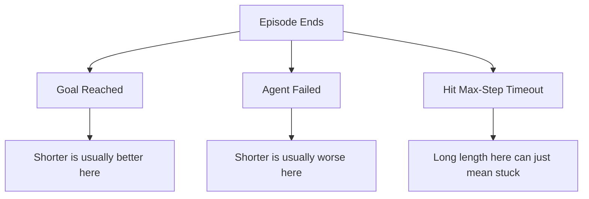
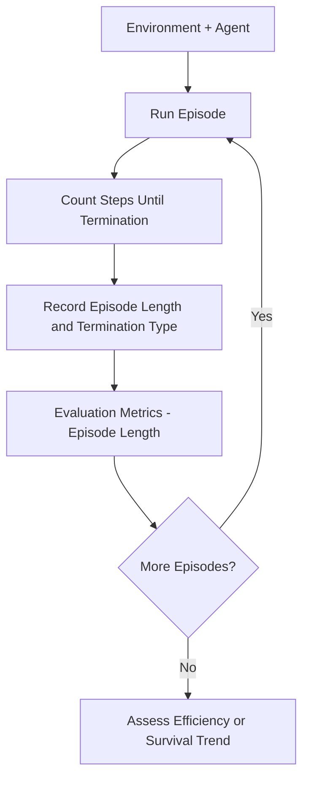
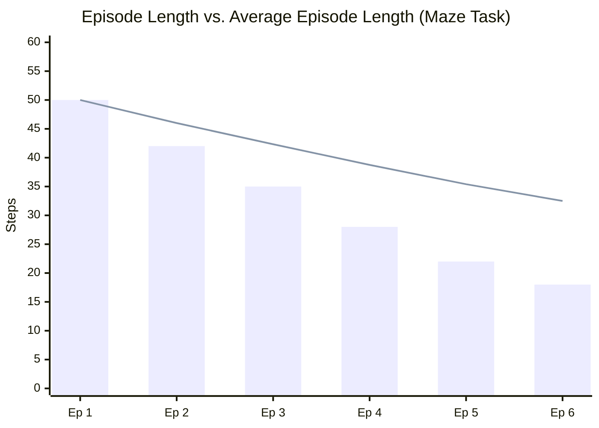
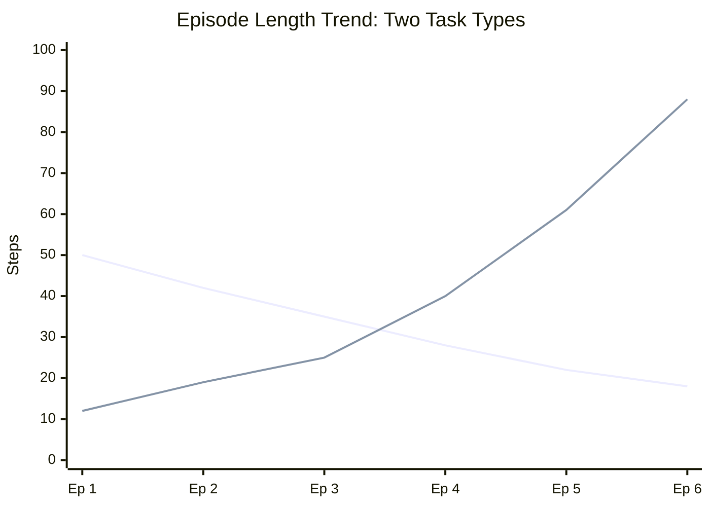
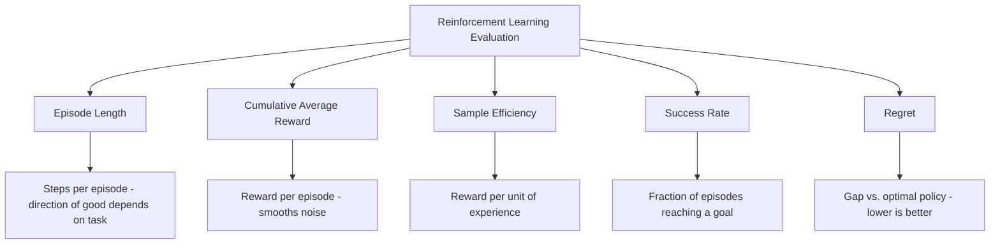

# Episode Length 

## What is Episode Length ? 

Episode Length is a **reinforcement learning metric** that measures **how many timesteps an episode takes before it terminates** — whether by reaching a goal, failing, or hitting a time limit.

It answers the question:

**"How many steps did it take before this episode ended?"**

Episode Length is unusual among RL metrics because it has **no fixed direction for "good."** In a goal-reaching task (a maze, a delivery task), a **shorter** episode means the agent finished efficiently. In a survival or balancing task (CartPole, a robot staying upright), a **longer** episode means the agent avoided failure for more steps. The same number can mean opposite things depending entirely on what the episode's ending represents.

---

## Components 

Episode Length is built from:

- **Timestep** — a single step of agent-environment interaction (one state, one action, one reward)
- **Episode Length** ($L_e$) — the terminal timestep $T_e$ at which episode $e$ ends, i.e. the total number of steps taken
- **Termination type** — *why* the episode ended: goal reached, failure, or a max-step timeout cutoff
- **E** — the number of episodes considered
- **Average Episode Length** ($\bar{L}_E$) — the running mean of episode lengths across all $E$ episodes

### Formula

$$L_e = T_e$$

$$\bar{L}_E = \frac{1}{E} \sum_{e=1}^{E} L_e$$

- In **goal-reaching** tasks: falling $\bar{L}_E$ → the agent is completing the task more efficiently
- In **survival / balancing** tasks: rising $\bar{L}_E$ → the agent is avoiding failure for longer
- In either task: episodes repeatedly hitting the environment's max-step cutoff is a red flag, not a neutral result

### Score Interpretation Scale

Episode Length has two problems a metric like MAE doesn't: it's scale-dependent (step counts are environment-specific), **and** the direction of "good" flips by task type. There's no universal band — read it like this instead:

| Comparison | Reading |
| ----------- | -------- |
| $\bar{L}_E$ trend in a goal-reaching task | Falling is usually better — faster task completion |
| $\bar{L}_E$ trend in a survival/avoidance task | Rising is usually better — failure avoided for longer |
| $\bar{L}_E$ vs. the environment's max-step cutoff | Frequently hitting the cutoff is a red flag — the agent may be stuck or looping, not succeeding |
| $\bar{L}_E$ across different environments | Not comparable directly — step scale and termination rules are environment-specific |

---

### Why an Episode Ended — Visual Intuition

Before reading any trend, it helps to see that "episode ended" isn't one event — it's three very different ones, each changing what the same length actually means:

*Two episodes that both lasted 40 steps can mean completely different things: one might be a quick success, another a quick failure, and another an agent wandering until the environment simply cut it off. Episode Length alone can't tell these apart — only the termination type can.*

---

### How it Works 

### Step-by-step Example

1. Dataset

An agent trains for 6 episodes on a **maze task** (goal-reaching), where every episode ends in success. Episode Length is the number of steps taken to reach the goal:

| Episode | Termination Type | Episode Length ($L_e$) |
| --------- | -------------------- | -------------------------- |
| 1         | Goal Reached          | 50                            |
| 2         | Goal Reached          | 42                            |
| 3         | Goal Reached          | 35                            |
| 4         | Goal Reached          | 28                            |
| 5         | Goal Reached          | 22                            |
| 6         | Goal Reached          | 18                            |

---

2. Running Average Episode Length

| After Episode | Sum of Lengths So Far | Average Episode Length ($\bar{L}_E$) |
| ---------------- | -------------------------- | ---------------------------------------- |
| 1                 | 50                          | 50 / 1 = 50.00                             |
| 2                 | 92                          | 92 / 2 = 46.00                             |
| 3                 | 127                         | 127 / 3 = 42.33                            |
| 4                 | 155                         | 155 / 4 = 38.75                            |
| 5                 | 177                         | 177 / 5 = 35.40                            |
| 6                 | 195                         | 195 / 6 = 32.50                            |

---

Visually, both the raw episode lengths and the running average fall steadily — the opposite shape of a rising reward curve, but representing the same underlying improvement:

*Every episode ends in success here, so a shorter length purely reflects a more efficient path to the goal — there's no ambiguity about direction in this specific task.*

3. Average Episode Length Calculation

$\bar{L}_6 = \frac{50 + 42 + 35 + 28 + 22 + 18}{6} = \frac{195}{6} = \mathbf{32.50}$

---

Interpretation:

Average Episode Length fell from 50.00 to 32.50 over 6 episodes — in this goal-reaching maze task, that's a clear efficiency gain: the agent is finding the goal in fewer and fewer steps.

---

### Edge Case: The Same Metric, Opposite Meaning

The maze example above only makes sense because falling length = improvement *for that task*. Now compare it against a **CartPole-style survival task**, trained for the same 6 episodes, where every episode ends in failure (the pole falls):

| Episode | Termination Type | Episode Length ($L_e$) |
| --------- | -------------------- | -------------------------- |
| 1         | Agent Failed           | 12                            |
| 2         | Agent Failed           | 19                            |
| 3         | Agent Failed           | 25                            |
| 4         | Agent Failed           | 40                            |
| 5         | Agent Failed           | 61                            |
| 6         | Agent Failed           | 88                            |

| Task Type | Trend Across Training | What It Actually Means |
| ----------- | -------------------------- | ---------------------------- |
| Maze (goal-reaching) | Falling: 50 → 18 | Agent reaches the goal faster — improving |
| CartPole (survival) | Rising: 12 → 88 | Agent avoids failure longer — improving |

Both agents are **improving**, but their Episode Length curves move in exactly opposite directions. Reading either curve without first knowing the task type would lead to the wrong conclusion — this is the single most important thing to check before trusting this metric.

---

## Limitations and Alternatives 

### Limitations

| Limitation | Impact |
|------------|--------|
| **Direction of "good" depends on task type** — goal-reaching wants it low, survival wants it high | Interpretation — as shown above, the same rising or falling trend can mean improvement or regression |
| **Doesn't distinguish why an episode ended** — success, failure, and timeout all just produce a number | Blind spot — two identical lengths can represent a fast success and a fast failure |
| **Confounded by the max-step cutoff** — episodes that time out are capped at an arbitrary value | Distortion — an average dominated by timeouts reflects the cutoff setting, not genuine agent skill |
| **Says nothing about reward or success on its own** — length alone doesn't confirm good or bad performance | Blind spot — always pair with Cumulative Average Reward or Success Rate |

### Alternatives

| Metric | Difference from Episode Length |
|--------|-------------------------------------|
| Cumulative Average Reward | Measures how much reward was earned, independent of how many steps it took |
| Sample Efficiency | Measures how much performance is achieved per unit of experience collected |
| Success Rate | Measures the fraction of episodes that reach a defined goal, regardless of how long they took |
| Regret | Measures the gap between reward actually earned and what an optimal policy would have earned |

Use Episode Length when the number of steps itself is meaningful — efficiency in a goal-reaching task, or survival time in a balancing task — but always confirm the task type first. Pair it with Cumulative Average Reward or Success Rate when you also need to know whether the episode actually succeeded, not just how long it ran.
