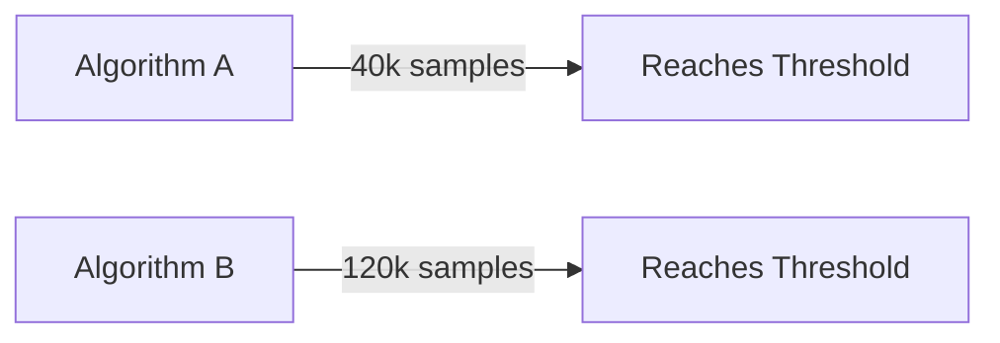
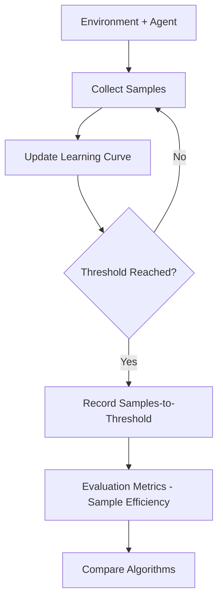
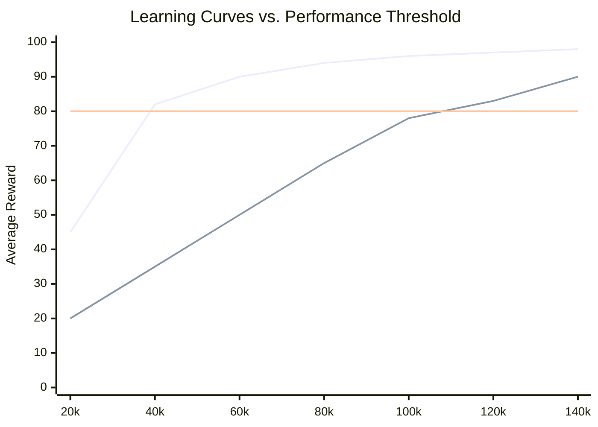
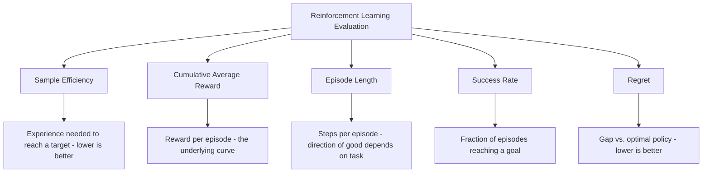

# Sample Efficiency 

## What is Sample Efficiency ? 

Sample Efficiency is a **reinforcement learning metric** that measures **how much experience (environment interactions) an agent needs before reaching a target level of performance**, rather than how good it eventually gets.

It answers the question:

**"How many samples of experience does my agent need to become good, not just how good does it eventually become?"**

Two agents can reach the exact same final performance, but if one needs 40,000 environment steps to get there and the other needs 120,000, the first is **3x more sample efficient** — a critical distinction whenever collecting experience is slow or expensive (robotics, real-world interaction, expensive simulations). It's most commonly reported as **samples-to-threshold**: the number of environment steps needed until average performance first crosses a target value.

---

## Components 

Sample Efficiency is built from:

- **Sample** — one environment interaction (a timestep) contributing to the agent's experience
- **Learning curve** — average performance ($\bar{G}_N$, i.e. Cumulative Average Reward) plotted against the number of samples collected so far
- **Performance threshold** ($\theta$) — a target level of performance considered "good enough" or "solved"
- **Samples-to-threshold** ($N_\theta$) — the smallest number of samples at which the learning curve first reaches $\theta$

### Formula

$$N_\theta = \min \{ N : \bar{G}_N \geq \theta \}$$

An alternative formalization sums the whole learning curve up to a fixed sample budget instead of using a threshold:

$$\text{Sample Efficiency (AUC)} = \sum_{n=1}^{N_{max}} \bar{G}_n$$

- Low $N_\theta$ → the agent reaches the target performance quickly, using little experience
- High $N_\theta$ → the agent needs a lot of experience before performing well
- Higher AUC → the agent accumulated good performance faster across the whole training run, not just at one checkpoint

### Score Interpretation Scale

$N_\theta$ is measured in raw samples, which is scale-dependent and environment-specific — like MAE's units problem. There's no universal band; it's only meaningful compared to something:

| Comparison | Reading |
| ----------- | -------- |
| $N_\theta$ for two algorithms, same environment, same threshold | Directly comparable — lower is more sample-efficient |
| $N_\theta$ across different environments | Not comparable directly — environments differ wildly in step scale and difficulty |
| $N_\theta$ vs. a baseline algorithm's $N_\theta$ | The standard way to report "2x more sample-efficient than baseline X" |
| AUC-based efficiency vs. threshold-based | Different questions: "how fast to hit the bar?" vs. "how good was the whole learning journey?" |

---

### Same Target, Different Budgets — Visual Intuition

Before comparing full learning curves, it helps to see what Sample Efficiency is actually measuring — not final skill, but the *cost* of getting there:

*Both algorithms arrive at the same destination — crossing the same performance threshold — but Algorithm A gets there using a third of the experience Algorithm B needed.*

---

### How it Works 

### Step-by-step Example

1. Dataset

Two algorithms, A and B, train on the same environment. Average reward is checkpointed every 20,000 steps:

| Steps | Algorithm A Reward | Algorithm B Reward |
| ------- | ---------------------- | ---------------------- |
| 20k     | 45                       | 20                       |
| 40k     | 82                       | 35                       |
| 60k     | 90                       | 50                       |
| 80k     | 94                       | 65                       |
| 100k    | 96                       | 78                       |
| 120k    | 97                       | 83                       |
| 140k    | 98                       | 90                       |

---

2. Finding Samples-to-Threshold ($\theta = 80$)

| Algorithm | First checkpoint ≥ 80 | $N_\theta$ |
| ----------- | -------------------------- | ------------- |
| A           | 82 at 40k steps              | 40,000         |
| B           | 83 at 120k steps             | 120,000        |

---

Visually, plotting both curves against a fixed threshold line makes the gap obvious — Algorithm A crosses it far earlier than Algorithm B:

*Algorithm A crosses the threshold line at 40k steps; Algorithm B doesn't cross it until 120k steps — the horizontal gap between the two curves and the threshold line is exactly what Sample Efficiency measures.*

3. Sample Efficiency Calculation

Sample Efficiency Ratio = $N_\theta(B) / N_\theta(A)$ = 120,000 / 40,000 = **3.0**

---

Interpretation:

Algorithm A is **3x more sample-efficient** than Algorithm B at reaching a reward of 80 — it needed a third of the environment interactions to hit the same target, even though both algorithms eventually reach similarly strong performance by 140k steps.

---

### Edge Case: Fast to the Bar, Low Ceiling

The comparison above only checked one threshold, so it's worth seeing what happens with a third algorithm, C, that looks even *more* efficient by that same measure — at first:

| Algorithm | $N_\theta$ (steps to reach 80) | Performance at 140k steps |
| ----------- | ---------------------------------- | ------------------------------ |
| A           | 40,000                               | 98                               |
| C           | 25,000                               | 82 — plateaued, no further gains |

By the $\theta = 80$ threshold, **C looks like the most sample-efficient algorithm of all** — it got there in just 25,000 steps, faster than A's 40,000. But C then plateaus at 82 and never improves again, while A keeps climbing to 98. Whether C or A "wins" entirely depends on which threshold you pick: a low bar favors C, a high bar (or no bar at all, just final performance) favors A. **Sample Efficiency measured against one threshold says nothing about an algorithm's eventual ceiling.**

---

## Limitations and Alternatives 

### Limitations

| Limitation | Impact |
|------------|--------|
| **Sensitive to the choice of threshold** — which algorithm looks best can flip depending on $\theta$ | Model selection — as shown above, a fast-but-mediocre algorithm can look better than a slower, ultimately stronger one |
| **Ignores eventual ceiling performance** — reaching a threshold fast says nothing about the best achievable result | Blind spot — always check the full learning curve, not just $N_\theta$ |
| **Scale-dependent** — raw sample counts are environment-specific | Comparability — cannot be compared across different environments or reward scales |
| **Requires multiple training runs to be reliable** — RL training is highly stochastic | Reliability — a single run's $N_\theta$ can vary widely; robust comparisons need several seeds averaged together |

### Alternatives

| Metric | Difference from Sample Efficiency |
|--------|----------------------------------------|
| Cumulative Average Reward | The underlying learning curve Sample Efficiency is measured against, without a notion of "cost to get there" |
| Episode Length | Measures steps per episode, not total experience needed to reach a performance target |
| Success Rate | Measures the fraction of episodes reaching a goal, regardless of how much experience was needed to learn that |
| Regret | Measures the cumulative gap from optimal performance over training, penalizing slow learning directly rather than via a threshold |

Use Sample Efficiency when the cost of collecting experience matters — real robots, expensive simulations, limited training budgets — and you need to compare how quickly different algorithms become useful. Pair it with the full Cumulative Average Reward learning curve to also see eventual ceiling performance, and use Regret when you want a single number that penalizes slow learning across the entire run, not just relative to one threshold.
