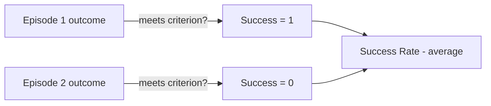
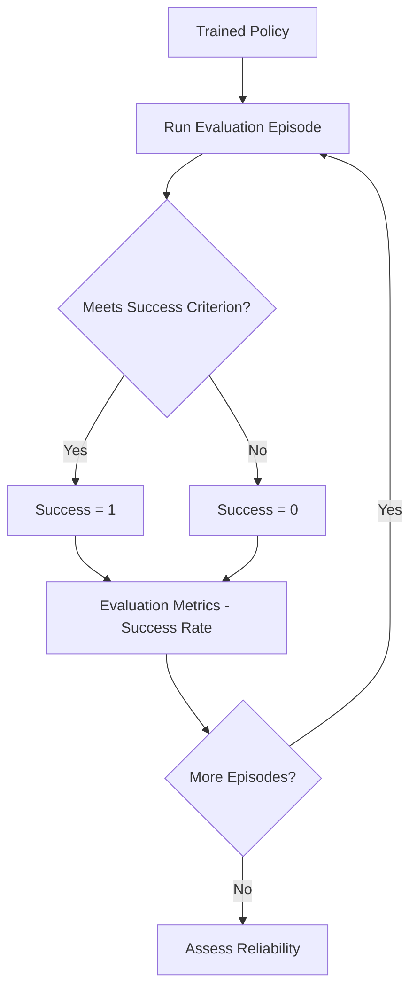
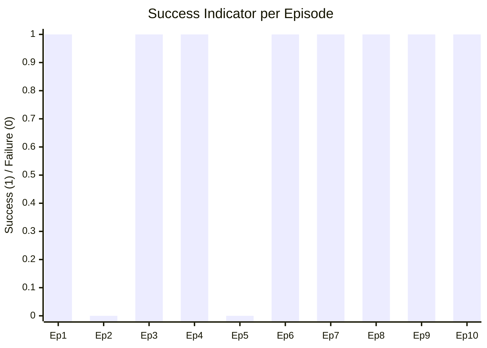
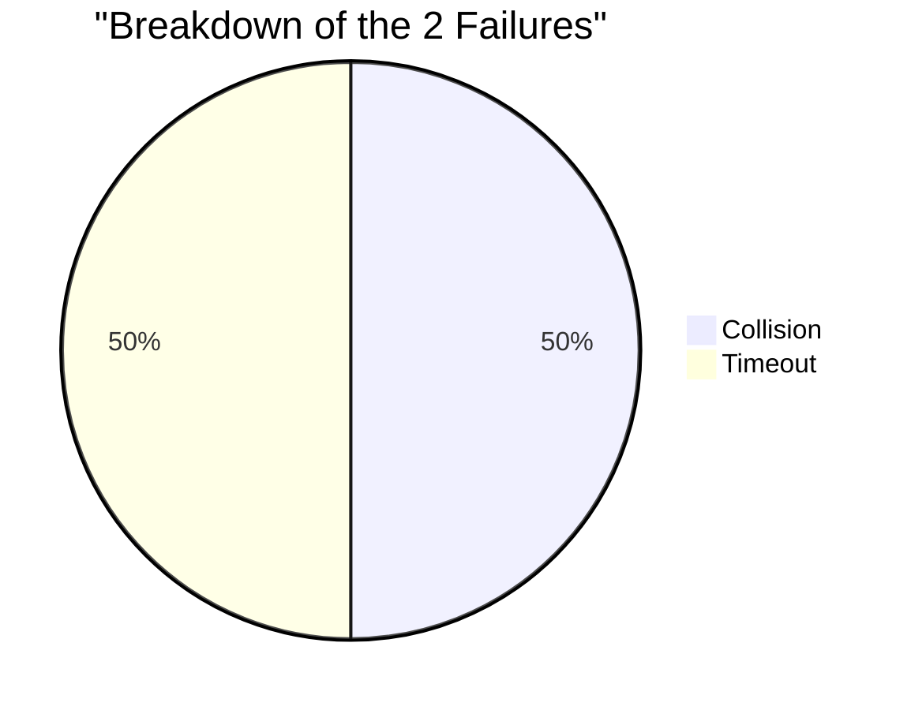
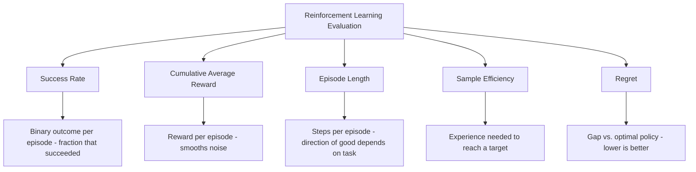

# Success Rate 

## What is Success Rate ? 

Success Rate is a **reinforcement learning metric** that measures the **fraction of episodes in which the agent actually completes the task**, according to a defined success criterion — reaching a goal, finishing within a limit, or any other pass/fail condition.

It answers the question:

**"Out of all the episodes I ran, what fraction actually succeeded?"**

Success Rate is the reinforcement learning cousin of Hit Rate from ranking evaluation — both collapse a whole trial down to a single 0-or-1 outcome, then average across many trials. It's usually reported by evaluating a fixed, already-trained policy over many test episodes, rather than tracked continuously like a training-time learning curve.

---

## Components 

Success Rate is built from:

- **Success criterion** — the task-specific definition of "success" (e.g., reached the goal, finished within a time limit, avoided all obstacles)
- **Success indicator** ($s_e$) — 1 if episode $e$ meets the success criterion, 0 otherwise
- **E** — the number of episodes evaluated
- **Success Rate** — the average of $s_e$ across all $E$ episodes

### Formula

$$s_e = \begin{cases} 1, & \text{if episode } e \text{ meets the success criterion} \\ 0, & \text{otherwise} \end{cases}$$

$$SuccessRate = \frac{1}{E} \sum_{e=1}^{E} s_e$$

- High Success Rate → the agent reliably completes the task
- Low Success Rate → the agent frequently fails, even if its average reward still looks reasonable

### Score Interpretation Scale

Success Rate is a genuine 0–1 proportion, so — like R², NDCG, and EVR — it supports a general-purpose scale. Task difficulty still shifts expectations (95% on a trivial task is unremarkable; 50% on a genuinely hard task can be a breakthrough), but as a starting point:

| Success Rate | Interpretation |
| -------------- | --------------- |
| 0.95 – 1.00     | Excellent — near-perfect reliability |
| 0.80 – 0.95     | Good — reliable most of the time |
| 0.50 – 0.80     | Moderate — succeeds more often than not, but not dependable |
| < 0.50          | Poor — fails more often than it succeeds |

---

### Collapsing Episodes to Outcomes — Visual Intuition

Before the worked example, it helps to see the two-stage collapse this metric performs — first outcome, then average:

*Every episode, no matter how it unfolded, gets reduced to a single bit before it's ever averaged. Whatever nuance existed inside the episode — how close it came, how efficiently, how riskily — is gone by the time it reaches the average.*

---

### How it Works 

### Step-by-step Example

1. Dataset

A trained policy is evaluated on a navigation task across **10 test episodes**. Success means reaching the goal; failures are logged with their cause:

| Episode | Outcome | Failure Cause | Success Indicator ($s_e$) |
| --------- | --------- | ------------------ | ------------------------------ |
| 1         | Success   | —                    | 1                                |
| 2         | Failure   | Collision            | 0                                |
| 3         | Success   | —                    | 1                                |
| 4         | Success   | —                    | 1                                |
| 5         | Failure   | Timeout              | 0                                |
| 6         | Success   | —                    | 1                                |
| 7         | Success   | —                    | 1                                |
| 8         | Success   | —                    | 1                                |
| 9         | Success   | —                    | 1                                |
| 10        | Success   | —                    | 1                                |

---

2. Success Indicator per Episode

Visually, each episode either hits or misses the criterion — Success Rate is just the fraction of hits across all 10 trials:

*8 of the 10 episodes succeeded. The two failures — Episode 2 and Episode 5 — had different causes, which matters for diagnosis even though Success Rate itself treats them identically.*

Breaking down just the failures shows they weren't the same kind of problem:

3. Success Rate Calculation

$SuccessRate = \frac{8}{10} = \mathbf{0.80}$

---

Interpretation:

The policy succeeds in **80% of episodes** — landing in the "Good" band above. The two failures came from different causes (one collision, one timeout), suggesting two separate issues to investigate rather than one recurring bug.

---

### Edge Case: The Same 10 Episodes, Two Very Different Scores

Success Rate depends entirely on how "success" is defined — and that definition is easy to overlook when comparing numbers across teams or papers. Using the exact same 10 trajectories from above, here's what happens under a looser vs. a stricter criterion:

| Criterion | Successes | Success Rate |
| ----------- | ------------- | --------------- |
| Loose — reached the goal eventually, any number of steps | 9 / 10 | 0.90 — "Good" |
| Strict — reached the goal within 50 steps and zero collisions | 5 / 10 | 0.50 — "Moderate" |

Nothing about the agent's actual behavior changed between these two rows — only the definition of "success" did. Reporting "Success Rate: 90%" and "Success Rate: 50%" for the identical policy are both technically correct; this is exactly why the success criterion must always be stated alongside the number, never assumed to match another report's definition.

---

## Limitations and Alternatives 

### Limitations

| Limitation | Impact |
|------------|--------|
| **Sensitive to how "success" is defined** — strictness of the criterion changes the number dramatically | Comparability — as shown above, always state the exact criterion, never assume it matches another report's |
| **Ignores reward magnitude and efficiency** — a perfect Success Rate says nothing about how well or how fast the task was completed | Blind spot — pair with Cumulative Average Reward or Episode Length for that |
| **Doesn't distinguish failure causes on its own** — collisions and timeouts collapse into the same "0" | Diagnosis — needs extra logging (like the failure breakdown above) to be actionable |
| **Needs enough episodes to be statistically reliable** — with few evaluation episodes, the estimate has high variance | Reliability — a single flipped outcome can swing a 10-episode Success Rate by 10 percentage points |

### Alternatives

| Metric | Difference from Success Rate |
|--------|-----------------------------------|
| Cumulative Average Reward | Measures the magnitude of reward earned, not a binary pass/fail outcome |
| Episode Length | Measures steps per episode, independent of whether the episode succeeded |
| Sample Efficiency | Measures how much experience was needed to reach a performance target, not a per-episode outcome |
| Regret | Measures the cumulative gap from optimal performance, rather than a simple success/failure count |

Use Success Rate when the task has a clear pass/fail outcome and reliability is what matters most — robotics deployment, safety-critical tasks, benchmark leaderboards. Pair it with Cumulative Average Reward or Episode Length when *how well* or *how efficiently* the task was completed matters just as much as whether it was completed at all.
