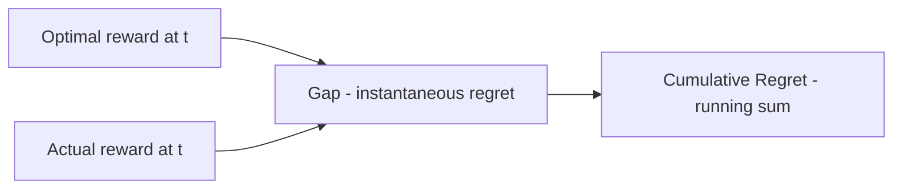
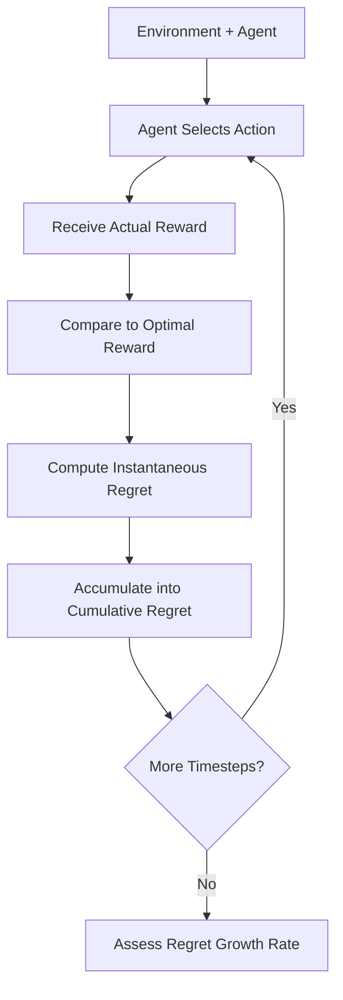
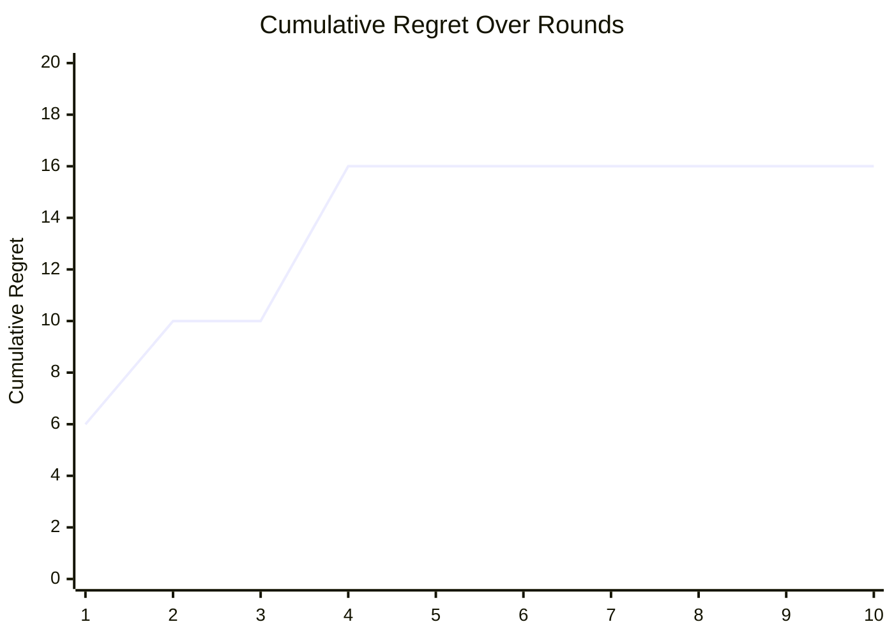
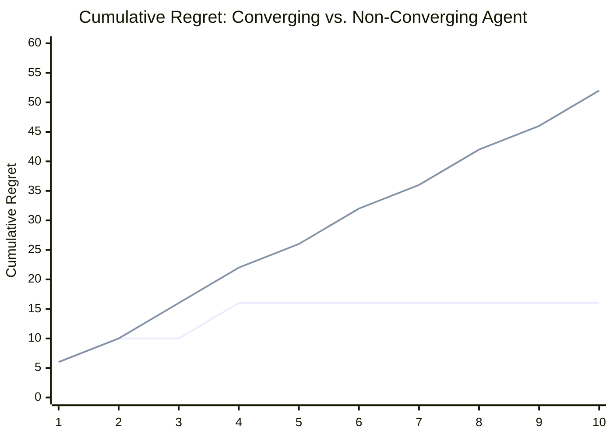
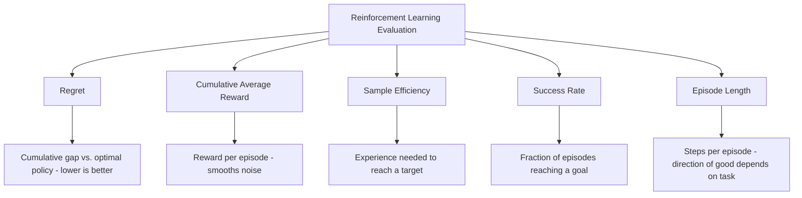

# Regret 

## What is Regret ? 

Regret is a **reinforcement learning metric** that measures the **cumulative gap between the reward an agent actually earned and the reward an optimal policy would have earned**, summed over every timestep so far.

It answers the question:

**"Adding up every mistake so far, how much reward has my agent left on the table by not acting optimally from the start?"**

Regret is the standard metric in bandit and online-learning problems, where "optimal" means a specific, well-defined best action. What matters most isn't the raw regret number at any one point — it's **how the cumulative regret curve grows**. A good learning algorithm's regret **flattens out** over time as it converges on the optimal action; a bad one keeps accumulating regret in a straight line, forever.

---

## Components 

Regret is built from:

- **Optimal reward at timestep t** ($r_t^*$) — the reward the single best possible action would have earned at that timestep
- **Actual reward at timestep t** ($r_t$) — the reward the agent's chosen action actually earned
- **Instantaneous regret** ($regret_t = r_t^* - r_t$) — the gap between the two, at one timestep
- **Cumulative Regret** ($Regret_T$) — the running sum of instantaneous regret from timestep 1 through $T$

### Formula

$$regret_t = r_t^* - r_t$$

$$Regret_T = \sum_{t=1}^{T} regret_t$$

- Cumulative Regret **flattening** over time (sublinear growth) → the agent is converging toward optimal behavior; mistakes become rare
- Cumulative Regret **rising steadily** (linear growth) → the agent keeps making costly mistakes at a constant rate and is never converging

### Score Interpretation Scale

Regret is scale-dependent, like reward — but more importantly, a single $Regret_T$ number at one point in time tells you far less than the shape of the curve leading up to it:

| Comparison | Reading |
| ----------- | -------- |
| $Regret_T$ for two algorithms, same $T$, same environment | Directly comparable — lower is better |
| Shape of the regret curve (flattening vs. a straight line) | Matters more than any single value — see the edge case below |
| $Regret_T$ across different environments | Not comparable directly — optimal reward and reward scale are environment-specific |
| Average regret per step, $Regret_T / T$ | A useful normalized view — should trend toward 0 for a converging algorithm as $T$ grows |

---

### Where Regret Comes From — Visual Intuition

Before the worked example, it helps to see regret as a gap that gets measured and then accumulated, timestep by timestep:

*Every timestep contributes its own gap to the running total. A gap of 0 means the agent picked the best possible action that round — it adds nothing new to the cumulative regret.*

---

### How it Works 

### Step-by-step Example

1. Dataset

A 3-armed bandit problem: Arm A always pays 10 (the optimal arm), while Arms B and C pay less. An agent explores early, then locks onto Arm A:

| Round | Arm Pulled | Actual Reward | Optimal Reward | Instantaneous Regret |
| ------- | -------------- | ----------------- | ------------------- | -------------------------- |
| 1       | B                | 4                    | 10                     | 6                             |
| 2       | C                | 6                    | 10                     | 4                             |
| 3       | A                | 10                   | 10                     | 0                             |
| 4       | B                | 4                    | 10                     | 6                             |
| 5       | A                | 10                   | 10                     | 0                             |
| 6       | A                | 10                   | 10                     | 0                             |
| 7       | A                | 10                   | 10                     | 0                             |
| 8       | A                | 10                   | 10                     | 0                             |
| 9       | A                | 10                   | 10                     | 0                             |
| 10      | A                | 10                   | 10                     | 0                             |

---

2. Cumulative Regret per Round

| Round | Instantaneous Regret | Cumulative Regret |
| ------- | -------------------------- | ---------------------- |
| 1       | 6                             | 6                         |
| 2       | 4                             | 10                        |
| 3       | 0                             | 10                        |
| 4       | 6                             | 16                        |
| 5       | 0                             | 16                        |
| 6       | 0                             | 16                        |
| 7       | 0                             | 16                        |
| 8       | 0                             | 16                        |
| 9       | 0                             | 16                        |
| 10      | 0                             | 16                        |

---

Visually, cumulative regret climbs during exploration, then flattens completely once the agent settles on Arm A:

*After Round 4, the line goes completely flat — the agent stopped making mistakes entirely. This flattening shape is what "sublinear regret" looks like in miniature.*

3. Regret Calculation

$Regret_{10} = 6 + 4 + 0 + 6 + 0 + 0 + 0 + 0 + 0 + 0 = \mathbf{16}$

---

Interpretation:

After 10 rounds, total Regret is **16** — but the more important fact is that it stopped growing after Round 4. The agent found the optimal arm and stuck with it, meaning every future round adds essentially nothing more to this total.

---

### Edge Case: Flattening vs. a Straight Line

The example above shows convergence, so it's worth contrasting it against an agent that never settles down — say, one that keeps exploring randomly instead of committing to what it's learned:

| Round | Converging Agent's Regret | Non-Converging Agent's Regret |
| ------- | ------------------------------- | ------------------------------------ |
| 1       | 6                                   | 6                                       |
| 2       | 4                                   | 4                                       |
| 3       | 0                                   | 6                                       |
| 4       | 6                                   | 6                                       |
| 5       | 0                                   | 4                                       |
| 6       | 0                                   | 6                                       |
| 7       | 0                                   | 4                                       |
| 8       | 0                                   | 6                                       |
| 9       | 0                                   | 4                                       |
| 10      | 0                                   | 6                                       |

Both agents start identically for the first two rounds — their cumulative regret is indistinguishable at Round 2. But the converging agent's curve goes flat, while the non-converging agent's curve keeps climbing in a straight line, all the way to 52 by Round 10 and still rising. **Comparing the two agents at Round 2 alone would say nothing useful; the entire story is in whether the curve eventually bends.**

---

## Limitations and Alternatives 

### Limitations

| Limitation | Impact |
|------------|--------|
| **Requires knowing the optimal reward** — the true best action's value must be known or estimated | Applicability — exact regret is usually only computable in simulated or benchmark settings, not real-world deployments |
| **A single value is uninformative without the growth shape** — one $Regret_T$ number hides whether the curve is flattening or still climbing | Interpretation — as shown above, always look at the trend, not one snapshot |
| **Scale-dependent** — reward units and the optimal value are environment-specific | Comparability — cannot be compared across different environments |
| **Near-zero early regret can mean under-exploration, not skill** — an agent that never tries alternatives may just be lucky, not smart | Diagnosis — some early regret from healthy exploration is often expected, not necessarily a flaw |

### Alternatives

| Metric | Difference from Regret |
|--------|------------------------------|
| Cumulative Average Reward | Tracks total reward earned directly, without needing to know the optimal reward at each step |
| Sample Efficiency | Measures experience needed to reach a performance target, rather than the cumulative cost of every past mistake |
| Success Rate | Measures a simple pass/fail outcome per episode, ignoring reward magnitude entirely |
| Episode Length | Measures steps per episode, unrelated to how close to optimal the reward was |

Use Regret when there's a well-defined optimal action to compare against, such as bandit problems, ad placement, or A/B testing at scale — it directly quantifies the cost of exploration and mistakes. Use Cumulative Average Reward or Success Rate when the optimal policy's value isn't known in advance, which is most real-world settings.
