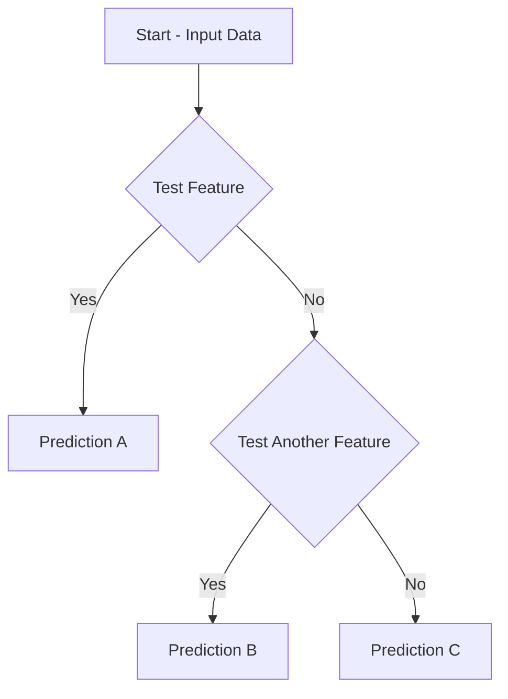

###  Decision Trees

---

## 🧠 What is a Decision Tree?

A **Decision Tree** is a **supervised learning algorithm** used for both **classification** and **regression** tasks.

It works like a **flowchart**:  
- Each **internal node** tests a feature,  
- Each **branch** represents an outcome of the test,  
- Each **leaf node** represents a prediction (label or value).

For example



This diagram shows:

- A is the starting point, where data enters the tree.
- B is the first decision node.
- If the feature test is Yes, it leads to C, a prediction.
- If No, it goes to D, another test.
- D then routes to:
- E if Yes (another prediction),
- F if No (a third prediction).

---

## 🧩 The Idea Behind It

Imagine a series of yes/no (binary) or multi-way questions that split your data into smaller and more **homogeneous** groups.  
The goal is to build a structure that leads you to the correct answer by asking the most **informative** questions first.

---

## 🧪 Classification vs Regression Trees

| Task           | What it Predicts       | Output at Leaves    |
|----------------|------------------------|---------------------|
| Classification | Categories/Classes     | Most common class   |
| Regression     | Continuous values      | Mean value          |

---

## 📊 How Splitting Works

Decision Trees split data based on a feature and a threshold to create the **purest** child nodes possible.

For Classification Trees:
- The goal is to reduce **impurity** (how mixed the classes are) at each split.

For Regression Trees:
- The goal is to minimize the **variance** of the target variable in each split.

---

## 🧮 Metrics Used for Splitting

### For Classification:

- **Gini Impurity**  
  $$ Gini = 1 - \sum_{i=1}^{C} (p_i)^2 $$
  
- **Entropy (Information Gain)**  
  $$ Entropy = - \sum_{i=1}^{C} p_i \log_2(p_i) $$

Where:
- $C$ is the number of classes
- $p_i$ is the proportion of class $i$

---

### For Regression:

- **Mean Squared Error (MSE)**  
  $$ MSE = \frac{1}{n} \sum_{i=1}^{n} (y_i - \bar{y})^2 $$

- **Mean Absolute Error (MAE)**  
  $$ MAE = \frac{1}{n} \sum_{i=1}^{n} |y_i - \bar{y}| $$

---

## 🏗️ Building the Tree

1. Start at the root node.
2. For each feature:
   - Test all possible splits.
   - Evaluate how "pure" the resulting nodes are.
3. Choose the best split (lowest impurity or error).
4. Repeat the process recursively for child nodes.
5. Stop when:
   - All data points in a node belong to the same class.
   - Or, a maximum depth is reached.
   - Or, a minimum number of samples is in the node.

---

## 🪓 Tree Pruning

Trees can **overfit** if they grow too deep.

**Pruning** is the process of removing parts of the tree that don’t provide significant power to predict the target variable.

Types of pruning:
- **Pre-pruning** (early stopping)
- **Post-pruning** (cutting back the tree after it’s grown)

---

## 🔍 Example: Classification

Let's say you're building a tree to classify **whether a student passed** based on **study hours** and **sleep hours**.

```
         [Study Hours > 3?]
           /           \
         Yes           No
        /                \
[Sleep > 6?]          [Fail]
   /     \
[Pass]   [Fail]
```

This tree says:
- If study hours > 3 and sleep > 6 → **Pass**
- If study hours > 3 and sleep ≤ 6 → **Fail**
- If study hours ≤ 3 → **Fail**

---

## ⚠️ Pros & Cons

### ✅ Pros:
- Easy to interpret and visualize.
- Handles both numerical and categorical data.
- Requires little data preprocessing.
- Can model non-linear relationships.

### ❌ Cons:
- Can easily **overfit** (too deep = too complex).
- Unstable: small changes in data can lead to different trees.
- Biased towards features with more levels.

---

## 📦 Used In:
- Customer segmentation
- Fraud detection
- Medical diagnosis
- Credit risk analysis
- Any task needing interpretable decisions

---

## 🌲 Fun Fact: Random Forests

A **Random Forest** is a collection of **Decision Trees** working together to make better predictions.  
Each tree gets a random sample of the data and a subset of features — then their outputs are averaged (regression) or voted (classification).
